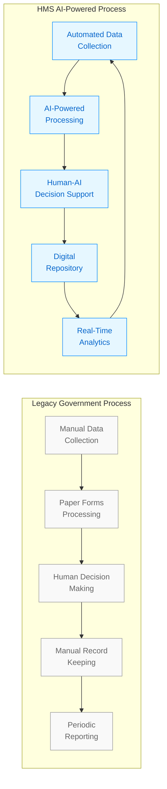
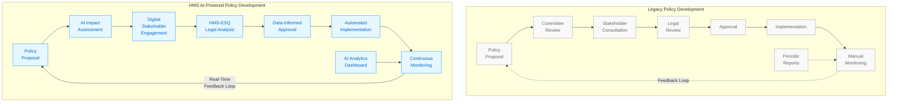
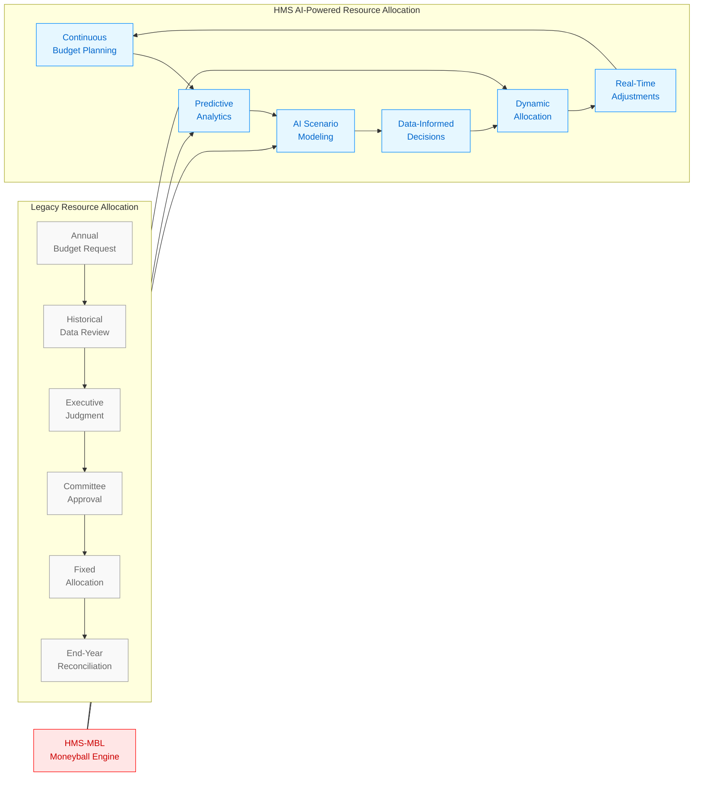
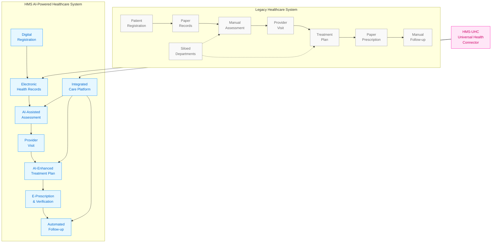
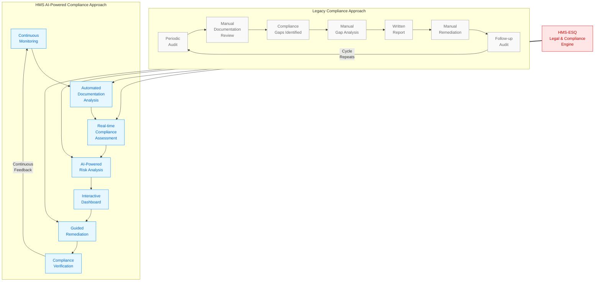
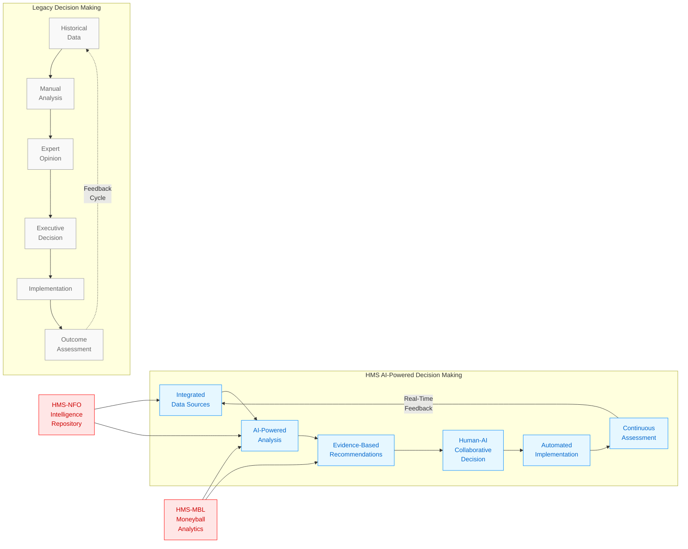
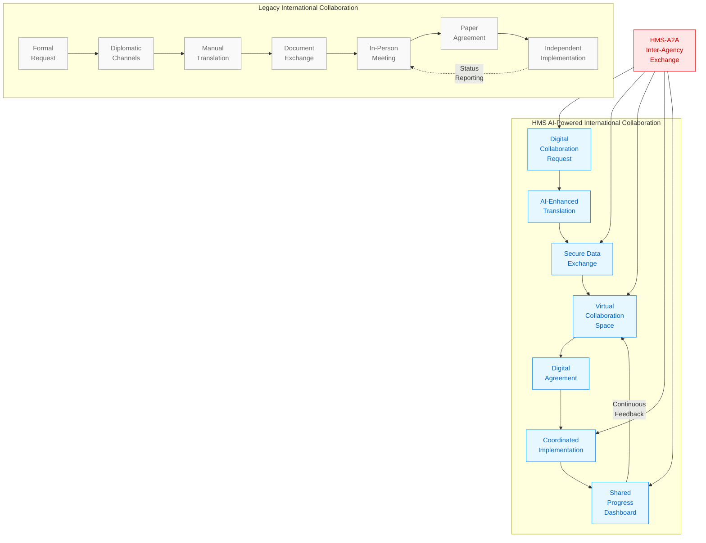

# Legacy vs. AI-Powered Government Operations

This document provides visualizations comparing traditional government operations with HMS AI-enhanced approaches.

## Process Comparison Overview

## Policy Development Comparison

## Citizen Service Delivery

```mermaid
flowchart TD
    subgraph "Legacy Service Delivery"
        LC1[Citizen<br>Application] --> LC2[Form<br>Submission]
        LC2 --> LC3[Queue for<br>Processing]
        LC3 --> LC4[Manual<br>Review]
        LC4 --> LC5[Decision]
        LC5 --> LC6[Manual<br>Notification]
        
        LC7[Status<br>Inquiry] -.-> LC3
        LC5 --> |Rejection|LC8[Appeal<br>Process]
        LC8 --> LC4
    end
    
    subgraph "HMS AI-Powered Service Delivery"
        AC1[Digital<br>Application] --> AC2[Automated<br>Validation]
        AC2 --> AC3[AI Initial<br>Assessment]
        AC3 --> AC4[Human-AI<br>Review]
        AC4 --> AC5[Decision<br>Engine]
        AC5 --> AC6[Automated<br>Notification]
        
        AC7[Real-Time<br>Status Tracking] --> AC3
        AC5 --> |Flagged for<br>Review|AC8[AI-Guided<br>Reassessment]
        AC8 --> AC4
    end
    
    classDef legacy fill:#f9f9f9,stroke:#999,color:#666
    classDef aipower fill:#e6f7ff,stroke:#0088ff,color:#0066cc
    
    class LC1,LC2,LC3,LC4,LC5,LC6,LC7,LC8 legacy
    class AC1,AC2,AC3,AC4,AC5,AC6,AC7,AC8 aipower
```

## Resource Allocation Comparison

## Healthcare Operations Comparison

## Regulatory Compliance Comparison

## Decision Support Comparison

## International Agency Collaboration

## Key Performance Indicators

| Metric | Legacy Approach | HMS AI-Powered Approach | Improvement |
|--------|----------------|--------------------------|------------|
| Processing Time | Days to Weeks | Minutes to Hours | 90-95% reduction |
| Decision Accuracy | 70-85% | 90-99% | 15-25% improvement |
| Resource Utilization | Fixed allocation | Dynamic optimization | 20-40% efficiency gain |
| Citizen Satisfaction | 50-70% | 80-95% | 25-45% improvement |
| Staff Productivity | Manual tasks | Focus on high-value work | 30-50% productivity gain |
| Compliance Rate | 75-90% | 95-99% | 10-25% improvement |
| Cost Efficiency | Baseline | 15-35% reduction | 15-35% savings |
| Response Time | Days | Hours or less | 85-95% reduction |
| Error Rate | 5-15% | 0.5-2% | 85-95% reduction |
| Innovation Capacity | Limited by resources | Enhanced by AI tools | 50-100% improvement |