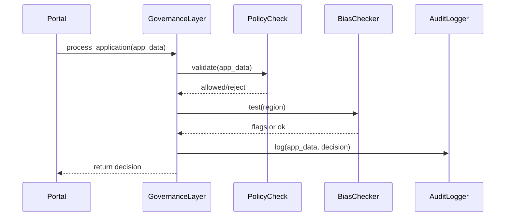

# Chapter 1: AI Governance Values

Welcome to the first chapter of HMS-OPS! Here we introduce **AI Governance Values**—the guardrails that ensure every algorithmic decision is transparent, truthful, safe, ethical, and private. Think of them like traffic laws for your AI: they keep everything moving smoothly, fairly, and with an audit trail.

---

## 1. Why AI Governance Values Matter

Imagine a federal citizen-service portal that uses AI to fast-track grant applications. A small business owner submits a form asking for disaster-relief funds. The AI recommends approval—great! But:

- **How** did it decide?  
- **Is** there hidden bias against rural applicants?  
- **Who** can audit that decision later?

**AI Governance Values** solve exactly that:

- **Transparency**: Every recommendation is explainable.  
- **Truth & Ethics**: Rules check for fairness and no hidden bias.  
- **Safety & Privacy**: Personal data is masked and securely logged.  

These mirror the Federal Data Strategy’s guidelines and live in HMS-OPS’s Governance Layer, audit modules, and data-pipeline privacy controls.

---

## 2. Key Concepts

Let’s break them down:

1. **Transparency**  
   Every AI decision comes with an explanation.  
2. **Truth & Ethics**  
   The system runs bias-tests (e.g., does it favor one region?).  
3. **Safety**  
   Reject or flag any decision that feels “off” or risky.  
4. **Privacy**  
   Personal data (SSNs, addresses) is encrypted/masked when logged.

---

## 3. Solving a Use Case

### 3.1 The Scenario

Our portal receives:

```json
{
  "applicant": "Rural Farms LLC",
  "region": "Midwest",
  "requested_amount": 50000,
  "financials": { /* … */ }
}
```

We need to:

1. Check policies (e.g., no more than $100K per applicant).  
2. Run a bias test on `region`.  
3. Log the decision securely for audits.

### 3.2 Example Code

```python
from hms_ops.governance import policy_check, bias_test, log_decision

def process_application(app_data):
    # 1. Policy check
    policy_result = policy_check(app_data)
    if not policy_result.allowed:
        return {"status": "rejected", "reason": policy_result.reason}

    # 2. Bias test
    bias_flags = bias_test(app_data["region"])
    if bias_flags:
        # escalate for manual review
        return {"status": "escalated", "bias": bias_flags}

    # 3. Log for audit
    decision = {"status": "approved", "amount": app_data["requested_amount"]}
    log_decision(app_data, decision)
    return decision
```

> This function enforces governance values at three touchpoints:  
> - policy  
> - bias  
> - secure logging  

---

## 4. Under the Hood: Step-by-Step

Before diving into code, here’s what happens when `process_application` is called:



---

## 5. Peek at the Code

### 5.1 policy_check (hms_ops/governance/policy.py)

```python
def policy_check(app_data):
    # Example: max $100K per applicant
    if app_data["requested_amount"] > 100_000:
        return SimpleNamespace(allowed=False, reason="Exceeds limit")
    return SimpleNamespace(allowed=True)
```

> A simple rule: reject if over budget.

### 5.2 bias_test (hms_ops/governance/bias.py)

```python
def bias_test(region):
    # Stub: check historical approvals by region
    biased_regions = ["North", "West"]
    return [region] if region in biased_regions else []
```

> Flags “North” or “West” for manual review.

### 5.3 log_decision (hms_ops/governance/audit.py)

```python
def log_decision(app_data, decision):
    # Mask PII before logging
    safe_data = {**app_data, "applicant": "***"}
    # Imagine writing to secure log
    print("AUDIT LOG:", safe_data, decision)
```

> In reality, this writes to an encrypted audit store.

---

## 6. Analogies & Takeaways

- **Traffic Laws**: Just as stop signs ensure safe driving, governance values keep AI “honest.”  
- **Financial Audits**: Like an accountant reviews books, our audit module records every AI move.  

As a beginner, remember: **every** AI call in HMS-OPS touches these five pillars. This pattern repeats in higher-level layers like the [Governance Layer](02_governance_layer_.md).

---

## Conclusion

You’ve learned what AI Governance Values are, why they matter for federal scenarios, and seen how to enforce them in code.  

Next up: dive into the broader **[Governance Layer](02_governance_layer_.md)** to see where these checks live and how they integrate with policies and workflows.

---

Generated by [AI Codebase Knowledge Builder](https://github.com/The-Pocket/Tutorial-Codebase-Knowledge)