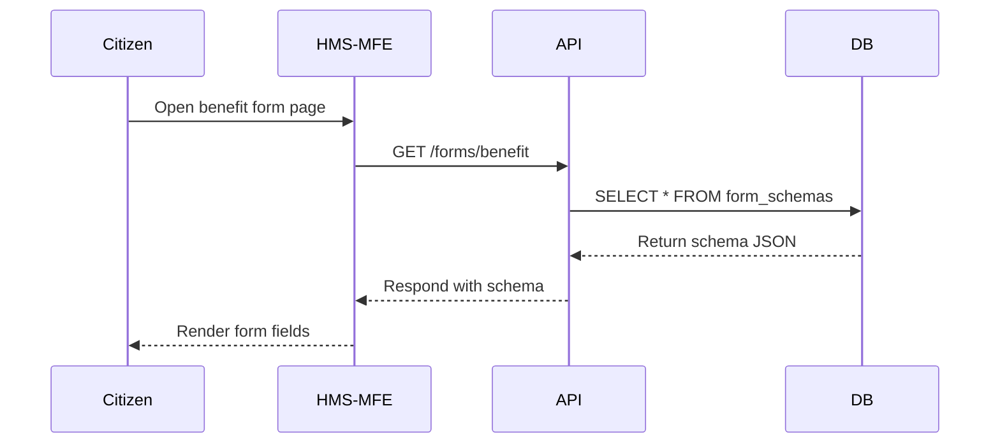

# Chapter 1: Interface Layer (HMS-MFE & HMS-GOV)

Welcome to HMS-OPS! In this chapter we introduce the **Interface Layer**, where citizens and agency staff interact with the system. Think of it as two separate lobbies in city hall:

- **HMS-MFE**: The public lobby—portals, forms, dashboards for end users (citizens, applicants).
- **HMS-GOV**: The official’s chamber—a workspace for policymakers and administrators to review AI proposals and approve workflows.

---

## 1. Why an Interface Layer?

Imagine a citizen filling out a federal benefit application online:

1. The citizen arrives at a portal.
2. They complete forms and upload documents.
3. Behind the scenes, data flows into backend services.

At the same time, an agency official logs in to review and approve that application in a secure admin console. We need two UIs—one tailored for public use, one for administrators—both talking to the same backend APIs but with different features, theming, and security.

---

## 2. Key Concepts

1. **Micro Frontends (HMS-MFE)**  
   - Modular UI “widgets” (forms, dashboards).  
   - Loaded on demand to keep pages fast and responsive.  
   - Theming and branding to match agency style guides.  

2. **Administrator UI (HMS-GOV)**  
   - Separate entry point with elevated permissions.  
   - Advanced components: proposal review tables, workflow dashboards.  
   - Customizable per agency (e.g., OSC vs. CAOC).  

3. **Plugging into Backend APIs**  
   - Both UIs call the same REST endpoints (e.g., GET `/applications/123`).  
   - Role-based UI features—citizens can submit, officials can approve.  

---

## 3. Using HMS-MFE: A Simple Example

Suppose you want to render a citizen benefit form. In **hms-mfe/src/bootstrap.js**:

```js
import React from 'react'
import ReactDOM from 'react-dom'
import BenefitForm from './components/BenefitForm'
import './themes/default.css'

// Fetch form schema then render
fetch('/api/forms/benefit')
  .then(res => res.json())
  .then(schema => {
    ReactDOM.render(
      <BenefitForm schema={schema} />,
      document.getElementById('root')
    )
  })
```

Explanation:
- We fetch the form schema from our backend.
- We mount a React component `BenefitForm` into the DOM.
- The CSS file provides default styling.

---

## 4. Using HMS-GOV: Admin Dashboard

In **hms-gov/src/AdminDashboard.js**:

```js
import React, { useEffect, useState } from 'react'
import './themes/gov.css'

export default function AdminDashboard() {
  const [proposals, setProposals] = useState([])

  useEffect(() => {
    // Fetch pending AI proposals
    fetch('/api/proposals?status=pending')
      .then(res => res.json())
      .then(setProposals)
  }, [])

  return (
    <div className="admin-dashboard">
      <h1>Pending Proposals</h1>
      {/* Map proposals to table rows */}
    </div>
  )
}
```

Explanation:
- Admin UI fetches a list of pending proposals.
- Renders them in a branded dashboard.

---

## 5. Under the Hood: Sequence Flow

Here’s what happens step-by-step when a citizen opens the benefit form page:



---

## 6. Internal Implementation Highlights

### a) API Client Module (`hms-mfe/src/api.js`)

```js
// Simplified HTTP client
export async function getForm(id) {
  const res = await fetch(`/api/forms/${id}`)
  return res.json() // returns form schema
}
```

- Centralizes API calls.
- New features (e.g., auth tokens) added here.

### b) Theme System (`hms-mfe/src/themes/default.css`)

```css
body {
  font-family: "Segoe UI", sans-serif;
  background-color: #f5f5f5;
}
input, button {
  font-size: 1rem;
}
```

- Agencies can override these styles in a custom theme folder.
- Keeps UI consistent with federal branding.

---

## 7. Why This Matters

- Clear separation: public vs. admin experiences.
- Modular UIs: easy to maintain and scale.
- Theming: agencies can apply their unique style guides and accessibility requirements.

You now know how to plug in an HMS-MFE citizen form and an HMS-GOV admin dashboard. In the next chapter, we’ll see how users navigate intent-driven flows seamlessly between these UIs.

---

## Conclusion

In this chapter, you learned:

- The role of **HMS-MFE** and **HMS-GOV** in the Interface Layer.  
- How to fetch and render a form for citizens.  
- How administrators review proposals in a separate portal.  
- A peek at internal API modules and theming.

Next up: [Intent-Driven Navigation](02_intent_driven_navigation_.md) — guiding users efficiently through goals and tasks.

---

Generated by [AI Codebase Knowledge Builder](https://github.com/The-Pocket/Tutorial-Codebase-Knowledge)