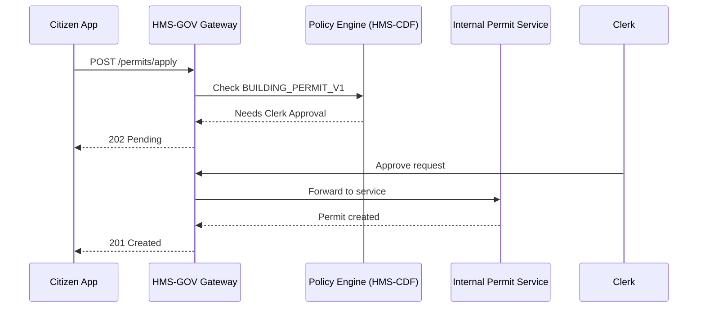

# Chapter 2: Governance Layer (HMS-GOV)

*(A gentle hand-off from [Chapter 1: Operations & Monitoring Hub (HMS-OPS)](01_operations___monitoring_hub__hms_ops__.md).)*  

---

## 1. Why do we need HMS-GOV?

Picture a small town called **Maple Falls**.  
A resident, Maria, wants to:

1. Request a building permit for a backyard solar panel.  
2. Check local zoning data.  
3. File a noise-complaint about late-night construction.

All three touch **different** departments, yet Maria interacts with a single public portal.  
HMS-GOV is that portal’s “City Hall front desk”:

* It **exposes** one uniform, secure API to the outside world.  
* It **enforces** house rules (privacy, approvals, audit logs) before any request reaches internal services.  
* It **records** who did what, so later a council member can trace every decision.

Without HMS-GOV, each microservice would have to reinvent security, approvals and logging—almost guaranteed to drift apart and create loopholes.

---

## 2. Key Concepts (Beginner Friendly)

| Idea | Analogy | Why it matters |
|------|---------|----------------|
| **Gateway API** | Reception desk counter | First door citizens meet. |
| **Policy Tag**  | Rubber stamp on a form | Declares how a request must be handled (e.g., “PUBLIC”, “SENSITIVE”). |
| **Approval Chain** | Signatures on paper | Who must say “yes” before data leaves. |
| **Audit Trail** | Security camera | Immutable record of every request & decision. |
| **Rate-Limit** | “Take a number” machine | Prevents any one caller from overwhelming services. |

---

## 3. Quick-Start: Your First “Permit Request” Endpoint

In this mini-demo we will:

1. Register a public endpoint `/permits/apply`.  
2. Attach a policy that demands department approval before the request is marked *accepted*.  
3. Watch the built-in audit log.

### 3.1 Create a Policy Tag

`permit_policy.yaml`

```yaml
id: BUILDING_PERMIT_V1
visibility: "PUBLIC"
requires_approval:
  - role: "BuildingDepartment.Clerk"
audit: true
```

Explanation  
• The tag is called `BUILDING_PERMIT_V1`.  
• Any request with this tag needs a clerk’s thumbs-up.  
• `audit: true` saves a log entry automatically.

### 3.2 Minimal Service Code (Python Flask, 18 lines)

```python
# file: app.py
from flask import Flask, request, jsonify
from hms_gov import GovernanceClient     # ← tiny SDK

app = Flask(__name__)
gov = GovernanceClient()

@app.route("/permits/apply", methods=["POST"])
def apply_permit():
    # 1. Wrap the raw request in a governance envelope
    envelope = gov.wrap(request, policy="BUILDING_PERMIT_V1")
    
    # 2. Submit to HMS-GOV gateway
    decision = gov.submit(envelope)

    # 3. Return the outcome to the caller
    return jsonify(decision), decision["http_status"]

if __name__ == "__main__":
    app.run(port=5000)
```

What happens?  
1. `wrap()` adds metadata (caller ID, timestamp, policy tag).  
2. `submit()` forwards it to HMS-GOV.  
3. Until the clerk approves, the caller receives `202 Accepted – Pending Approval`.

### 3.3 Sample Interaction

```bash
curl -X POST http://localhost:5000/permits/apply \
     -H "X-User: maria@example.com" \
     -d '{"address":"123 Oak St."}'
```

Response:

```json
{
  "request_id": "req_2491",
  "status": "PENDING_APPROVAL",
  "next": "BuildingDepartment.Clerk"
}
```

An email / dashboard task now waits for the clerk.  
After approval, Maria is automatically notified and the status flips to **APPROVED**.

---

## 4. What’s Inside the Black Box?

### 4.1 Birds-Eye Flow



### 4.2 Step-by-Step (words only)

1. Gateway authenticates the caller (ties into the **Identity, Access & Authorization** layer—see later chapter).  
2. It loads the policy tag and pushes the rule evaluation to the [Policy Engine – HMS-CDF](03_policy_engine___hms_cdf__codified_democracy_foundation__.md).  
3. Because approval is required, the request is paused and written to an **Audit Log**.  
4. After approval, the request is replayed to the internal service, response captured, and a final audit entry recorded.

---

## 5. Peek at the Gateway Implementation

*(Files live in `hms-gov/` folder—names simplified for clarity.)*

### 5.1 Routing Table (`routes.yaml`, 9 lines)

```yaml
- path: /permits/apply
  method: POST
  upstream: http://permit-service.internal/apply
  policy: BUILDING_PERMIT_V1
  rate_limit_per_min: 30
```

HMS-GOV reads this at startup to know:

* Where to forward the request (`upstream`).  
* Which policy to enforce.  
* That any single IP may call it only 30 times per minute.

### 5.2 Approval Record (tiny excerpt, 10 lines)

```python
# file: approvals.py
def pause(request):
    db.insert("pending", request)          # store frozen copy
    notify(request["next"])                # email the Clerk

def resume(request_id, approver):
    req = db.pop("pending", id=request_id)
    req["approver"] = approver
    return forward(req)                    # continue journey
```

Beginners’ take-away:  
*`pause`* saves the full JSON and tells the right person.  
*`resume`* pulls it back when green-lit.

---

## 6. Where HMS-GOV Sits in the Big Picture

```
Internet Caller
      ↓
[Governance Layer – HMS-GOV]  ← policy, approval, audit
      ↓
Internal Microservices
      ↓
[Operations Hub – HMS-OPS]    ← monitors their health
```

Later you will see HMS-GOV collaborating with:

* [Policy Engine – HMS-CDF](03_policy_engine___hms_cdf__codified_democracy_foundation__.md) for complex, crowd-voted rules.  
* [Compliance & Legal Reasoner (HMS-ESQ)](04_compliance___legal_reasoner__hms_esq__.md) to ensure every action stays within the law.

---

## 7. Recap

You learned how HMS-GOV:

1. Acts as a single, secure entry point for citizens and external agencies.  
2. Applies policy tags, approvals, rate-limits and audit logs **for you**.  
3. Lets internal teams focus on business logic while governance is handled automatically.

In the next chapter we will zoom into the rule-brain that powers those policy decisions:  
[Policy Engine – HMS-CDF (Codified Democracy Foundation)](03_policy_engine___hms_cdf__codified_democracy_foundation__.md)  

*(Get ready to codify the voice of the people into executable rules!)*

---

Generated by [AI Codebase Knowledge Builder](https://github.com/The-Pocket/Tutorial-Codebase-Knowledge)