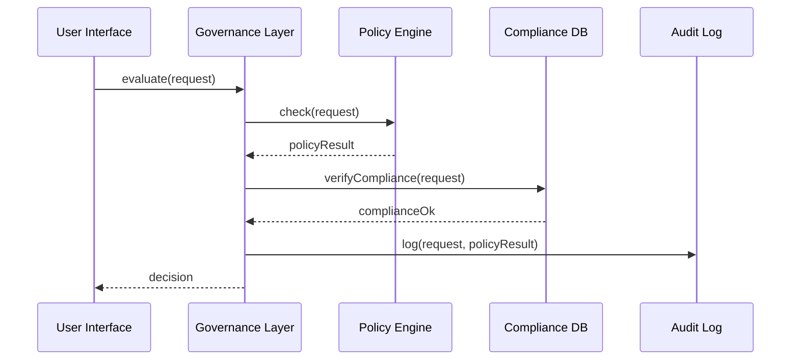

# Chapter 2: Governance Layer

Welcome back! In [Chapter 1: AI Governance Values](01_ai_governance_values_.md) we learned about the core principles—transparency, truth, ethics, safety, and privacy—that every AI decision in HMS-OPS must respect. Now, we’ll zoom out to see **where** and **how** those principles get enforced: the **Governance Layer**.

---

## Why a Governance Layer?

Imagine the U.S. Drug Enforcement Administration (DEA) opening a procurement request for secure communication servers. They must follow the Federal Acquisition Regulation (FAR), FIPS encryption rules, and internal privacy policies. The **Governance Layer** in HMS-OPS is like Congress and the regulatory agencies:

- It **writes** the high-level laws (policies & compliance frameworks).  
- It **enforces** audit trails so you always know who changed what, when, and why.  
- It **grants** role-based permissions so only authorized users can approve or modify requests.  

In short, it keeps every microservice and AI agent playing by the same federal rulebook.

---

## Central Use Case: A Procurement Request

Let’s walk through a minimal example:

1. The DEA user submits a procurement request for \$50 000 servers.  
2. The Governance Layer checks:  
   - “Does FAR allow this purchase under clause 52.204-21?”  
   - “Is the user cleared for that dollar amount?”  
3. If all checks pass, it logs the decision for audits and returns “approved.”  
4. If a rule breaks, it returns “rejected” or “needs manual review.”

---

## Key Concepts

1. **Policy Engine**  
   Houses rules like “No purchases over \$100K without congressional sign-off.”  
2. **Compliance Frameworks**  
   Maps federal mandates (FAR, FIPS, NIST) to code checks.  
3. **Role-Based Permissions**  
   Ensures only roles with “Contract Officer” privileges can approve.  
4. **Audit Trail**  
   Records every request, result, user, and timestamp in a secure log.  
5. **Transparency & Reporting**  
   Exposes who invoked what rule and why, for reporting dashboards.

---

## Using the Governance Layer

Here’s a simple Python snippet showing how an HMS-OPS client might invoke it:

```python
from hms_ops.governance_layer import GovernanceLayer, ProcurementRequest

# 1. Build the request
req = ProcurementRequest(
    agency="DEA",
    item="SecureServer",
    amount=50_000,
    user_role="ContractOfficer"
)

# 2. Evaluate via Governance Layer
gov = GovernanceLayer()
decision = gov.evaluate(req)

# 3. Inspect the result
print(decision)
# Possible output:
# {"status": "approved", "policy": "FAR 52.204-21", "trace_id": "abc123"}
```

Explanation:
- `GovernanceLayer.evaluate()` runs **all** policy, compliance, permission, and audit checks.
- The returned `decision` tells you if it’s approved, rejected, or flagged for manual review.

---

## What Happens Under the Hood

First, a non-code overview:



1. **Check Policies** (Policy Engine)  
2. **Verify Federal Compliance** (Compliance DB)  
3. **Log Everything** (Audit Log)  
4. **Return Decision** to the caller  

---

### Inside: governance_layer.py

File: `hms_ops/governance_layer.py`
```python
class GovernanceLayer:
    def __init__(self):
        self.policy_engine = PolicyEngine()
        self.compliance_store = ComplianceStore()
        self.audit_logger = AuditLogger()

    def evaluate(self, request):
        # 1. Policy check
        policy_result = self.policy_engine.check(request)
        if not policy_result.allowed:
            return policy_result.to_dict()

        # 2. Compliance check
        if not self.compliance_store.verify(request):
            return {"status": "rejected", "reason": "Compliance failure"}

        # 3. Log for audit
        self.audit_logger.log(request, policy_result)

        # 4. Return approval
        return {"status": "approved", "policy": policy_result.policy_id}
```
> We wire together policy checks, compliance data, and auditing in one place.

---

### Inside: policy_engine.py

File: `hms_ops/policy_engine.py`
```python
class PolicyEngine:
    def check(self, req):
        # Example rule: max $100K per request
        if req.amount > 100_000:
            return PolicyResult(False, "Exceeds federal limit")
        # Placeholder: match to a FAR clause
        return PolicyResult(True, policy_id="FAR 52.204-21")
```

---

## Analogy & Takeaways

- Think of the Governance Layer as **Congress + GAO + OMB** rolled into one:
  - **Congress** writes the law (policies).  
  - **Office of Management & Budget** verifies compliance.  
  - **Government Accountability Office** audits every action.  

By centralizing these checks, HMS-OPS makes sure no AI agent or microservice can accidentally—or maliciously—break federal rules.

---

## Conclusion

You’ve seen how the **Governance Layer** defines and enforces the “laws” for our AI-driven workflows, ensuring every action is policy-compliant, auditable, and transparent. Next up, we’ll explore the [Management Layer](03_management_layer_.md), where these decisions get turned into real-world tasks and workflows.

---

Generated by [AI Codebase Knowledge Builder](https://github.com/The-Pocket/Tutorial-Codebase-Knowledge)