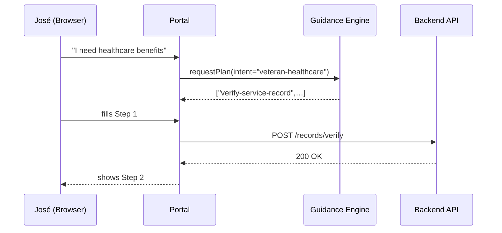

# Chapter 2: Intent-Driven Navigation & Guided Journeys

*(A friendly continuation of what you built in  
[Chapter 1: Interface Layer (HMS-MFE / User & Admin Portals)](01_interface_layer__hms_mfe___user___admin_portals__.md))*  

---

## 1 . Why do we need “intent-driven” anything?

Picture José, a 65-year-old Vietnam veteran.  
He opens a federal website and is greeted by ten menu tabs: “Forms”, “Benefits”, “Medical”, “Programs”… Overwhelmed, he closes the browser.

Now imagine the site simply asks:

> “What outcome do you want to achieve?”

José types **“I need healthcare benefits.”**  
The system replies: *“Great, we’ll guide you through 3 quick steps.”*  
He sees only the relevant questions, signs the final form, and is done in seven minutes.

That is Intent-Driven Navigation & Guided Journeys—the GPS of government paperwork.  
It shortens paths, removes wrong turns, and lowers abandonment rates.

---

## 2 . Key Ideas in Plain English

| Term                 | A Beginner-Friendly Meaning                                   |
|----------------------|---------------------------------------------------------------|
| Intent               | What the user wants to accomplish (the destination).          |
| Journey Plan         | The shortest list of steps to reach that intent (the route).  |
| Step                 | A single screen, form, or action in the journey.              |
| Guidance Engine      | The AI that picks & orders steps, like a GPS’ routing brain.  |
| Context Pruning      | Hiding anything not needed for the current user.              |

---

## 3 . Quick Start – Create Your First Guided Journey

Let’s build a **3-step journey** called `"veteran-healthcare"`.

### 3.1 Define the Intent & Steps

```ts
// File: journeys/veteran-healthcare.ts
import { defineJourney } from '@hms/guide';

export default defineJourney({
  intent: 'veteran-healthcare',
  title: 'Apply for VA Healthcare Benefits',
  steps: [
    'verify-service-record',
    'collect-contact-info',
    'submit-va-form-10-10EZ'
  ]
});
```

Explanation:  
1. `defineJourney` registers a new journey in **one file**.  
2. We list the **three screen IDs** it must show—nothing else will appear.

### 3.2 Render the Journey in the Portal

```tsx
// File: pages/apply-va.tsx
import JourneyRunner from '@hms/guide/JourneyRunner';
import journey from '../journeys/veteran-healthcare';

export default () => <JourneyRunner journey={journey} />;
```

Explanation:  
`JourneyRunner` is a reusable component that handles **navigation, validation, and progress UI**. You only pass the journey object.

### 3.3 Live Test

```bash
$ npm run portal:user
```

Visit `http://localhost:4200/apply-va` – you’ll see Step 1 automatically.

---

## 4 . How It Works Under the Hood (High-Level)



Takeaways:  
• The **Guidance Engine** decides the plan once, then the Portal simply follows it.  
• All heavy lifting (record look-ups, form submission) still flows through the [Backend API Gateway](03_backend_api_gateway__hms_api___hms_mkt__.md).

---

## 5 . A Peek Inside the Guidance Engine

### 5.1 Journey Registry

```ts
// File: guide/registry.ts
const journeys = new Map();
/* load all *.ts files and store by intent */
export const register = (j) => journeys.set(j.intent, j);
export const get = (intent) => journeys.get(intent);
```

Explanation: A **plain Map** keeps things simple—great for beginners and unit tests.

### 5.2 Plan Generator

```ts
// File: guide/plan-generator.ts
import { get } from './registry';

export function createPlan(intent, userProfile) {
  const j = get(intent);
  if (userProfile.veteran !== true)
    throw new Error('User not eligible'); // guardrail
  return j.steps;
}
```

Explanation:  
1. Fetch journey by intent.  
2. Run quick eligibility logic (later you can call AI here).  
3. Return the ordered array of step IDs—the **plan**.

### 5.3 Context Pruning in the UI

```tsx
// inside JourneyRunner
if (!plan.includes(currentStepId)) {
  return <Redirect to={firstStepInPlan} />;
}
```

Explanation: Even if users try to jump around with the URL bar, you keep them on the official route—no detours.

---

## 6 . Branching & Smart Shortcuts (Optional Advanced Bit)

Want to skip already-known data? Mark a step as **skippable**:

```ts
steps: [
  { id: 'verify-service-record', skippableIf: user.hasVerified },
  'collect-contact-info',
  'submit-va-form-10-10EZ'
]
```

The engine evaluates `skippableIf` on the fly, shortening the path just like a GPS reroutes around traffic.

---

## 7 . Common Pitfalls & Easy Fixes

Mistake: Putting eligibility rules in the UI component.  
Fix: Keep all rules in the **Guidance Engine** so you can reuse them in chatbots or phone IVR later.

Mistake: Hard-coding URLs between steps.  
Fix: Always let `JourneyRunner` calculate the next step based on the plan array.

Mistake: Forgetting accessibility.  
Fix: Each step is still a regular **MFE** page—use the design system components from [Chapter 1](01_interface_layer__hms_mfe___user___admin_portals__.md).

---

## 8 . Recap

• You learned to ask for **intent**, not just clicks.  
• A **journey** is a tiny JSON/TS object listing steps.  
• `JourneyRunner` renders the steps; the **Guidance Engine** builds the plan.  
• Users finish faster, agencies see fewer abandoned forms.

Next we’ll wire these journeys to real data and security controls in  
[Chapter 3: Backend API Gateway (HMS-API / HMS-MKT)](03_backend_api_gateway__hms_api___hms_mkt__.md).

---

Generated by [AI Codebase Knowledge Builder](https://github.com/The-Pocket/Tutorial-Codebase-Knowledge)