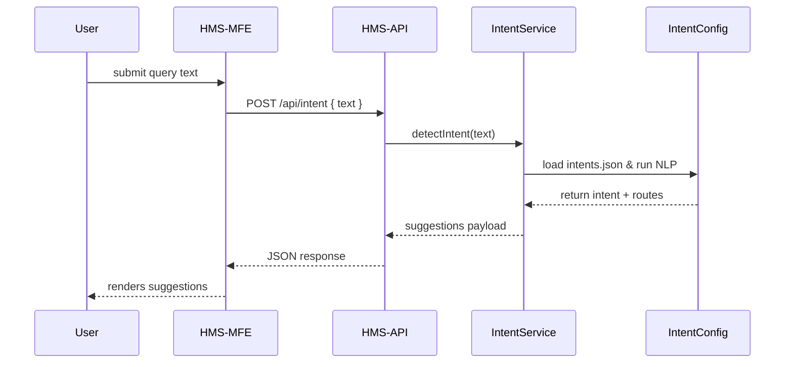

# Chapter 2: Intent-Driven Navigation

In [Chapter 1: Interface Layer (HMS-MFE & HMS-GOV)](01_interface_layer__hms_mfe___hms_gov__.md) we saw how users and administrators interact with HMS-OPS through two separate UIs. Now, let’s give those users a smart concierge: **Intent-Driven Navigation** guides them to exactly the service they need, based on what they say they want.

---

## 1. Why Intent-Driven Navigation?

Imagine Jane, a citizen who wants to file a workplace safety complaint with a federal agency:

1. She lands on a long portal menu and isn’t sure where to start.
2. She types “I want to file a complaint about unsafe water” into a search box.
3. The system instantly shows:
   - A “File Water Safety Complaint” form.
   - A link to FAQs about water safety.
   - An AI-suggested next step: “Upload your lab report.”

This saves Jane time, reduces confusion, and helps the agency increase completion rates.

---

## 2. Key Concepts

1. **Intent Detection**  
   We use simple NLP (keyword matching or models) to map user text to an *intent key*.

2. **Intent Taxonomy**  
   A configuration (e.g. `intents.json`) listing each intent, its keywords, and where to route.

3. **Routing Rules**  
   For each intent, we define destinations: forms, FAQs, external links, or AI chat prompts.

4. **Dynamic Surface**  
   HMS-MFE dynamically renders the matching form components or links without a full page reload.

---

## 3. Building the User-Facing Component

In `hms-mfe`, we add an **IntentNavigator** component:

```jsx
// hms-mfe/src/components/IntentNavigator.js
import React, { useState } from 'react'
import { detectIntent } from '../api/intent'

export default function IntentNavigator() {
  const [query, setQuery] = useState('')
  const [options, setOptions] = useState([])

  async function handleSearch() {
    const result = await detectIntent(query)
    setOptions(result.suggestions)
  }

  return (
    <div className="intent-navigator">
      <input
        value={query}
        onChange={e => setQuery(e.target.value)}
        placeholder="What do you need today?"
      />
      <button onClick={handleSearch}>Go</button>
      <ul>
        {options.map(o =>
          <li key={o.id}>
            <a href={o.link}>{o.label}</a>
          </li>
        )}
      </ul>
    </div>
  )
}
```

Explanation:
- The user types their goal.
- On click, we call our API (`detectIntent`) to get suggestions.
- We render links or forms based on the response.

And in our API client module:

```js
// hms-mfe/src/api/intent.js
export async function detectIntent(text) {
  const res = await fetch('/api/intent', {
    method: 'POST',
    headers: {'Content-Type': 'application/json'},
    body: JSON.stringify({ text })
  })
  return res.json()  // { intent: 'file_complaint', suggestions: [...] }
}
```

---

## 4. Under the Hood: Sequence Flow

Here’s what happens when a user clicks **Go**:



---

## 5. Internal Implementation Details

### a) Intent Taxonomy (`hms-svc/config/intents.json`)

```json
{
  "intents": [
    {
      "id": "file_complaint",
      "keywords": ["complaint", "report issue", "unsafe"],
      "routes": [
        { "id": "complaintForm", "label": "File Complaint Form", "link": "/forms/complaint" },
        { "id": "faqs", "label": "See FAQs", "link": "/faqs/complaint" }
      ]
    }
    // … other intents …
  ]
}
```

### b) Intent Service (`hms-svc/src/intentService.js`)

```js
import intentsConfig from '../config/intents.json'

export function detectIntent(text) {
  // 1. Simplest NLP: lowercase & keyword match
  const lower = text.toLowerCase()
  const intent = intentsConfig.intents.find(i =>
    i.keywords.some(k => lower.includes(k))
  )
  // 2. Fallback
  if (!intent) {
    return { intent: 'default_help', suggestions: [
      { id: 'search', label: 'Search All Services', link: '/search' }
    ]}
  }
  // 3. Return configured routes
  return { intent: intent.id, suggestions: intent.routes }
}
```

Explanation:
- We load our static taxonomy.
- We match keywords in the user’s text.
- We return the routes defined for that intent.

---

## 6. Why This Matters

- **Beginners** get a simple input box that “just works.”  
- **Power users** (agency developers) can extend `intents.json`, hook in ML models, and tune routing rules.  
- **End users** experience faster, more intuitive journeys—no hunting for the right form or FAQ.

---

## Conclusion

You’ve learned how HMS-OPS captures a user’s goal, runs it through an intent taxonomy, and dynamically surfaces forms or links—all within the same frontend. Next up, we’ll dive into the [Management Layer (HMS-SVC & HMS-ACH)](03_management_layer__hms_svc___hms_ach__.md), where we configure services and assemble workflows to support these intents.

---

Generated by [AI Codebase Knowledge Builder](https://github.com/The-Pocket/Tutorial-Codebase-Knowledge)