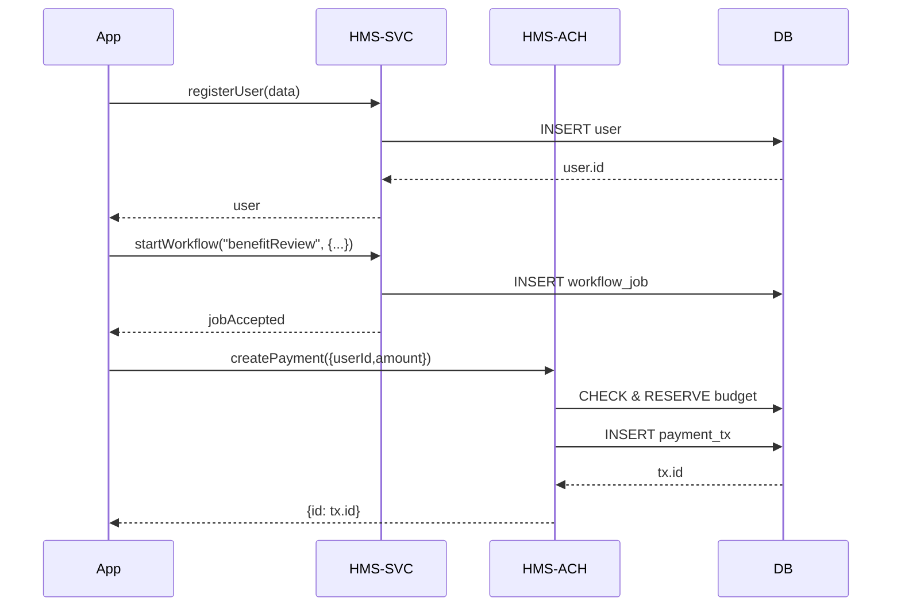

# Chapter 3: Management Layer (HMS-SVC & HMS-ACH)

Welcome back! In [Chapter 2: Intent-Driven Navigation](02_intent_driven_navigation_.md) we learned how users express goals and get routed to the right forms. Now we’ll dive under the hood to see **how** those forms and workflows actually run. Enter the **Management Layer**—your “city hall” behind the scenes.

## 1. Why the Management Layer?

Imagine a federal benefit program:

1. A citizen applies online for a housing stipend.
2. The system needs to:
   - Create or look up a user account.
   - Log every action for auditors.
   - Drive a multi-step review workflow.
   - When approved, issue a payment and update the agency budget.

The **Management Layer** splits these duties into two departments:

- **HMS-SVC** (“Services Dept.”)  
  Issues “permits”: user management, logging, workflows, shared APIs.

- **HMS-ACH** (“Treasury Dept.”)  
  Handles secure financial transactions, budget checks, payment records.

Administrators configure these services, while devs call simple APIs. Experts tune them for performance and audit trails.

---

## 2. Key Concepts

1. **HMS-SVC**  
   - User accounts (create, update).  
   - Event logging (who did what, when).  
   - Workflow engine (define approval steps).

2. **HMS-ACH**  
   - Transaction gateway (issue payments).  
   - Budget management (check & reserve funds).  
   - Secure audit log (immutable payment records).

3. **Extensibility & Auditability**  
   - Services are pluggable: add new workflows or payment rules.  
   - All actions generate logs for compliance.

---

## 3. A Simple Usage Example

When an application is approved, our app code does three things:

1. Register or fetch the user.  
2. Kick off a review workflow.  
3. Create a payment transaction.

Here’s minimal code in `app/src/processApplication.js`:

```js
import { registerUser, startWorkflow } from 'hms-svc'
import { createPayment }           from 'hms-ach'

export async function handleApprovedApplication(appId, userData, amount) {
  const user    = await registerUser(userData)
  await startWorkflow('benefitReview', { appId, userId: user.id })
  const payment = await createPayment({ userId: user.id, amount })
  console.log('Payment sent, tx id:', payment.id)
}
```

Explanation:

- `registerUser` → ensures we have a user record.  
- `startWorkflow` → schedules the approval steps defined in config.  
- `createPayment` → checks budget, records a transaction, and returns its ID.

---

## 4. Sequence of Events

Here’s what happens under the covers:



---

## 5. Under the Hood: Configuration & Code

### a) Defining Workflows (hms-svc)

```json
// hms-svc/config/services.json
{
  "workflows": {
    "benefitReview": {
      "steps": ["initialCheck", "managerApprove"]
    }
  }
}
```

Explanation: A simple JSON listing each workflow by name and its ordered steps.

### b) HMS-SVC Implementation

```js
// hms-svc/src/userService.js
export async function registerUser(data) {
  // Save or lookup user in DB
  const user = await db.insertOrFind('users', data)
  return user
}
```

```js
// hms-svc/src/workflowService.js
export async function startWorkflow(name, params) {
  // Enqueue a job based on services.json
  const job = { name, params, createdAt: Date.now() }
  await jobQueue.add(job)
}
```

### c) HMS-ACH Implementation

```js
// hms-ach/src/paymentService.js
export async function createPayment({ userId, amount }) {
  // 1. Verify available budget
  if (!budgetService.hasFunds(amount)) {
    throw Error('Insufficient budget')
  }
  // 2. Record transaction
  const tx = await db.insert('payments', { userId, amount, date: Date.now() })
  return tx
}
```

Explanation: `createPayment` checks the budget, then writes a payment record for auditing.

---

## 6. Why This Matters

- **Reusability**: Many apps call the same HMS-SVC APIs for users, logs, workflows.  
- **Consistency**: All payments go through HMS-ACH for uniform budget rules.  
- **Compliance**: Every action is logged and traced, aiding audits and security reviews.

---

## Conclusion

You’ve seen how the **Management Layer**—split between **HMS-SVC** (services) and **HMS-ACH** (payments)—powers user accounts, workflows, and secure transactions for government programs. Next, we’ll expose these services through a unified gateway in [Chapter 4: Backend API Gateway (HMS-API / HMS-MKT)](04_backend_api_gateway__hms_api___hms_mkt__.md).

---

Generated by [AI Codebase Knowledge Builder](https://github.com/The-Pocket/Tutorial-Codebase-Knowledge)