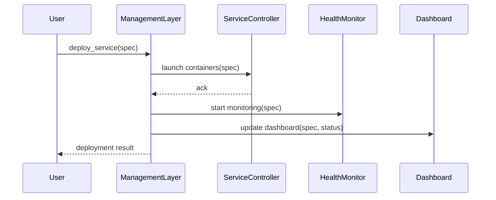

# Chapter 3: Management Layer

Welcome back! In [Chapter 2: Governance Layer](02_governance_layer_.md), we saw how HMS-OPS enforces policies, compliance, and audit trails. Now we’ll explore the **Management Layer**, which takes those policy decisions and turns them into real-world workflows, service deployments, and AI-driven optimizations.

---

## Why the Management Layer?

Imagine a city’s Department of Public Works organizing road repairs, contractor schedules, and emergency fixes. They need to:

1. Track ongoing jobs.  
2. Allocate crews and materials.  
3. Scale up teams when there’s a flood of potholes.  
4. Get sign-off from program managers before starting big projects.

The **Management Layer** does this for HMS-OPS:

- It **orchestrates** microservices and AI workflows.  
- It **monitors** health and performance.  
- It **scales** services up or down.  
- It **pushes** policy updates from the [Governance Layer](02_governance_layer_.md).  
- It **surfaces** dashboards for approvals.

---

## Central Use Case: Citizen Service Portal

Scenario: The Federal Labor Department launches a new “Job Training Grant” portal. 

1. A request for new microservices comes in (data ingestion, AI-recommendation engine).  
2. The Governance Layer approved the policy.  
3. The Management Layer must now:
   - Deploy those microservices.  
   - Watch CPU/memory.  
   - If load spikes, spin up more instances.  
   - Run an AI job nightly to optimize resource allocation.  
   - Present a dashboard where a manager can approve adding extra budget.

---

## Key Concepts

1. Service Lifecycle  
   - Deploy, update, and retire microservices.  
2. AI Workflow Orchestration  
   - Schedule and monitor AI training or inferencing jobs.  
3. Policy Deployment  
   - Push newly approved policies (from [Governance Layer](02_governance_layer_.md)) to running services.  
4. Monitoring & Scaling  
   - Track CPU, memory, response time; auto-scale.  
5. Dashboard & Approvals  
   - Web UI for program managers to review and approve changes.

---

## Using the Management Layer

Here’s a minimal Python example showing how to deploy a service and an AI job:

```python
from hms_ops.management import ManagementLayer, ServiceSpec, AIJobSpec

mgmt = ManagementLayer()

# 1. Deploy a microservice
svc = ServiceSpec(name="job-ingest", image="govlab/job-ingest:v1")
mgmt.deploy_service(svc)

# 2. Schedule an AI optimization job
job = AIJobSpec(name="optimize-resources", schedule="0 2 * * *")
mgmt.schedule_ai_job(job)
```

What happens:

- `deploy_service` spins up containers, registers health checks.  
- `schedule_ai_job` creates a nightly workflow that fine-tunes service limits.  

---

## What Happens Under the Hood

Below is a high-level flow when you call `deploy_service`:



1. **Launch**: a ServiceController deploys containers.  
2. **Monitor**: HealthMonitor tracks CPU, memory, restarts.  
3. **Dashboard**: updates UI for managers.  
4. **Result**: returns success/failure to caller.  

---

## Inside: management_layer.py

File: `hms_ops/management/management_layer.py`

```python
from .orchestrator import ServiceController
from .monitor import HealthMonitor
from .dashboard import Dashboard

class ManagementLayer:
    def __init__(self):
        self.sc = ServiceController()
        self.hm = HealthMonitor()
        self.db = Dashboard()

    def deploy_service(self, spec):
        result = self.sc.launch(spec)
        self.hm.start(spec.name)
        self.db.update(spec.name, status="deploying")
        return result

    def schedule_ai_job(self, job_spec):
        # Implementation detail: registers job in workflow engine
        return {"status": "scheduled", "job": job_spec.name}
```

Explanation:

- `ServiceController.launch` handles container orchestration.  
- `HealthMonitor.start` begins periodic health checks.  
- `Dashboard.update` pushes status to the UI.  

---

## Supporting Modules

Orchestrator (`orchestrator.py`):

```python
class ServiceController:
    def launch(self, spec):
        # stub: call Kubernetes or Docker API
        print(f"Deploying {spec.name} with image {spec.image}")
        return {"status": "ok"}
```

Monitor (`monitor.py`):

```python
class HealthMonitor:
    def start(self, service_name):
        # stub: schedule periodic checks
        print(f"Monitoring {service_name}")
```

Dashboard (`dashboard.py`):

```python
class Dashboard:
    def update(self, service_name, status):
        # stub: send WebSocket/event update
        print(f"[Dashboard] {service_name} is {status}")
```

These tiny modules illustrate how the Management Layer wires everything together.

---

## Analogies & Takeaways

- Think of the Management Layer as the **traffic control center** in a city:
  - It routes vehicles (services) to open lanes (nodes).  
  - It monitors congestion (CPU/memory).  
  - It calls in more buses (scale out) when needed.  
  - It shows real-time maps (dashboards) for the control room.  

By orchestrating services, AI jobs, and policy updates, it keeps your “digital city” running smoothly.

---

## Conclusion

You’ve learned how the **Management Layer** in HMS-OPS deploys services, runs AI workflows, monitors health, scales dynamically, and surfaces dashboards for approvals. Next up: the [Interface Layer](04_interface_layer_.md), which provides reusable UI components and APIs to build dashboards and developer tools.

---

Generated by [AI Codebase Knowledge Builder](https://github.com/The-Pocket/Tutorial-Codebase-Knowledge)