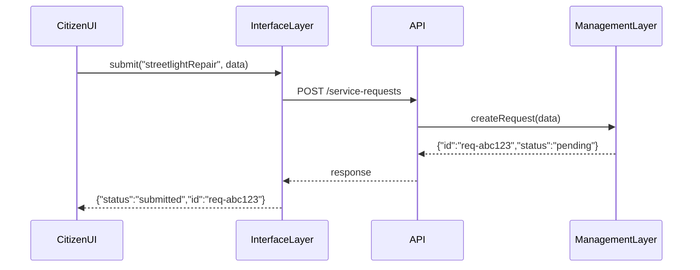

# Chapter 4: Interface Layer

Welcome back! In [Chapter 3: Management Layer](03_management_layer_.md) we learned how HMS-OPS deploys and monitors services. Now we’ll build the **Interface Layer**, the user-friendly front door that hides back-end complexity and presents neat portals to citizens, admins, and decision-makers.

---

## 1. Why the Interface Layer?

Imagine a city website where:

- **Citizens** fill out forms to request pothole repairs or file noise complaints.  
- **Admins** log into a console to approve service requests, assign crews, and view real-time KPIs.  
- **Policy-Makers** see dashboards with budgets, trends, and AI-backed recommendations for improving services.

The **Interface Layer** provides:

- HMS-MFE: a Multi-Front-End portal for general users (citizens).  
- HMS-GOV: an admin/policy dashboard for decision-makers.  
- Shared UI Kits: prebuilt forms, tables, charts, and guided workflows.

Together, they let any user drive outcomes—file requests, track approvals, generate reports—without coding or deep technical know-how.

---

## 2. Central Use Case: Submitting a Citizen Service Request

Scenario:  
A resident wants to request a streetlight repair.

1. Resident navigates to the **citizen portal**.  
2. They fill out an intuitive form (address, issue type, photo).  
3. The form guides them with AI-powered suggestions (e.g., “Is it a flickering or dead bulb?”).  
4. On submit, the portal shows a confirmation and tracks status.  
5. An admin sees the new request in their **admin console**, assigns a crew, and approves budget.  
6. A decision-maker reviews weekly trends in the **policy dashboard**.

This flow lives entirely in the Interface Layer—no one types raw API calls or wires up charts from scratch.

---

## 3. Key Concepts

1. **HMS-MFE (Multi-Front-End)**  
   - React/Vue apps for citizens and staff.  
   - Hosted static assets, connects to back-end APIs.

2. **HMS-GOV (Admin Dashboard)**  
   - Role-based views for managers and policy-makers.  
   - Reports, KPIs, and AI insights.

3. **Shared UI Kits**  
   - Reusable components (FormInput, DataTable, Chart).  
   - Ensures consistent branding and accessibility.

4. **Guided AI Journeys**  
   - Step-by-step wizards powered by AI hints (e.g., form completion tips).  
   - Lowers confusion and error rates.

---

## 4. Using the Interface Layer

Below is a minimal Python example showing how a client might submit a service request via the Interface Layer API:

```python
from hms_ops.interface.layer import InterfaceLayer

# 1. Initialize for citizens
ui = InterfaceLayer(audience="citizen")

# 2. Render a repair form (in a real app this would render HTML/JS)
form = ui.render_form("streetlightRepair")
print("Form fields:", form.fields)

# 3. Submit data
data = {
    "address": "123 Main St",
    "issue": "dead_bulb",
    "photo_url": "https://..."
}
result = ui.submit("streetlightRepair", data)
print("Submission result:", result.status)
```

After calling `submit`, the layer handles validation, posts to the back end, and returns a simple status:

- **status**: "submitted"  
- **request_id**: "req-abc123"  

---

## 5. Under the Hood

### 5.1 Sequence Diagram

When a citizen submits the form, here’s what happens:



1. **InterfaceLayer** validates and formats input.  
2. It calls the back-end **API**.  
3. The **Management Layer** spins up the request workflow.  
4. Response bubbles back to the UI.

### 5.2 Internal Implementation

#### File: `hms_ops/interface/layer.py`

```python
class InterfaceLayer:
    def __init__(self, audience):
        # audience: "citizen", "admin", or "policy"
        self.audience = audience

    def render_form(self, form_name):
        # Load form schema from shared UI kit
        return SharedUI.load_form(form_name, audience=self.audience)

    def submit(self, form_name, data):
        # 1. Validate locally
        errors = SharedUI.validate(form_name, data)
        if errors:
            return SimpleNamespace(status="error", errors=errors)

        # 2. Forward to API
        resp = BackendAPI.post(f"/{form_name}", data)
        return SimpleNamespace(status=resp["status"], request_id=resp["id"])
```

- `SharedUI.load_form` returns field definitions for rendering.  
- `SharedUI.validate` checks required fields and types.  
- `BackendAPI.post` hides HTTP details.

#### File: `hms_ops/interface/shared_ui.py`

```python
class SharedUI:
    @staticmethod
    def load_form(name, audience):
        # Stub: pick schema based on form and role
        return SimpleNamespace(fields=["address", "issue", "photo_url"])

    @staticmethod
    def validate(name, data):
        missing = [f for f in SharedUI.load_form(name, None).fields if f not in data]
        return missing  # empty list means OK
```

These tiny helpers show how UI kits keep forms consistent and validation simple.

---

## Conclusion

You’ve seen how the **Interface Layer** wraps complex back-end workflows in intuitive portals for citizens, admins, and policy-makers. We covered:

- Why we need HMS-MFE, HMS-GOV, and shared UI kits.  
- A complete request-submission example.  
- The internal flow and minimal code.

Next up: dive deeper into how the UI actually renders and interacts with users in the browser. Check out [Chapter 5: Frontend Interface](05_frontend_interface_.md)!

---

Generated by [AI Codebase Knowledge Builder](https://github.com/The-Pocket/Tutorial-Codebase-Knowledge)