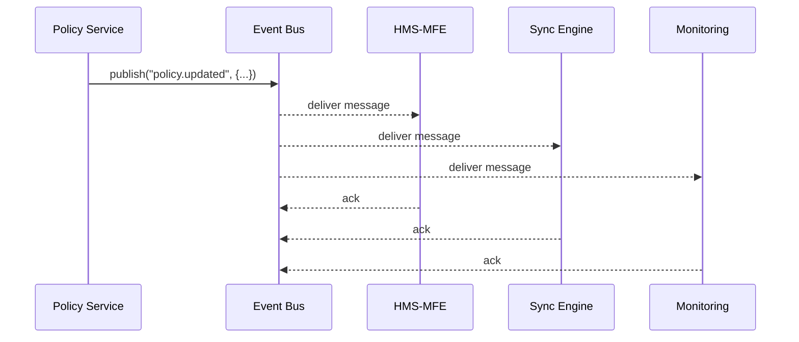

# Chapter 5: Event Bus / Message Layer

In [Chapter 4: Backend API Gateway (HMS-API / HMS-MKT)](04_backend_api_gateway__hms_api___hms_mkt__.md) we saw how services handle synchronous HTTP requests. Now let’s look at **asynchronous**, broadcast-style communication: the **Event Bus**, or **Message Layer**.

---

## 1. Motivation: Why an Event Bus?

Imagine an agency policymaker updates a citizen service policy:

1. The policy service updates its database.
2. We need to:
   - Tell front-end UIs to refresh their policy list.
   - Instruct a sync engine to push changes to an external system.
   - Log the change for monitoring and auditing.

Rather than each service calling every other service (tight coupling!), we use an **Event Bus**—a public announcement system. Services **publish** events, and interested services **subscribe** to them.

---

## 2. Key Concepts

- **Broker**  
  The central server managing topics and queues (e.g., RabbitMQ, Kafka).

- **Topic**  
  A named channel (e.g., `policy.updated`) where messages are grouped.

- **Publisher**  
  A service that sends a message to a topic.

- **Subscriber**  
  A service that listens for messages on one or more topics.

- **Message**  
  A small payload (usually JSON) describing an event.

- **Ack & Retry**  
  Subscribers acknowledge messages; failures can trigger retries or a dead-letter queue.

- **Dead-Letter Queue (DLQ)**  
  A special queue for messages that can’t be processed after several retries.

---

## 3. A Simple Publish/Subscribe Example

### a) Publishing an Event

In **hms-svc/src/eventPublisher.js**:

```js
import { broker } from '../lib/brokerClient'

// After updating a policy record...
export async function onPolicyUpdate(policy) {
  await broker.publish('policy.updated', {
    id: policy.id,
    title: policy.title,
    updatedAt: new Date().toISOString()
  })
}
```

Explanation:  
We call `broker.publish(topic, payload)` to announce a policy change.

### b) Subscribing to an Event

In **hms-mfe/src/eventSubscriber.js**:

```js
import { broker } from '../lib/brokerClient'

broker.subscribe('policy.updated', msg => {
  console.log('Policy changed:', msg)
  // e.g., re-fetch the policy list and re-render UI
})
```

Explanation:  
We tell our broker client to listen on `policy.updated`. Each time a message arrives, the callback runs.

---

## 4. Sequence Flow



1. **Policy Service** publishes.  
2. **Broker** fans out to all subscribers.  
3. Each service processes and acknowledges the message.

---

## 5. Under the Hood

### Step-by-Step Walkthrough

1. **Publish Call**  
   Your code asks the broker to publish a message to topic `policy.updated`.  
2. **Broker Storage**  
   The broker writes the message to disk (for durability).  
3. **Fan-Out**  
   The broker sends the message to all queues bound to that topic.  
4. **Delivery & Ack**  
   Subscribers receive the message and send an acknowledgment.  
5. **Retries & DLQ**  
   If a subscriber fails to ack after N tries, the message moves to a Dead-Letter Queue.

### Key Files & Code

#### a) Broker Client (`hms-ops-lib/brokerClient.js`)

```js
// Simplified example using a fake in-memory broker
class InMemoryBroker {
  constructor() { this.topics = {} }
  async publish(topic, msg) {
    (this.topics[topic] || []).forEach(cb => cb(msg))
  }
  subscribe(topic, callback) {
    this.topics[topic] = this.topics[topic] || []
    this.topics[topic].push(callback)
  }
}
export const broker = new InMemoryBroker()
```

Explanation:  
This toy broker keeps subscribers in memory and invokes callbacks immediately. Real brokers (RabbitMQ, Kafka) handle persistence, retries, and scaling.

#### b) Real-World Broker Setup

In a production setup you’d:

1. Run RabbitMQ or Kafka as a separate service.  
2. Use a client library to connect, e.g., `amqplib` for RabbitMQ.  
3. Configure topics/exchanges, queues, and binding rules in code or infrastructure.

---

## 6. Why This Matters

- **Decoupling**: Publishers don’t need to know who listens.  
- **Scalability**: Add more subscribers without touching the publisher.  
- **Resilience**: Retries and DLQs handle transient failures.  
- **Extensibility**: Experts tune topics, queues, and retry policies as the system grows.

---

## Conclusion

You’ve seen how an **Event Bus** lets services broadcast updates—like policy changes—to any interested module without tight coupling. This message layer is crucial for building resilient, scalable microservices. Next up: [External System Synchronization](06_external_system_synchronization_.md), where we connect HMS-OPS to outside agencies and data stores.

---

Generated by [AI Codebase Knowledge Builder](https://github.com/The-Pocket/Tutorial-Codebase-Knowledge)