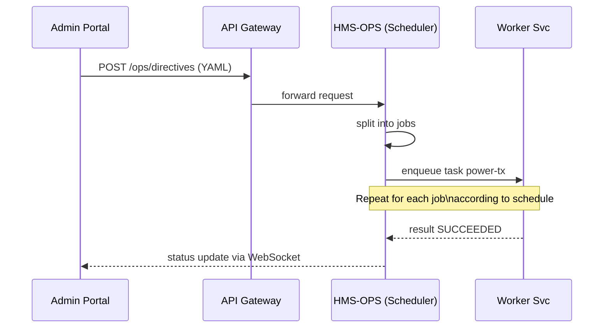

# Chapter 5: Management Layer (HMS-SVC / HMS-OPS)

*(You just learned **who** is allowed to do **what** in  
[Access Control & Authorization (RBAC/ABAC)](04_access_control___authorization__rbac_abac__.md).  
Now let’s see **how the work actually gets done once permission is granted.)*  

---

## 1 · Why Do We Need a “Management Layer”?

### One-Minute Story

The **Southwestern Power Administration (SWPA)** must send 1 000 MW of hydro-power to three states every morning **before 06:00 AM**.  

1. A policy analyst in the Admin Portal selects *“Distribute Daily Power”* for tomorrow.  
2. A single API call reaches the backend:  

   ```
   POST /ops/directives  { type:"daily-power", date:"2024-06-01" }
   ```

3. **HMS-OPS** automatically:
   • splits the directive into **3 region-specific jobs**;  
   • checks each job has a free **worker microservice**;  
   • schedules execution at **05:00 AM**;  
   • watches the clock and retries failed tasks;  
   • raises an alert if all jobs aren’t finished by **05:45 AM** (the SLO).  

Without HMS-OPS, analysts would wake up at 4 AM to click buttons manually—and citizens might lose power.

---

## 2 · Key Ideas in Plain English

| Term                     | Beginner-Friendly Meaning |
|--------------------------|---------------------------|
| Directive                | A big instruction, e.g., “Daily Power Distribution”. |
| Job                      | A slice of the directive, e.g., “Send 400 MW to Texas”. |
| Task                     | The smallest runnable unit (an HTTP or gRPC call). |
| Scheduler                | The auto-planner that picks *when* each job should run. |
| Worker Pool              | The fleet of microservices that actually do the tasks. |
| SLO (Service-Level Objective) | A promise like “finish by 06:00 AM” or “99.9 % uptime”. |
| Ops Console              | A dashboard inside the Admin Portal that shows status. |

Analogy: City hall passes an ordinance (**directive**); the COO’s office (**HMS-OPS**) breaks it into street-level work orders (**jobs & tasks**) and makes sure the garbage trucks (**workers**) finish before rush hour (**SLO**).

---

## 3 · Quick Start — Creating Your First Directive

### 3.1 Write a Job Spec (YAML)

```yaml
# File: jobs/daily-power.yaml
directive: daily-power
version: 1
schedule: "05:00"
jobs:
  - id: power-tx
    payload: { region: "TX", megawatts: 400 }
  - id: power-ok
    payload: { region: "OK", megawatts: 350 }
  - id: power-ar
    payload: { region: "AR", megawatts: 250 }
slo:
  finish_before: "06:00"
```

Explanation  
• One YAML file captures **everything**: sub-jobs, timing, and the SLO.  
• You can commit this file to Git just like code.

---

### 3.2 Submit the Directive via API

```bash
curl -X POST /ops/directives \
  -H "Authorization: Bearer <token>" \
  -H "Content-Type: application/yaml" \
  --data-binary @jobs/daily-power.yaml
```

What happens:  
1. The API Gateway authenticates your token (see Chapter 3).  
2. HMS-OPS validates the YAML schema.  
3. A record appears in the **Ops Console** with status “Scheduled”.

---

### 3.3 Check Status Later

```bash
curl /ops/directives/daily-power/2024-06-01/status
```

Example JSON response:

```json
{
  "directive": "daily-power",
  "date": "2024-06-01",
  "jobs": {
    "power-tx":  "SUCCEEDED",
    "power-ok":  "SUCCEEDED",
    "power-ar":  "RUNNING"
  },
  "slo_ok": true
}
```

---

## 4 · What Happens Under the Hood?



Key steps  
1. **Split** — YAML is parsed into individual jobs.  
2. **Schedule** — Each job is stored with a `run_at` timestamp (e.g., 05:00).  
3. **Dispatch** — At `run_at` HMS-OPS places a task onto a queue (Redis, SQS…).  
4. **Execute** — A Worker Service pulls the task and does the work.  
5. **Monitor** — HMS-OPS records duration and checks against the SLO.  
6. **Alert** — On failure or SLO breach, an incident is raised (ties into [Incident Escalation & Replacement Logic](15_incident_escalation___replacement_logic_.md)).

---

## 5 · Inside the Scheduler (Tiny Code Tour)

### 5.1 Task Enqueuer (8 lines)

```ts
// file: ops/enqueue.ts
export function enqueue(job) {
  const msg = JSON.stringify(job);
  redis.zadd('task:queue', job.runAt, msg); // score = timestamp
}
```

Explanation  
• Uses a **sorted set**; Redis pops tasks whose time ≤ `now`.

---

### 5.2 Worker Loop (14 lines)

```ts
// file: workers/power-worker.ts
while (true) {
  const msg = redis.zpopmin('task:queue', 1)[0]; // oldest task
  if (!msg) { await sleep(1000); continue; }

  const job = JSON.parse(msg);
  try {
    await callTurbineAPI(job.payload);         // do the work
    report('SUCCEEDED', job.id);
  } catch (e) {
    report('FAILED', job.id);
    retryLater(job);                           // back-off logic
  }
}
```

Explanation  
• Each worker is **generic**—it reads any job whose `type` it understands.  
• `report` sends status back to HMS-OPS for monitoring.

---

### 5.3 SLO Watchdog (9 lines)

```ts
// file: ops/slo.ts
export function checkSLO(dir) {
  const allDone = dir.jobs.every(j => j.state === 'SUCCEEDED');
  const pastDeadline = Date.now() > dir.slo.finishBefore;
  if (pastDeadline && !allDone) raiseIncident(dir.id);
}
```

Explanation  
• Runs every minute.  
• Fires an incident only if the directive is still incomplete **and** past the deadline.

---

## 6 · Hands-On: Viewing the Ops Console

Start the local dev stack:

```bash
docker compose up ops postgres redis
```

Open `http://localhost:4400/ops`.  
You’ll see a table like:

| Directive | Date       | Progress | SLO OK | Actions |
|-----------|------------|----------|--------|---------|
| daily-power | 2024-06-01 |  2/3 🟢   | 🟡      | View |

The console uses the same React components from [Interface Layer (HMS-MFE / User & Admin Portals)](01_interface_layer__hms_mfe___user___admin_portals__.md).

---

## 7 · Common Pitfalls & Easy Fixes

| Pitfall | Quick Fix |
|---------|-----------|
| Long YAML files with hundreds of jobs | Use **variables + loops** in a templating tool (e.g., Jsonnet). |
| Worker starvation (no pods available) | Enable **auto-scaling** based on queue length. |
| Silent failures (task stuck forever)  | Implement a **max runtime**; unfinished tasks are auto-marked “TIMED OUT”. |
| Forgetting to update SLOs when policy changes | Store SLOs **inside the directive file** so they version together. |

---

## 8 · Recap

You now know how HMS-OPS:

• Breaks **big directives** into **bite-sized jobs**.  
• **Schedules** and **dispatches** work to microservices.  
• Monitors **SLOs** and triggers incidents automatically.  

This orchestration only works smoothly because each job targets a small, focused service. In the next chapter we’ll design those services using a **Modular Microservice Architecture**.

[Next Chapter: Modular Microservice Architecture](06_modular_microservice_architecture_.md)

---

Generated by [AI Codebase Knowledge Builder](https://github.com/The-Pocket/Tutorial-Codebase-Knowledge)