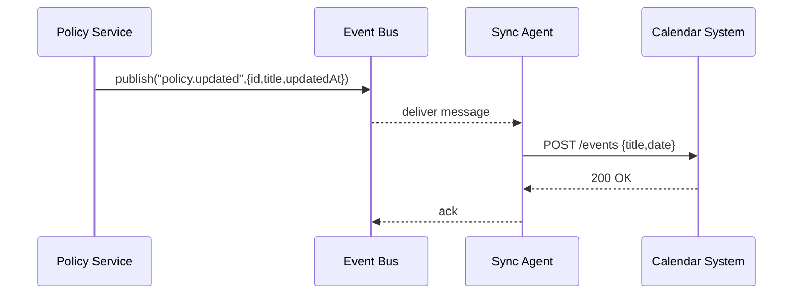

# Chapter 6: External System Synchronization

In [Chapter 5: Event Bus / Message Layer](05_event_bus___message_layer_.md) we learned how HMS-OPS broadcasts events. Now we’ll build an **External System Synchronization** layer—an “air-traffic control” that coordinates updates between HMS-OPS and outside systems (calendars, data stores, scheduling engines).

---

## 1. Motivation: Keeping Everything in Sync

Imagine the **Office for Civil Rights** updates its complaint-handling policy. We need that change to flow to:

- A shared calendar (so field officers see new deadlines).  
- A records database managed by another agency.  
- A citizen-facing portal displaying the new guidance.

Without a sync layer, each service would have to call every external API directly—easy to misconfigure, hard to scale, and prone to conflicts. Our **Sync Agents** automate this in real time.

---

## 2. Key Concepts

1. **Sync Connector**  
   A mini-adapter knowing how to talk to one external system (e.g., REST, SOAP, database).

2. **Sync Agent**  
   A service that subscribes to HMS-OPS events and invokes connectors.

3. **Message Queue**  
   From [Event Bus / Message Layer](05_event_bus___message_layer_.md): decouples HMS-OPS from sync agents.

4. **Conflict Resolution**  
   Strategies for handling simultaneous updates (e.g., last-write-wins, merge).

5. **SLA & Reliability**  
   How quickly and reliably updates must reach external systems—retries, timeouts, alerts.

---

## 3. Getting Started: A Simple Example

Suppose a policy update event arrives on the bus. Our sync agent should pick it up and push the new policy text to an external calendar service.

### connectors.json

```json
{
  "calendarService": {
    "type": "rest",
    "endpoint": "https://api.calendar.gov/events",
    "authToken": "ABC123"
  }
}
```
We define a **calendarService** connector with its URL and credentials.

### agent.js

```js
import { broker } from 'hms-ops-lib'
import connectors from './connectors.json'
import fetch from 'node-fetch'

// Listen for policy.updated events
broker.subscribe('policy.updated', async msg => {
  const url = connectors.calendarService.endpoint
  await fetch(url, {
    method: 'POST',
    headers: {
      'Authorization': `Bearer ${connectors.calendarService.authToken}`,
      'Content-Type': 'application/json'
    },
    body: JSON.stringify({
      title: msg.title,
      date: msg.updatedAt
    })
  })
})
```
Explanation:
- We load our connector config.
- We subscribe to the `policy.updated` topic.
- On each event, we POST to the calendar’s API.

---

## 4. Sequence Flow



1. **Policy Service** publishes an event.  
2. **Sync Agent** receives it from the **Event Bus**.  
3. **Agent** calls the external **Calendar System**.  
4. On success, the agent acknowledges the message.

---

## 5. Under the Hood

### 5.1 Conflict Resolution

File: `conflictResolver.js`

```js
export function resolve(local, remote) {
  // simple last-write-wins:
  return local.updatedAt > remote.updatedAt ? local : remote
}
```
Explanation: If two updates collide, the one with the newer timestamp wins.

### 5.2 SLA Configuration

File: `sla.json`

```json
{
  "policy.updated": {
    "maxRetries": 5,
    "retryIntervalMs": 2000,
    "alertOnFailure": true
  }
}
```
Explanation: Defines how many times to retry and whether to send alerts on persistent failures.

### 5.3 Full Agent Sketch

```js
import { broker } from 'hms-ops-lib'
import connectors from './connectors.json'
import sla from './sla.json'
import { resolve } from './conflictResolver'

async function pushMessage(topic, msg) {
  const cfg = sla[topic]
  for (let i = 0; i <= cfg.maxRetries; i++) {
    try {
      // invoke connector (see agent.js example)
      return
    } catch (err) {
      if (i === cfg.maxRetries && cfg.alertOnFailure) {
        console.error('Sync failure:', topic, msg)
      }
      await new Promise(r => setTimeout(r, cfg.retryIntervalMs))
    }
  }
}

broker.subscribe('policy.updated', pushMessage)
```
Explanation:
- We loop up to `maxRetries`.  
- On final failure, we log an alert.

---

## 6. Why This Matters

- **Reliability**: Agents retry and alert on failures.  
- **Decoupling**: Core HMS-OPS code only publishes events; sync logic lives externally.  
- **Scalability**: Add new connectors without touching the HMS-OPS core.  
- **Consistency**: SLAs and conflict rules enforce predictable behavior.

---

## Conclusion

You’ve learned how **External System Synchronization** uses **Sync Agents**, **Connectors**, **Message Queues**, **Conflict Resolution**, and **SLAs** to keep outside systems up to date in real time. Next up: the system’s “ambassador”—our [AI Representative Agent (HMS-A2A)](07_ai_representative_agent__hms_a2a__.md).

---

Generated by [AI Codebase Knowledge Builder](https://github.com/The-Pocket/Tutorial-Codebase-Knowledge)