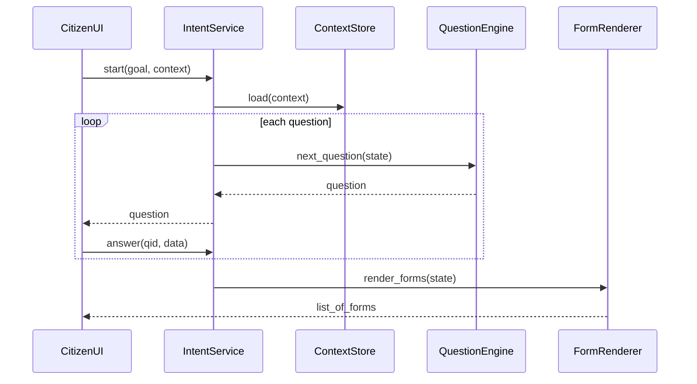

# Chapter 6: Intent-Driven Navigation

Welcome back! In [Chapter 5: Frontend Interface](05_frontend_interface_.md), we built beautiful citizen and admin portals. Now we’ll learn how to guide users step-by-step through complex tasks using **Intent-Driven Navigation**—an AI-powered wizard that adapts to each person’s goal.

---

## 6.1 Why Intent-Driven Navigation?

Imagine visiting your state’s DMV website to **renew your driver’s license**. There are multiple forms—address change, vision test waiver, REAL ID upgrade—and it’s easy to get lost.  
**Intent-Driven Navigation** acts like an interactive DMV clerk: it asks only the questions you need, then shows the exact forms or instructions you must complete. This cuts confusion, speeds up processing, and raises completion rates.

---

## 6.2 Central Use Case: Driver’s License Renewal

1. Alice logs into the DMV portal and selects “Renew License.”  
2. The system asks:
   - “Do you want a REAL ID upgrade?”  
   - “Has your address changed?”  
   - “Any medical conditions affecting vision?”  
3. Based on answers, Alice sees:
   - A REAL ID application (if requested).  
   - An address-change form (if moved).  
   - A vision-test waiver (if eligible).  
4. She completes only relevant forms and finishes in minutes—no show-ups at the office.

This dynamic flow is powered by **IntentNavigator**, our core abstraction for Intent-Driven Navigation.

---

## 6.3 Key Concepts

- **User Intent**  
  What the user wants to achieve (e.g., “renew license”).

- **Context Awareness**  
  Pre-filled data like user’s state, previous answers, role.

- **Adaptive Questions**  
  A question engine that chooses the next best question.

- **Dynamic Form Rendering**  
  Only the needed forms appear at the end.

- **Outcome Delivery**  
  Final instructions or form packages tailored to user intent.

---

## 6.4 Using IntentNavigator

Here’s a minimal Python example:

```python
from hms_ops.navigation.intent import IntentNavigator

# 1. Start a wizard for license renewal in California
nav = IntentNavigator(goal="license_renewal", context={"state": "CA"})

# 2. Get the first question
step = nav.next_step()
# step -> {"id":"q1","question":"Do you want a REAL ID upgrade?"}

# 3. Submit answer
nav.submit_answer("q1", {"real_id": True})

# 4. Next question
step2 = nav.next_step()
# step2 -> {"id":"q2","question":"Has your address changed in the last 12 months?"}

# 5. After all answers, render the final form list
if nav.is_complete():
    forms = nav.render_forms()
    # forms -> ["real_id_application.pdf", "address_change.pdf"]
    print("Download these:", forms)
```

Explanation:  
- `next_step()` returns the next question to ask.  
- `submit_answer(id, payload)` records the user’s response.  
- When all questions are done, `render_forms()` gives you the exact forms or instructions.

---

## 6.5 Under the Hood

Here’s what happens when Alice interacts with our wizard:



1. **Load context** (e.g., user profile, prior data).  
2. **Ask questions** one by one, adapting as you go.  
3. **Render final outcome**—a set of forms or instructions tailored to answers.

---

## 6.6 Internal Implementation

File: `hms_ops/navigation/intent.py`

```python
class IntentNavigator:
    def __init__(self, goal, context):
        self.goal = goal
        self.context = context
        self.state = {}  # store answers

    def next_step(self):
        # stub: pick next question based on goal & state
        if "real_id" not in self.state:
            return {"id":"q1","question":"Do you want a REAL ID upgrade?"}
        if "address_changed" not in self.state:
            return {
              "id":"q2",
              "question":"Has your address changed in the last 12 months?"
            }
        # no more questions
        return None

    def submit_answer(self, qid, answer):
        # save answer
        self.state.update(answer)

    def is_complete(self):
        return self.next_step() is None

    def render_forms(self):
        forms = []
        if self.state.get("real_id"):
            forms.append("real_id_application.pdf")
        if self.state.get("address_changed"):
            forms.append("address_change_form.pdf")
        return forms
```

Explanation:  
- We keep a simple `state` dict of answers.  
- `next_step()` checks which questions remain.  
- Once complete, `render_forms()` picks the right forms.

In a real system, the question list and form logic would live in a database or AI model, but our stub shows the basic pattern.

---

## 6.7 Analogy & Takeaways

- Like an interactive **“Choose Your Own Adventure”** book: each answer leads you down a different path, so you end up only where you need to go.  
- Similar to the IRS’s “Do I need to file?” wizard—ask a few targeted questions, then deliver the proper forms.

**Intent-Driven Navigation** makes complex government processes feel like a friendly conversation, reducing mistakes and drop-offs.

---

## 6.8 Conclusion

You’ve learned how to use **Intent-Driven Navigation** in HMS-OPS to guide users through goals like license renewals or grant applications. We covered:

- Why it matters for citizen services.  
- Key concepts: intent, context, adaptive questions, dynamic forms.  
- A hands-on example with `IntentNavigator`.  
- The internal flow and simple implementation stub.

Next up: we’ll look at how HMS-OPS breaks its backend into independent services in [Chapter 7: Microservices Architecture](07_microservices_architecture_.md).

---

Generated by [AI Codebase Knowledge Builder](https://github.com/The-Pocket/Tutorial-Codebase-Knowledge)