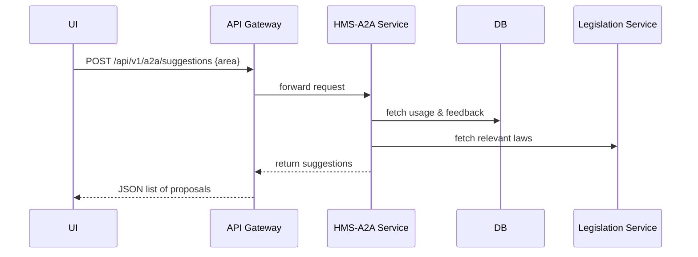

# Chapter 7: AI Representative Agent (HMS-A2A)

In the last chapter we saw how changes in HMS-OPS flow out to external systems using sync agents. Now we’ll meet the system’s “in-house consultant”: the **AI Representative Agent**, or **HMS-A2A**, which ingests data and suggests policy or process improvements.

---

## 1. Why an AI Representative Agent?

Imagine a housing agency is drowning in tenant complaints:

1. Citizens file housing complaints through an online portal.  
2. The team notices rising backlogs and missed response times.  
3. They ask HMS-A2A: “Where are we stuck?”  

HMS-A2A reads:

- Platform usage logs (how long each step takes).
- Stakeholder feedback (user survey comments).
- Relevant laws and guidelines (legislative context).

It then recommends, for example, “Add an automated triage form for Section 8 appeal complaints” to cut triage time in half.

For beginners, this feels like an automated consultant you can query. For experts, you can customize its plugins, tune its models, and set governance rules so it only auto-applies high-confidence suggestions.

---

## 2. Key Concepts

1. **Data Ingestion**  
   Collects usage metrics, feedback entries, legislative rules.

2. **Analysis Engine**  
   Runs ML models or rule-based plugins to spot bottlenecks.

3. **Suggestion API**  
   Exposes a simple endpoint to fetch recommended adjustments.

4. **Plugin Architecture**  
   Loadable modules (“mini-apps”) that encapsulate different analyses.

5. **Governance & HITL**  
   Human-in-the-loop thresholds and rules to balance autonomy with oversight.

---

## 3. Getting Started: Requesting Suggestions

Here’s how a front-end component asks HMS-A2A for ideas on complaint handling:

```js
// hms-mfe/src/components/AgentAdvisor.js
async function loadSuggestions() {
  const res = await fetch('/api/v1/a2a/suggestions', {
    method: 'POST',
    headers: {'Content-Type': 'application/json'},
    body: JSON.stringify({ area: 'complaintHandling' })
  });
  const { suggestions } = await res.json();
  console.log('AI Suggestions:', suggestions);
}
```

Explanation:
- We POST the domain of interest (`complaintHandling`).
- HMS-A2A returns an array of suggestion objects (`{ id, text, confidence }`).
- The UI can render these for a policy manager to review.

---

## 4. Sequence Flow

Here’s what happens when you ask for suggestions:



---

## 5. Under the Hood

### 5.1 How Suggestions Are Generated

File: `hms-a2a/src/agentService.js`

```js
import { getUsageData } from './dataFetcher'
import { fetchLaws }      from './legislationClient'
import plugins             from './plugins.json'

export async function generateSuggestions(area) {
  const usage = await getUsageData(area)
  const laws  = await fetchLaws(area)
  let suggestions = []
  for (const p of plugins.enabled) {
    const result = await p.run(usage, laws)
    suggestions.push(...result)
  }
  return suggestions
}
```

Explanation:
- We load usage metrics and laws for the given area.
- We loop through each enabled plugin and collect its results.
- Each plugin returns zero or more suggestion objects.

### 5.2 Plugin Configuration

File: `hms-a2a/config/plugins.json`

```json
{
  "enabled": [
    { "name": "bottleneckFinder", "path": "./plugins/bottleneckFinder.js" },
    { "name": "policyCompliance", "path": "./plugins/policyCompliance.js" }
  ]
}
```

Explanation:
- Each plugin has a `name` and file `path`.
- You can add your own plugins to perform new analyses.

### 5.3 Governance & Human-in-the-Loop

File: `hms-a2a/config/governance.json`

```json
{
  "autoApplyThreshold": 0.85,
  "maxAutoActionsPerDay": 3
}
```

Explanation:
- Suggestions with `confidence >= 0.85` can be auto-applied (if under the daily limit).
- Lower-confidence results show up for manual review in the [Administrator UI](01_interface_layer__hms_mfe___hms_gov__.md).

---

## 6. Why This Matters

- **For beginners**: It’s an automated policy consultant you can query with one API call.  
- **For experts**: You can write plugins, tweak ML thresholds, and govern exactly how much autonomy the agent has.  
- **For agencies**: It spotlights hidden bottlenecks and compliance gaps, helping improve citizen services faster.

---

## Conclusion

You’ve learned how **HMS-A2A** acts like a digital advisor—ingesting data, running plugins, and surfacing policy or process recommendations. Next up, we’ll see how these suggestions fit into a full [Process Optimization Workflow](08_process_optimization_workflow_.md) that can drive real changes in HMS-OPS.

---

Generated by [AI Codebase Knowledge Builder](https://github.com/The-Pocket/Tutorial-Codebase-Knowledge)