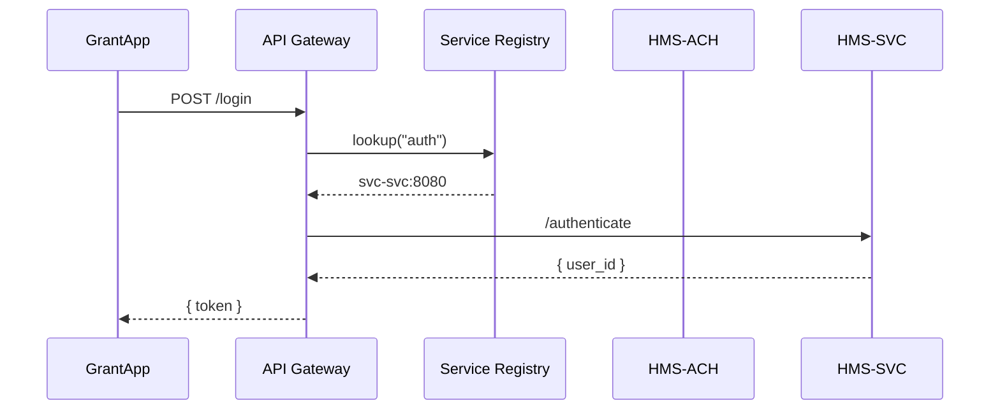

# Chapter 7: Microservices Architecture

Welcome back! In [Chapter 6: Intent-Driven Navigation](06_intent_driven_navigation_.md) we learned how to guide users step-by-step through complex tasks. Now let’s see how HMS-OPS breaks its backend into a **cabinet of specialized agencies**—the **Microservices Architecture**.

---

## 1. Why Microservices Architecture?

Imagine a federal grants portal:

- **Authentication** (HMS-SVC) checks who you are.  
- **Payment** (HMS-ACH) handles disbursing funds.  
- **Analytics** (HMS-ANL) tracks usage and trends.  
- **Messaging** (HMS-MSG) sends notifications.

If all this lived in one giant app, updating the payment logic for one grant program could risk breaking authentication or analytics. By splitting into small, independent services—each with its own code, data store, and deployment—you gain:

- **Scalability**: Spin up more payment instances during peak disbursements.  
- **Fault Tolerance**: If analytics goes down, payments and auth still work.  
- **Independent Deployments**: Update payment code (HMS-ACH) without touching auth.  
- **Clear APIs**: Services talk over well-defined, versioned interfaces.

---

## 2. Central Use Case: Disbursing a Grant

Scenario: The Department of Labor approves a training grant. The portal must:

1. Verify the user’s identity with HMS-SVC.  
2. Record the transaction in HMS-ANL for reporting.  
3. Trigger the fund transfer in HMS-ACH.  
4. Send an email via HMS-MSG.

All steps happen through small, focused services talking over HTTP APIs.

---

## 3. Key Concepts

- **Service Boundary**  
  Each microservice owns one function—auth, payments, analytics, messaging.

- **API Contract**  
  JSON over HTTP (or gRPC) defines how services communicate. Versioned for safe upgrades.

- **Service Registry**  
  A directory where each service announces its endpoint. Other services look up addresses here.

- **API Gateway**  
  A single entry point for clients. Routes requests to the appropriate microservice.

- **Independent Lifecycle**  
  Build, test, deploy, and scale each service on its own schedule.

---

## 4. Using Microservices in Code

Here’s a minimal Python example showing how a parts of the grant workflow might run:

```python
from hms_ops.svc import AuthService
from hms_ops.ach import PaymentService
from hms_ops.anl import AnalyticsService
from hms_ops.msg import MessagingService

# 1. Authenticate user
user = AuthService().login(username="alice", password="secret")
if not user:
    raise Exception("Invalid credentials")

# 2. Record grant event
AnalyticsService().track_event("grant_approved", {"user": user.id, "amount": 50000})

# 3. Execute payment
payment = PaymentService().transfer(to_account="123-456", amount=50000)

# 4. Notify recipient
MessagingService().send_email(user.email, "Your grant has been disbursed", f"Txn ID: {payment.id}")
```

Explanation:
1. `AuthService()` calls HMS-SVC to log in.  
2. `AnalyticsService()` logs the approved grant.  
3. `PaymentService()` calls HMS-ACH to transfer funds.  
4. `MessagingService()` sends a confirmation email via HMS-MSG.

Each line calls a tiny service focused on one job.

---

## 5. What Happens Under the Hood



1. **Lookup**: Gateway asks the registry where `auth` lives.  
2. **Route**: Gateway forwards `/authenticate` to HMS-SVC.  
3. **Respond**: HMS-SVC verifies creds and returns a token.

A similar flow happens for payments and analytics.

---

## 6. Internal Implementation

Below is a simple **Service Registry** and **API Gateway** stub.

### 6.1 Service Registry (`hms_ops/microservices/registry.py`)

```python
class ServiceRegistry:
    def __init__(self):
        self._services = {}

    def register(self, name, url):
        self._services[name] = url

    def get(self, name):
        return self._services.get(name)
```

This registry holds in-memory mappings like:
- `"auth" -> "http://svs-auth:8000"`
- `"payment" -> "http://svs-pay:8010"`

### 6.2 API Gateway (`hms_ops/microservices/api_gateway.py`)

```python
from .registry import ServiceRegistry
import requests

class APIGateway:
    def __init__(self):
        self.registry = ServiceRegistry()

    def route(self, service_name, path, payload):
        url = self.registry.get(service_name)
        # Forward the request to the microservice
        resp = requests.post(f"{url}{path}", json=payload)
        return resp.json()
```

- `register()` and `get()` let each service announce its endpoint.
- `route()` abstracts HTTP forwarding.

---

## 7. Analogy & Takeaways

- Think of each microservice as its own **federal agency**:
  - **HMS-SVC** is the passport office (identity).  
  - **HMS-ACH** is the Treasury (payments).  
  - **HMS-ANL** is the GAO (analytics).  
  - **HMS-MSG** is the USPS (messaging).

They collaborate through clear APIs—no one agency hoards all the data or logic.

---

## Conclusion

You’ve learned:

- What microservices are and why they matter in federal contexts.  
- How HMS-OPS splits responsibilities into small, deployable services.  
- A hands-on example calling auth, analytics, payment, and messaging.  
- A peek at the registry and API gateway under the hood.

Next up: dive into the broader **[Backend API](08_backend_api_.md)**, where these services expose their full feature sets.

---

Generated by [AI Codebase Knowledge Builder](https://github.com/The-Pocket/Tutorial-Codebase-Knowledge)