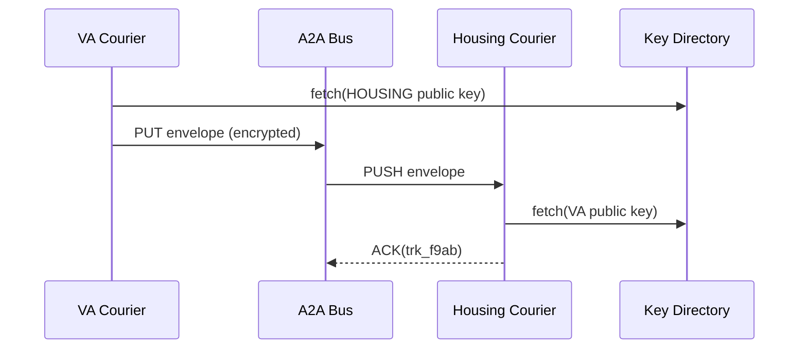

# Chapter 8: Inter-Agency Communication Bus (HMS-A2A)

*(continues from [Chapter 7: Workflow Orchestrator (HMS-ACT / OMS)](07_workflow_orchestrator__hms_act___oms__.md))*  

---

## 1  Why do we need HMS-A2A?

Imagine a veteran named **Lila** applying for low-income housing through her city portal.

1. The **Housing Authority** must check that Lila’s disability rating is ≥ 70 % (held by the **Department of Veterans Affairs – VA**).  
2. The VA must not expose Lila’s entire medical file—only the disability percentage.  
3. Both agencies must keep a provable audit trail or risk violating HIPAA and Privacy Act rules.

E-mailing CSV files back and forth is a legal disaster waiting to happen.

**HMS-A2A is the secure courier between agencies.**  
It:

* Wraps each data parcel in a signed, encrypted **envelope**.  
* Delivers it over a policy-aware **route**.  
* Records every hand-off so auditors can replay the trip later.

Think of it as **“FedEx for government data,”** complete with tamper-evident seals and real-time tracking.

---

## 2  Key Concepts (Beginner Friendly)

| Word | Analogy | Why it matters |
|------|---------|----------------|
| **Parcel** | The box | Actual JSON/CSV/PDF you’re sending. |
| **Envelope** | Bubble-mailer with security seal | Holds the parcel + metadata + signature. |
| **Route** | The delivery path | Sequence of agencies that may handle the parcel. |
| **Courier** | Delivery van | HMS-A2A runtime that moves envelopes between routes. |
| **Tracking ID** | FedEx number | Lets anyone with permission see live status. |
| **Public-Key Directory** | Address book of padlocks | Where couriers fetch each agency’s encryption key. |

Remember these six words; almost everything in A2A is just a variation on them.

---

## 3  Quick-Start: Send Lila’s Disability Rating to Housing

We’ll simulate the VA sending the single data point to the Housing Authority.

### 3.1  Install the SDK

```bash
pip install hms-a2a
```

### 3.2  Sender side (VA)

```python
# file: send_parcel.py  (18 lines)
from hms_a2a import Courier, Envelope

va = Courier(agency="VA")

parcel = {"veteran_id": "V12345", "disability_pct": 80}

envelope = Envelope(
    parcel=parcel,
    to_agency="HOUSING",
    purpose="BENEFITS_DETERMINATION",
    retention="30d"
)

tracking_id = va.send(envelope)
print("📦 Sent! Track with:", tracking_id)
```

Explanation  
1. `Courier` loads VA’s private key automatically.  
2. `Envelope` is signed, then encrypted with Housing’s public key.  
3. `send()` places it on the A2A bus; you get a `tracking_id` like `trk_f9ab`.

### 3.3  Receiver side (Housing Authority)

```python
# file: receive_parcel.py  (13 lines)
from hms_a2a import Courier

housing = Courier(agency="HOUSING")

for envelope in housing.inbox(purpose="BENEFITS_DETERMINATION"):
    data = envelope.open()         # decrypts & verifies signature
    print("Received:", data)       # {'veteran_id':'V12345', 'disability_pct':80}
    envelope.ack()                 # mark delivered
```

Explanation  
* `inbox()` streams all waiting envelopes addressed to HOUSING.  
* `open()` fails if the signature or policy tag is invalid.  
* `ack()` finalizes delivery and stops retries.

### 3.4  Tracking the parcel (anywhere)

```python
from hms_a2a import track
print(track("trk_f9ab"))
```

Sample output:

```json
{
  "status": "DELIVERED",
  "route": ["VA", "A2A_BUS", "HOUSING"],
  "timestamps": {
      "VA_OUT": "2024-06-02T14:11Z",
      "HOUSING_IN": "2024-06-02T14:12Z"
  }
}
```

---

## 4  What happens under the hood?



Plain-English steps:

1. Sender fetches recipient’s public key.  
2. Envelope is **signed then encrypted** (sign-then-encrypt order prevents tampering).  
3. BUS stores the blob and notifies the recipient.  
4. Receiver decrypts, verifies the signature, processes, and acknowledges.  
5. BUS stamps each transition into the immutable **Tracking Ledger**.

---

## 5  Peek Inside the Implementation

### 5.1  Sign-then-encrypt (simplified, 19 lines)

```python
# file: crypto.py
from cryptography.hazmat.primitives import serialization, hashes
from cryptography.hazmat.primitives.asymmetric import padding, rsa

def seal(parcel, from_priv, to_pub):
    # 1. sign
    signature = from_priv.sign(
        parcel,
        padding.PSS(mgf=padding.MGF1(hashes.SHA256()), salt_length=32),
        hashes.SHA256()
    )
    blob = signature + b"::" + parcel

    # 2. encrypt
    cipher = to_pub.encrypt(
        blob,
        padding.OAEP(mgf=padding.MGF1(hashes.SHA256()), algorithm=hashes.SHA256(), label=None)
    )
    return cipher
```

Beginners: just see the two steps—`sign()` then `encrypt()`.

### 5.2  Router snippet (12 lines)

```python
# file: router.py
import queue, threading

outbox = queue.Queue()   # envelopes to deliver

def run_router():
    while True:
        env = outbox.get()
        dest = env["to_agency"]
        link = peer_conn(dest)
        link.send(env["cipher"])
        tracking.log(env["id"], stage=f"BUS→{dest}")
```

The real router handles retries/ordering, but conceptually it’s just a queue plus a network send.

---

## 6  Policy & Compliance Guardrails

* HMS-A2A consults the [Governance Layer (HMS-GOV)](02_governance_layer__hms_gov__.md) to ensure the **purpose tag** (`BENEFITS_DETERMINATION`) is allowed between VA → HOUSING.  
* The **Compliance & Legal Reasoner (HMS-ESQ)** can scan Tracking Ledger entries for retention or jurisdiction issues.  
* **Identity, Access & Authorization** (see upcoming [Chapter 10](10_identity__access___authorization_.md)) supplies API tokens so only legitimate couriers can call `send()` or `inbox()`.

---

## 7  Beginner FAQ

**Q:** Do I have to manage keys?  
**A:** No. The platform’s key-vault rotates keys and publishes public certs to the directory automatically.

**Q:** What if the receiver is offline?  
A2A retries with exponential back-off for 7 days, then escalates to a human.

**Q:** Can I send large files (e.g., 500 MB MRI scan)?  
Yes. Envelopes can reference S3-style object URLs encrypted with the same key pair.

**Q:** How is this different from e-mail with S/MIME?  
A2A adds enforced routing, retries, SLA monitoring, automatic policy checks, and a uniform API—no messy inbox parsing.

---

## 8  Recap

In this chapter you:

1. Learned why cross-agency data exchange needs strict security and auditability.  
2. Sent an encrypted, signed parcel from the **VA** to a **Housing Authority** in < 20 lines of code.  
3. Tracked its journey end-to-end.  
4. Peeked at the minimal crypto and routing logic under the hood.  
5. Saw how governance and compliance layers wrap around every parcel automatically.

Next we’ll explore how HMS talks to **completely external systems** (e.g., state DMV APIs or legacy mainframes) through adapters.  

Continue to [Chapter 9: External System Adapter](09_external_system_adapter_.md).

---

Generated by [AI Codebase Knowledge Builder](https://github.com/The-Pocket/Tutorial-Codebase-Knowledge)