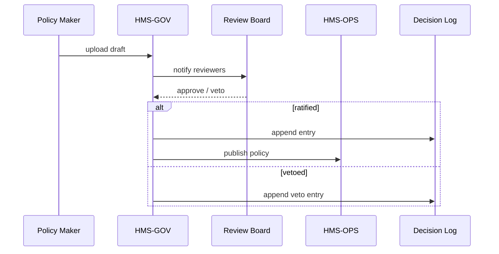

# Chapter 9: Governance Layer (HMS-GOV)

*(coming from [External System Sync Connector](08_external_system_sync_connector_.md) — we just learned how data *leaves* HMS; now we decide **what is allowed to change in the first place**).*

---

## 1 · Why Have a “Governance Layer”?

### One-minute story — “The Fraud Threshold Bill”

The **Postal Regulatory Commission (PRC)** runs an AI that flags suspicious parcel shipments.  
Last month the model suggested raising the fraud-score threshold from **0.70 ➜ 0.85**.  
Cool idea, *but*:

1. The Department of Justice (DOJ) worries this may hide evidence.  
2. The Farm Credit Administration (FCA) wants public transparency.  
3. Federal rules (DISA STIGs) require a signed audit trail of every change.

The **Governance Layer (HMS-GOV)** is “city hall” for that decision:

*Draft → debate → amend → approve/veto → publish → immutable record.*

Without HMS-GOV the AI tweak might slip straight to production, breaking laws and public trust.

---

## 2 · Key Ideas in Plain English

| Term                 | Beginner Meaning (government flavoured)                     |
|----------------------|-------------------------------------------------------------|
| Policy Draft         | A proposed rule (e.g., “fraudThreshold = 0.85”).            |
| Review Board         | Human officials who must sign or veto the draft.            |
| Governance Portal    | The “counter window” where drafts are viewed & signed.      |
| Decision Log         | Tamper-proof journal of *every* action (like the Federal Register). |
| Enforcement API      | Tiny endpoint other services call to fetch the **ratified** rules. |

Think of **drafts** as *bills*, **ratified policies** as *laws*, and the **log** as the *Congressional Record*.

---

## 3 · Quick Start — Passing Your First Policy

We’ll raise the PRC fraud threshold as a hands-on example.

### 3.1 Write the Draft (8-line YAML)

```yaml
# fraud-threshold-v2.yaml
id: fraud-threshold
version: 2
title: Raise fraud score threshold
proposedBy: "ai-model-42"
changes:
  fraudThreshold: 0.85
rationale: >
  Model retrained on 2024 data; precision up 6 %.
```

**What you wrote**

* **id + version** make the policy uniquely addressable.  
* **changes** is plain key/value — HMS-GOV stays format-agnostic.

---

### 3.2 Submit via CLI or Portal (single cURL)

```bash
curl -X POST /gov/policies/drafts \
  -H "Authorization: Bearer <token>" \
  -F file=@fraud-threshold-v2.yaml
```

Expected JSON back:

```json
{ "draftId": "abc123", "status": "UNDER_REVIEW" }
```

---

### 3.3 Approve in the Governance Portal

1. Open **Admin → Governance → Drafts**.  
2. Click draft **abc123**.  
3. Read AI justification, add comment *“Need DOJ sign-off.”*  
4. Click **Approve** (your signature auto-adds).  

When the last required reviewer signs, status = **RATIFIED**.

---

### 3.4 Verify Enforcement

```bash
curl /gov/policies/fraud-threshold/latest
```

Returns:

```json
{ "version": 2, "fraudThreshold": 0.85, "signedBy": ["PRC","DOJ"] }
```

Every downstream service (API Gateway, workers, connectors) now obeys `0.85`.

---

## 4 · What Happens Under the Hood?



*≤5 participants to stay beginner-friendly.*

---

## 5 · Inside HMS-GOV (Tiny Code Tour)

### 5.1 Schema Validation (10 lines)

```ts
// gov/validate.ts
import Ajv from 'ajv';
const schema = { type:'object',
  required:['id','version','changes'],
  additionalProperties:true };
export const ok = new Ajv().compile(schema);
```

*If `ok(draft)` is false, HMS-GOV rejects the upload with 400 Bad Request.*

---

### 5.2 Review Queue (12 lines)

```ts
// gov/queue.ts
import redis from 'redis';
export function enqueue(draftId, reviewers){
  reviewers.forEach(r =>
    redis.lpush(`review:${r}`, draftId)); // one list per reviewer
}
```

*Each reviewer sees their personal queue in the Portal.*

---

### 5.3 Tamper-Proof Decision Log (18 lines)

```ts
// gov/log.ts
import fs from 'fs';
export function append(event){
  const line = JSON.stringify({ ts:Date.now(), ...event }) + '\n';
  fs.appendFileSync('/var/log/gov/ledger.log', line, { mode:0o444 }); // read-only
}
```

*Ledger file is mounted on **WORM** (Write Once Read Many) storage; even root can’t edit old lines.*

---

### 5.4 Enforcement API Extract (14 lines)

```ts
// gov/routes.ts
app.get('/policies/:id/latest', async (req,res)=>{
  const policy = await db
     .collection('policies')
     .find({ id:req.params.id })
     .sort({ version:-1 })
     .limit(1)
     .toArray();
  res.json(policy[0]);
});
```

*Other HMS layers call this endpoint at startup or on a “policy-updated” event.*

---

## 6 · Common Pitfalls & Easy Fixes

| Pitfall                                   | Quick Fix |
|-------------------------------------------|-----------|
| “Shadow changes” directly in code         | Gateway forces every config read via **Enforcement API**; block env-var overrides. |
| Reviewers forget to sign                  | Set `auto-reminder: 24h` in board settings; emails + Slack DM. |
| Version collisions (two drafts both v3)   | HMS-GOV auto-bumps conflicting version to *next free integer*. |
| Huge YAML blobs (>1 MB)                   | Enforce `maxSize` and push complex data to Git repo; policy holds just a commit hash. |

---

## 7 · Why Agencies & Auditors Love This

* DISA gets **immutable evidence** that only approved settings reach prod.  
* GAO auditors download **ledger.log** and reconstruct the entire timeline.  
* Citizens see transparency dashboards because the log is exportable (redacted).

---

## 8 · Recap & What’s Next

In this chapter you:

• Drafted, reviewed, and ratified a policy.  
• Saw how HMS-GOV queues reviewers, writes an indelible log, and publishes rules for the rest of HMS.  
• Learned simple code snippets that power validation, queuing, and logging.

Up next we automate delivery of these policies across staging → production with rollbacks and smoke tests in  
[Policy Versioning & Deployment Pipeline](10_policy_versioning___deployment_pipeline_.md).

---

Generated by [AI Codebase Knowledge Builder](https://github.com/The-Pocket/Tutorial-Codebase-Knowledge)