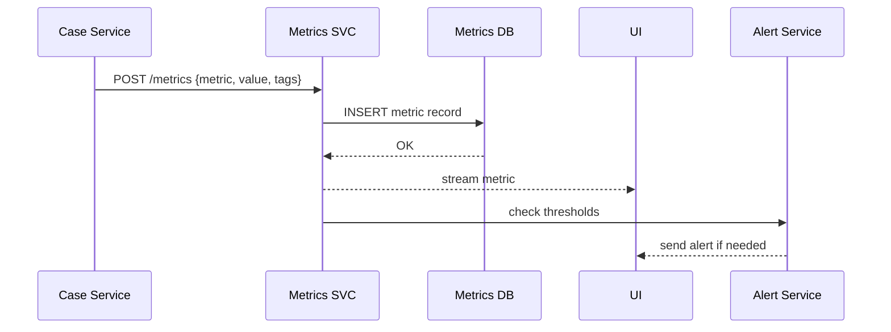

# Chapter 9: Metrics & Monitoring

In [Chapter 8: Process Optimization Workflow](08_process_optimization_workflow_.md), we saw how HMS-OPS finds and deploys process improvements. Now let’s build the system’s control room: **Metrics & Monitoring**. Think of this as the real-time dashboard and performance lab for your agency.

---

## 1. Why Metrics & Monitoring?

Imagine the **Office of Case Management** at the Department of Transportation runs a hotline for permit disputes. They need to know:

- How many cases are resolved per hour (throughput)?
- Are they meeting the 48-hour response SLA?
- How satisfied are callers after each resolution?
- Are there spikes in conflicts when two agents handle the same case?

Without live insights, they can’t spot slowdowns or unhappy citizens until it’s too late. **Metrics & Monitoring** gives you a glass-walled control room showing key performance indicators (KPIs) and alerts when something breaks.

---

## 2. Key Concepts

1. **Throughput**  
   The rate of completed actions (e.g., “cases resolved per hour”).

2. **SLA Adherence**  
   Percentage of tasks finished within the target time (e.g., 90% under 48 hours).

3. **User Satisfaction Scores**  
   Citizen feedback collected after a case closes (e.g., stars or NPS).

4. **Conflict Resolution Metrics**  
   How often two or more agents edit the same case and how quickly those conflicts clear.

5. **Dashboards & Alerts**  
   Live graphs, charts, and custom triggers (email, SMS) when KPIs cross thresholds.

---

## 3. A Simple Usage Example

Here’s how a backend service can push metrics, and how a UI can display them.

### 3.1 Tracking a Case Resolution

File: `hms-monitor/src/metricsClient.js`

```js
// Minimal client to send a metric
export async function track(metricName, value, tags = {}) {
  await fetch('http://metrics-svc/metrics', {
    method: 'POST',
    headers: {'Content-Type': 'application/json'},
    body: JSON.stringify({ metricName, value, tags, timestamp: Date.now() })
  })
}
```

Explanation:  
- We call `track()` with a name, numeric value, and optional tags (e.g., `{caseId, agentId}`).  
- The metrics service ingests and stores it.

### 3.2 Rendering Live Charts

File: `hms-monitor/src/Dashboard.js`

```js
import React, { useEffect, useState } from 'react'

export default function Dashboard() {
  const [data, setData] = useState([])
  useEffect(() => {
    const es = new EventSource('/metrics/stream')
    es.onmessage = e => setData(d => [...d, JSON.parse(e.data)])
    return () => es.close()
  }, [])
  return (
    <div>
      <h2>Cases Resolved Per Hour</h2>
      {/* Imagine a simple line chart with `data` */}
    </div>
  )
}
```

Explanation:  
- We open a Server-Sent Event stream at `/metrics/stream`.  
- Each message is a new metric point.  
- A chart component updates in real time.

---

## 4. Sequence of Events



1. **Case Service** pushes a metric after each resolution.  
2. **Metrics Service** writes it to the **Metrics DB**.  
3. It streams the update to **Dashboard UI**.  
4. It also checks alert rules and notifies **Alert Service** if thresholds are exceeded.

---

## 5. Under the Hood

### 5.1 Metrics Service (hms-monitor/src/server.js)

```js
const express = require('express')
const bodyParser = require('body-parser')
const { broadcast, checkAlerts } = require('./helpers')
const db = require('./db')  // simple DB client

const app = express()
app.use(bodyParser.json())

app.post('/metrics', async (req, res) => {
  const { metricName, value, tags, timestamp } = req.body
  await db.insert('metrics', { metricName, value, tags, timestamp })
  broadcast({ metricName, value, tags, timestamp })
  checkAlerts(metricName, value, tags)
  res.sendStatus(204)
})

app.get('/metrics/stream', (req, res) => {
  // Set headers for SSE
  res.writeHead(200, { 'Content-Type': 'text/event-stream' })
  // Keep connection open
  const send = msg => res.write(`data: ${JSON.stringify(msg)}\n\n`)
  broadcast.subscribe(send)
  req.on('close', () => broadcast.unsubscribe(send))
})
```

Explanation:  
- We accept metric posts, store them, then broadcast via SSE.  
- We also run `checkAlerts()` to fire any threshold-based notifications.

### 5.2 Alerting Helpers (hms-monitor/src/helpers.js)

```js
const thresholds = {
  'case.resolved.rate': { warning: 5, critical: 2 } // per hour
}

function checkAlerts(name, value) {
  const cfg = thresholds[name]
  if (!cfg) return
  if (value < cfg.critical) sendAlert('critical', name, value)
  else if (value < cfg.warning) sendAlert('warning', name, value)
}

module.exports = { broadcast: createBroadcast(), checkAlerts }
```

Explanation:  
- We define simple threshold rules.  
- `checkAlerts` fires warnings or critical alerts when values drop below thresholds.

---

## 6. Why This Matters

- **For beginners**: You get a one-stop dashboard showing health and performance—no code sprawl.  
- **For experts**: You can add custom KPIs, write advanced alert rules, correlate logs, and connect to external monitoring tools.  
- **For agencies**: Continuous visibility into SLAs, citizen satisfaction, and process conflicts drives faster service improvements.

---

## Conclusion

In this chapter you learned how to collect, store, visualize, and alert on key metrics—turning raw events into a live performance control room. Next up: adding a safety net when things go off-script in [Human-in-the-Loop (HITL) Override](10_human_in_the_loop__hitl__override_.md).

---

Generated by [AI Codebase Knowledge Builder](https://github.com/The-Pocket/Tutorial-Codebase-Knowledge)