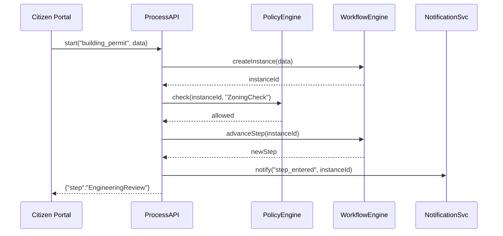

# Chapter 9: Process & Policy Module

Continuing from [Chapter 8: Backend API](08_backend_api_.md), we now introduce the **Process & Policy Module**—the digital rulebook that models government processes, approval steps, and policy rules in HMS-OPS.

## 1. Why a Process & Policy Module?

Imagine a city’s Planning Department issuing building permits. Each permit follows a set of steps:

1. Submit application & documents (site plan, environmental report).  
2. Check zoning rules (height limits, land use).  
3. Route to Engineering for safety review.  
4. Notify applicant of approval or required fixes.

Hard-coding these steps in every portal is a maintenance nightmare. The **Process & Policy Module** makes this configurable:

- Define each step, required documents, decision criteria, and notifications as objects.  
- Administrators use an editor to tweak rules—no developers needed.  
- Changes flow automatically to front-end forms and back-end engines.

## 2. Central Use Case: Building Permit Workflow

Let’s walk through “Green City” issuing a building permit:

1. Citizen uploads site plan and fee receipt.  
2. System checks policy: is the lot size ≥ 500 sqft?  
3. If OK, it creates an Engineering review task.  
4. Engineering approves or requests changes.  
5. Applicant gets notified by email.

We’ll see how to model this in HMS-OPS.

## 3. Key Concepts

1. **ProcessDefinition**  
   A named workflow with ordered steps (e.g. “Submit → ZoningCheck → EngineeringReview → Notify”).  

2. **PolicyRule**  
   A rule tied to a step, with criteria (e.g. `lot_size >= 500`).  

3. **DocumentType**  
   Required documents for a process (e.g. “site_plan.pdf”).  

4. **WorkflowInstance**  
   A running request following the definition, tracking current step and status.  

5. **Notifications**  
   Configured messages sent on events (step entered, approved, or rejected).

## 4. Modeling a Process: Example

Below is a minimal Python example showing how an admin might define the building-permit process:

```python
from hms_ops.process_policy import ProcessManager, Step, PolicyRule, DocType

pm = ProcessManager()

# 1. Create process definition
proc = pm.create_process("building_permit")

# 2. Add steps and link a policy rule
proc.add_step(Step("ZoningCheck"))
proc.add_rule("ZoningCheck", PolicyRule("lot_size >= 500"))

# 3. Require a site plan document
proc.add_document("ZoningCheck", DocType("site_plan.pdf"))

# 4. Final notify step
proc.add_step(Step("NotifyApplicant"), notify=True)

pm.save(proc)
print("Process defined:", proc.name)
```

Explanation:  
- `create_process`: starts a new workflow.  
- `add_step`: defines each stage.  
- `add_rule`: enforces a policy at that step.  
- `add_document`: marks needed uploads.  
- `notify`: sends an email when the step is reached.

## 5. Running the Workflow

When a citizen submits their documents, you start a new instance:

```python
from hms_ops.process_policy import ProcessManager

# 1. Launch a workflow instance
pm = ProcessManager()
instance = pm.start("building_permit", applicant_id="user123",
                    data={"lot_size":600})

# 2. Check status
print("Current step:", instance.current_step)
# -> "ZoningCheck"

# 3. After upload, evaluate policy
result = pm.evaluate_step(instance.id)
# result.allowed -> True or False
```

- `start()`: creates a `WorkflowInstance`.  
- `evaluate_step()`: runs policy checks and moves you to the next step.

## 6. What Happens Under the Hood



1. **start**: UI calls ProcessAPI to create a workflow instance.  
2. **check**: API asks the PolicyEngine if criteria pass.  
3. **advanceStep**: WorkflowEngine updates the instance.  
4. **notify**: NotificationSvc emails the applicant.

## 7. Internal Implementation

### 7.1 Process Manager (`hms_ops/process_policy/manager.py`)

```python
class ProcessManager:
    def __init__(self):
        self.store = ProcessStore()
        self.engine = WorkflowEngine()
        self.policy = PolicyEngine()
        self.notify = NotificationService()

    def create_process(self, name):
        return self.store.new_process(name)
    # ...
    def start(self, name, applicant_id, data):
        proc = self.store.get(name)
        return self.engine.start(proc, applicant_id, data)

    def evaluate_step(self, instance_id):
        inst = self.engine.get_instance(instance_id)
        rule = inst.current_rule
        allowed = self.policy.check(rule, inst.data)
        if allowed:
            self.engine.advance(inst)
            self.notify.step_entered(inst)
        return SimpleNamespace(allowed=allowed)
```

### 7.2 Policy Engine (`hms_ops/process_policy/policy.py`)

```python
class PolicyEngine:
    def check(self, rule, data):
        # Very simple eval for demo purposes
        return eval(rule.expression, {}, data)
```

### 7.3 Workflow Engine (`hms_ops/process_policy/workflow.py`)

```python
class WorkflowEngine:
    def start(self, proc, applicant_id, data):
        inst = WorkflowInstance(proc, applicant_id, data)
        inst.current_step = proc.steps[0]
        return inst

    def advance(self, inst):
        idx = inst.proc.steps.index(inst.current_step)
        inst.current_step = inst.proc.steps[idx+1]
```

These snippets show how definitions, policy checks, and workflow state tie together.

## 8. Analogy & Takeaways

- Think of a **board game**: the process definition is the rulebook, steps are spaces on the board, and policy rules are the instructions on each space. The WorkflowEngine moves your token (instance) from space to space, and PolicyEngine checks if you rolled the right number. Notifications are the announcer telling you “You landed on Go—collect \$200.”

- By modeling permit workflows as data, administrators can update rules and steps without rewriting code.

## Conclusion

In this chapter you learned how the **Process & Policy Module** in HMS-OPS:

- Models government workflows as configurable objects.  
- Defines steps, policy criteria, and document requirements.  
- Links to back-end enforcement (PolicyEngine) and front-end forms.  
- Automatically reflects changes in live workflows.

Next up: resolve overlapping rules with [Conflict Resolution Mechanism](10_conflict_resolution_mechanism_.md).

---

Generated by [AI Codebase Knowledge Builder](https://github.com/The-Pocket/Tutorial-Codebase-Knowledge)