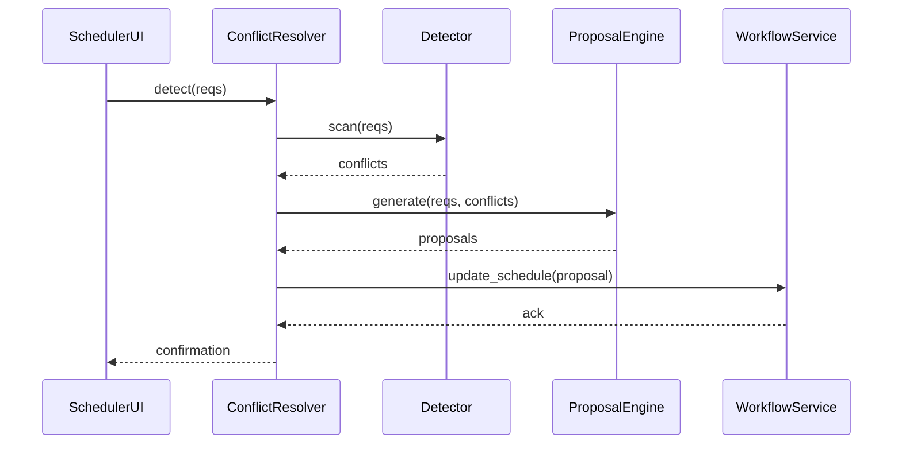

# Chapter 10: Conflict Resolution Mechanism

Welcome back! In [Chapter 9: Process & Policy Module](09_process___policy_module_.md) we learned how HMS-OPS models workflows and policy rules. Now we’ll tackle **conflicts**—situations where processes or stakeholders compete for the same resource or approval—and see how the **Conflict Resolution Mechanism** mediates automatically.

---

## 1. Why Conflict Resolution Matters

Imagine two federal agencies both request the same secure lab time on a high-performance computing cluster. Without coordination:

- One request may block the other, causing delays.  
- Manual arbitration by a central office wastes time.  
- Stakeholders get frustrated and productivity drops.

The **Conflict Resolution Mechanism** in HMS-OPS acts like an AI-driven mediator:

1. **Detect** overlapping approvals or bottlenecks.  
2. **Analyze** using simple rules or ML models.  
3. **Propose** workflow adjustments (reschedule, split time).  
4. **Seek** stakeholder sign-off if needed.  
5. **Apply** the agreed resolution without manual arbitration.

---

## 2. Central Use Case: Scheduling Shared Lab Time

1. Department A books “GPU Cluster” from 9am–1pm on Monday.  
2. Department B requests the same slot.  
3. The Conflict Resolver sees the overlap.  
4. It suggests:
   - Move B to 1pm–5pm  
   - Split the slot (A:9–11, B:11–1)  
   - Escalate to scheduler if neither works  
5. If both agree, the system updates both workflows.

---

## 3. Key Concepts

- **Conflict Detector**  
  Scans workflows for overlapping resource requests or approval clashes.

- **Resolution Strategy**  
  A set of rule-based (e.g., “first-come, first-served”) or ML-driven approaches (learned from past resolutions).

- **Proposal Engine**  
  Generates alternative schedules or decision splits.

- **Stakeholder Negotiator**  
  Notifies involved parties, collects approval or revisions.

- **Automated Arbiter**  
  Once a resolution is confirmed, applies changes to workflows.

---

## 4. Using the Conflict Resolution Mechanism

Below is a minimal Python example:

```python
from hms_ops.conflict import ConflictResolver

# Two booking requests
reqs = [
  {"id": "A", "resource": "GPU", "start": "09:00", "end": "13:00"},
  {"id": "B", "resource": "GPU", "start": "09:00", "end": "13:00"}
]

resolver = ConflictResolver()
# 1. Detect conflicts
conflicts = resolver.detect(reqs)
# conflicts -> [("A","B")]

# 2. Generate proposals
proposals = resolver.propose(conflicts, reqs)
# proposals -> [
#   {"A":("09:00","11:00"), "B":("11:00","13:00")},
#   {"A":("09:00","13:00"), "B":("13:00","17:00")}
# ]

# 3. Apply first proposal automatically
result = resolver.apply(proposals[0])
print("Resolved:", result)
# -> {"status":"success","schedule":proposals[0]}
```

Explanation:
- `detect()` finds overlapping bookings.  
- `propose()` suggests alternative time splits.  
- `apply()` updates schedules in the system.

---

## 5. Under the Hood



1. **scan**: Detector locates overlaps.  
2. **generate**: ProposalEngine creates ways to split or reschedule.  
3. **update_schedule**: WorkflowService applies the chosen plan.

---

## 6. Internal Implementation (Stubs)

### File: `hms_ops/conflict/detector.py`
```python
class Detector:
    def scan(self, requests):
        overlaps = []
        for i, r1 in enumerate(requests):
            for r2 in requests[i+1:]:
                if r1["resource"]==r2["resource"] \
                   and r1["start"]<r2["end"] \
                   and r2["start"]<r1["end"]:
                    overlaps.append((r1["id"], r2["id"]))
        return overlaps
```
> A simple O(n²) check for time overlaps on the same resource.

### File: `hms_ops/conflict/proposal_engine.py`
```python
class ProposalEngine:
    def generate(self, reqs, conflicts):
        # For each conflict, split the slot in half
        proposals = []
        for a,b in conflicts:
            ra = next(r for r in reqs if r["id"]==a)
            mid = "11:00"  # hard-coded midpoint for demo
            proposals.append({a:(ra["start"], mid), b:(mid, ra["end"])})
        return proposals
```
> Stub: always split equally at 11am. A real system would compute dynamically or use ML.

### File: `hms_ops/conflict/resolver.py`
```python
from .detector import Detector
from .proposal_engine import ProposalEngine

class ConflictResolver:
    def __init__(self):
        self.detector = Detector()
        self.proposer = ProposalEngine()

    def detect(self, reqs):
        return self.detector.scan(reqs)

    def propose(self, conflicts, reqs):
        return self.proposer.generate(reqs, conflicts)

    def apply(self, proposal):
        # Here you'd call into the workflow engine to update schedules
        return {"status":"success","schedule":proposal}
```
> This wrapper ties detection, proposal, and application together.

---

## 7. Analogy & Takeaways

Think of this like the **U.S. Supreme Court** settling two states’ water rights disputes:

- **Detect** when both claim the same river allocation.  
- **Generate** legal opinions or adjustments.  
- **Seek** briefs from both parties (stakeholder negotiation).  
- **Issue** a binding resolution that everyone follows.

The Conflict Resolution Mechanism lets HMS-OPS handle these “interagency disputes” automatically.

---

## Conclusion

You’ve learned how HMS-OPS’s **Conflict Resolution Mechanism**:

- Detects overlapping requests or approval clashes.  
- Applies rule-based or ML-driven strategies to propose fair solutions.  
- Automates updates and minimizes manual arbitration.

Next up: synchronize with outside data sources in [Chapter 11: External System Synchronization](11_external_system_synchronization_.md).

---

Generated by [AI Codebase Knowledge Builder](https://github.com/The-Pocket/Tutorial-Codebase-Knowledge)