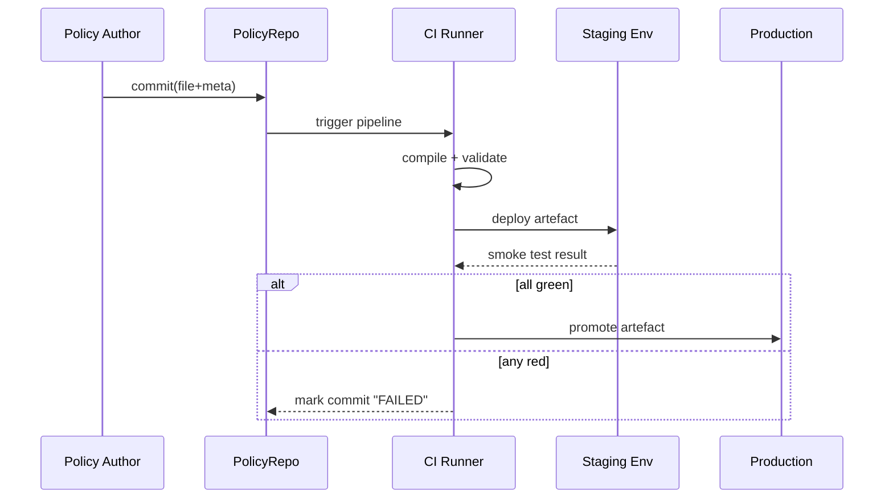

# Chapter 10: Policy Versioning & Deployment Pipeline  

*(You just ratified a rule in [Governance Layer (HMS-GOV)](09_governance_layer__hms_gov__.md).  
Now we’ll see **how that rule safely marches from “approved paper” to running code**—just like a bill becoming law.)*  

---

## 1 Why Do We Need Yet Another Pipeline?  

### One-minute use-case — “New HazMat Label Rules”

The Pipeline and Hazardous Materials Safety Administration (PHMSA) publishes a policy:  
*“Lithium-ion batteries must display the new **UN 3481** label.”*

1. Policy analyst Dana submits the YAML draft.  
2. Review board ratifies it (Chapter 9).  
3. **But** dozens of field scanners, mobile apps, and airline portals must update *exactly the same day*—or passengers will miss flights.

The **Policy Versioning & Deployment Pipeline (PVDP)** is our automated Federal Register:

Draft → signed → compiled → tested → staged → **published nationwide** with an audit trail.

Without PVDP, every team would update manually at 2 a.m. and hope for the best.

---

## 2 Key Ideas in Plain English  

| Term                        | Beginner-friendly meaning                                          |
|-----------------------------|--------------------------------------------------------------------|
| Policy Commit               | A snapshot of a policy, stored like a Git commit.                  |
| Metadata                    | Who wrote it, when, diff lines, test results.                      |
| Compile Step                | Turn human YAML → machine JSON / Rego / SQL.                       |
| Validation Suite            | Tiny automated tests; e.g., “threshold between 0 and 1”.           |
| Staging Environment         | Safe sandbox where only testers can see the new rule.              |
| Promotion Gate              | Green light that moves artefact from staging → production.         |
| Rollback                    | Auto-revert to last good version if smoke tests fail.              |

Analogy:  
Congress (HMS-GOV) passes a law → Government Printing Office prints it → Agencies test enforcement → Federal Register “publishes” → The rule is live at every checkpoint.

---

## 3 Quick Start — Ship One Policy End-to-End  

We will push **fraud-threshold v2** (from Chapter 9) through the pipeline.

### 3.1 Commit the Policy  

```bash
# ONE command = one commit
hms policy commit fraud-threshold-v2.yaml \
  --message "Raise to 0.85" \
  --author "dana@prc.gov"
```

Output:

```txt
✔ Saved as commit 9f31c2b @ 2024-06-05 14:03Z
```

**What just happened?**  
A “commit object” was stored in **PolicyRepo** (a Postgres table).  
It contains the file, author, timestamp, and a diff from v1.

---

### 3.2 Kick Off the Pipeline  

```bash
hms policy pipeline run 9f31c2b
```

Live log (trimmed):

```txt
⏳ compile........OK 0.4 s
⏳ unit-tests.....OK 5/5 passed
⏳ staging-deploy.OK
⏳ smoke-tests....OK latency < 200 ms
🎉 promote........DONE → production v2
```

That’s it—fraud-threshold v2 is now active across HMS.

---

## 4 Under the Hood — Five Simple Stages  



Only **five participants** keep the flow easy to picture.

---

## 5 Tiny Code Tour (All ≤ 20 Lines)  

### 5.1 Commit Object (simplified)  

```ts
// repo/commit.ts
export interface Commit {
  id: string;             // sha hash
  policyId: string;
  version: number;
  author: string;
  ts: number;
  diff: string;           // unified diff text
  tests?: TestResult[];
  status: 'PENDING' | 'FAILED' | 'PROMOTED';
}
```

*Every row looks like a Git commit—easy to diff & audit.*

---

### 5.2 Compile Step (YAML → JSON)  

```ts
// pipeline/compile.ts
import yaml from 'yaml';
export function compile(raw: Buffer){
  const doc = yaml.parse(raw.toString());
  return JSON.stringify(doc.changes); // machine-readable
}
```

*Under 10 lines; more complex rules could emit Rego.*

---

### 5.3 Validation Suite (one generic rule)  

```ts
// pipeline/validate.ts
export function test(changes){
  if ('fraudThreshold' in changes &&
      (changes.fraudThreshold < 0 || changes.fraudThreshold > 1))
    throw new Error('fraudThreshold must be 0-1');
}
```

*Add more mini-tests as your agency’s catalogue grows.*

---

### 5.4 Promotion Gate  

```ts
// pipeline/promote.ts
export async function promote(commitId){
  await db.tx(async sql=>{
    await sql`UPDATE commits SET status = 'PROMOTED' WHERE id = ${commitId}`;
    await sql`INSERT INTO active_policies(commit_id) VALUES (${commitId})`;
  });
}
```

*Single transaction guarantees atomic cut-over.*

---

## 6 Beginner-Friendly Local Demo (≈ 30 s)  

```bash
# 1. start toy services
docker compose up repo ci staging production
# 2. commit + run
hms policy commit demo.yaml --message "demo" --author "you@agency.gov"
hms policy pipeline run HEAD
```

Open `http://localhost:5050/policies` and watch the status column flip from PENDING → PROMOTED.

---

## 7 Common Pitfalls & Easy Fixes  

| Pitfall                                       | Quick Fix |
|-----------------------------------------------|-----------|
| Forgetting tests, pipeline lets bad value pass | Add **`validate.ts`** guardrails; pipeline fails fast. |
| Long staging smoke tests block prod release   | Parallelise tests or set a **max-duration** gate (e.g., 3 min). |
| “Worked on dev laptop but not in CI”          | Compile inside a **container** to freeze Node / Python versions. |
| Need to hotfix prod ASAP                      | `hms policy rollback <version>` instantly re-promotes previous commit. |

---

## 8 Why Auditors & Developers Both Smile  

• Every change carries a **diff + test log**—no mystery toggles.  
• Rollbacks are **one command**, because old artefacts stay in PolicyRepo.  
• Status badges show “staging OK / production OK”—confidence for releases.  

---

## 9 Recap & What’s Next  

You learned how the **Policy Versioning & Deployment Pipeline**:  

1. Stores each update like a Git commit with full metadata.  
2. Compiles, tests, and stages the rule automatically.  
3. Promotes (or rolls back) with an auditable push-button flow.  

Once the rule is live we still need to verify it behaves in the wild and feed real-world metrics back to analysts.  
That’s the job of our next module: [Telemetry & Feedback Loop](11_telemetry___feedback_loop_.md).

---

Generated by [AI Codebase Knowledge Builder](https://github.com/The-Pocket/Tutorial-Codebase-Knowledge)