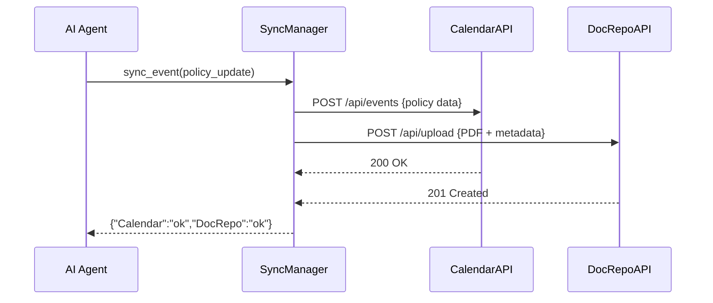

# Chapter 11: External System Synchronization

Welcome back! In [Chapter 10: Conflict Resolution Mechanism](10_conflict_resolution_mechanism_.md) we learned how HMS-OPS mediates overlapping workflows. Now, we’ll see how HMS-OPS keeps data in sync with outside tools—like scheduling systems, document repositories, or legacy databases—in real time.

---

## 1. Motivation & Central Use Case

**Problem:** Agencies often use multiple systems—an internal policy portal, a public training calendar, a legacy compliance database. When a policy or event changes, staff manually update each tool, risking delays and inconsistencies.

**Use Case:**  
The Access Board publishes a new accessibility regulation. An AI agent updates the policy in HMS-OPS. Immediately, HMS-OPS must:

- Push the PDF to a public **document repository**.  
- Update the instructor schedule in the **training calendar**.  
- Write a record to a **legacy compliance database**.

With **External System Synchronization**, all partner systems stay consistent without manual work.

---

## 2. Key Concepts

1. **Sync Manager**  
   Central service that tracks “what changed” and “where to send” updates.

2. **External Connector**  
   A small adapter for each partner API (e.g., calendars, DBs, repos).

3. **Real-Time Propagation**  
   Events trigger immediate HTTP calls or messages to partners.

4. **Retry & Error Handling**  
   Failed updates are retried or logged for later reconciliation.

5. **Subscription Registry**  
   Configurable list of external targets and event types they care about.

---

## 3. Using External System Synchronization

Below is a minimal example showing how an AI agent can trigger a policy sync:

```python
from hms_ops.sync.manager import SyncManager
from hms_ops.sync.models import ExternalSystem

# 1. Register external systems
sm = SyncManager()
sm.register( ExternalSystem(
    name="TrainingCalendar",
    endpoint="https://calendar.gov/api/events"
))
sm.register( ExternalSystem(
    name="DocRepo",
    endpoint="https://docs.gov/api/upload"
))

# 2. Sync a policy update event
event = {"type":"policy_updated", "id":"policy-42"}
result = sm.sync_event(event)

print("Sync results:", result)
# -> {"TrainingCalendar":"ok", "DocRepo":"ok"}
```

Explanation:  
- We create a `SyncManager` and tell it about two external targets.  
- Calling `sync_event` sends the update to each connector and returns a summary.

---

## 4. What Happens Under the Hood



1. The AI Agent calls `SyncManager`.  
2. For each registered system, the manager invokes its connector.  
3. Responses are collected and returned to the agent.

---

## 5. Internal Implementation

### File: hms_ops/sync/manager.py

```python
from .connectors import ConnectorRegistry

class SyncManager:
    def __init__(self):
        self.registry = ConnectorRegistry()

    def register(self, external_system):
        # Store system info and build connector
        self.registry.add(external_system)

    def sync_event(self, event):
        results = {}
        for name, connector in self.registry.connectors.items():
            try:
                status = connector.send(event)
                results[name] = status
            except Exception as e:
                results[name] = f"error: {e}"
        return results
```

> The manager holds a registry of connectors and loops over them to send events.

### File: hms_ops/sync/connectors.py

```python
import requests

class ConnectorRegistry:
    def __init__(self):
        self.connectors = {}

    def add(self, system):
        # Build a connector for each external system
        self.connectors[system.name] = ExternalConnector(system)

class ExternalConnector:
    def __init__(self, system):
        self.url = system.endpoint

    def send(self, event):
        resp = requests.post(self.url, json=event)
        resp.raise_for_status()
        return "ok"
```

> Each `ExternalConnector` wraps HTTP calls to a partner endpoint.

---

## 6. Analogy & Takeaways

Think of HMS-OPS as a **postal sorting center**:

- **SyncManager** is the mailroom clerk who sees an outgoing letter (event).  
- **Connectors** are the envelopes addressed to different agencies.  
- **Real-Time Propagation** is next-day delivery—partners get updates immediately.  
- **Retry Logic** is like re-sending a returned letter.

With this hub-and-spoke model, no system falls out of date.

---

## Conclusion

You’ve learned how **External System Synchronization** in HMS-OPS:

- Automatically propagates updates to third-party calendars, repositories, and legacy platforms.  
- Uses a central manager and small connectors for each partner API.  
- Ensures consistency, eliminates manual reconciliation, and handles errors gracefully.

Next up: explore how specialized AI Agents orchestrate these flows in [Chapter 12: Specialized AI Agents](12_specialized_ai_agents_.md).

---

Generated by [AI Codebase Knowledge Builder](https://github.com/The-Pocket/Tutorial-Codebase-Knowledge)