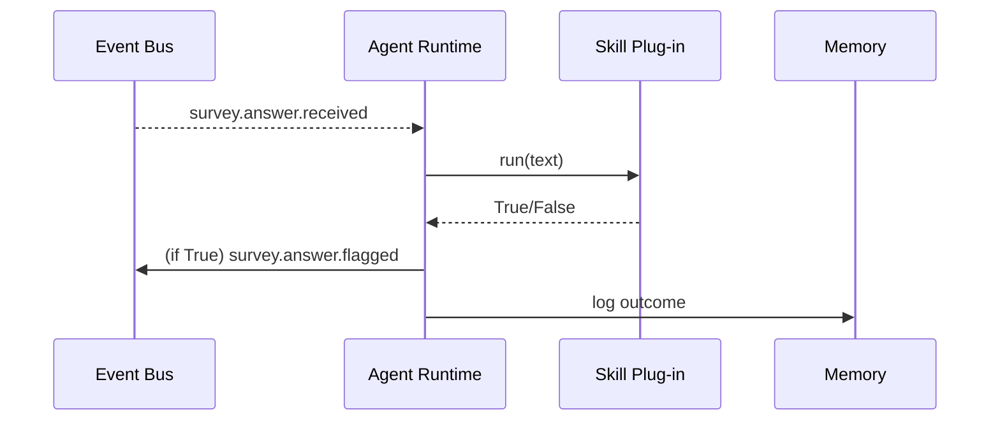

# Chapter 12: Agent Framework Core (HMS-AGT / AGX)

*(picks up from [Chapter 11: AI Representative Agent](11_ai_representative_agent_.md))*  

---

## 1. Why do we need HMS-AGT / AGX?

Imagine the **U.S. Census Bureau** wants 300 tiny AI helpers to:

1. Check incoming survey answers for profanity.  
2. Predict if a household forgot a section.  
3. Auto-draft reminder postcards.

Every helper needs the same “boring” plumbing:

* Load an AI model.  
* Remember past interactions.  
* Wake up on a queue message, then go back to sleep.  
* Respect API rate-limits and refresh its token every hour.

Copy-pasting that plumbing 300 times is a waste and a risk.  
**HMS-AGT / AGX** gives each helper:

* a **brain** (LLM wrapper),  
* a **voice** (uniform I/O ports),  
* a **résumé** (skills list, past performance).  

Developers only write the policy logic—AGX handles the rest.

---

## 2. Key Concepts (Beginner Friendly)

| Word | Think of it as…      | Why it matters                                  |
|------|----------------------|-------------------------------------------------|
| **Brain**       | The agent’s mind | Thin wrapper around any LLM / ML model. |
| **Voice**       | Mouth & ears     | Standard ports: `events.in`, `events.out`, `logs`. |
| **Memory**      | Personal diary   | Key-value store the agent can read/write. |
| **Skill Plug-in** | Superpower card | Extra code it can call (e.g., “detect profanity”). |
| **Lifecycle**   | Work schedule    | `spawn → run → sleep → retire` handled for you. |

Keep these five words—most of AGX is just orchestrating them.

---

## 3. Quick-Start: Build a “Profanity Watchdog” Agent

Goal: whenever a survey answer arrives, flag it if it contains profanity.

### 3.1  Create a skill plug-in (Python, 12 lines)

```python
# skills/profanity.py
BAD_WORDS = {"dang", "shoot"}

def run(text:str) -> bool:
    """Return True if profanity found."""
    words = {w.lower() for w in text.split()}
    return any(w in BAD_WORDS for w in words)
```

*What it does* – very naive check, but enough for a demo.

### 3.2  Define the agent (YAML, 17 lines)

```yaml
# agents/profanity_watchdog.yaml
id: CENSUS_WATCHDOG_V1
description: "Flags survey answers with profanity"
on_event: "survey.answer.received"
skills:
  - skills/profanity.py
action:
  if_true:  "emit survey.answer.flagged"
  if_false: "noop"
memory:
  driver: "local"       # file on disk for demo
resources:
  max_calls_per_min: 30
```

Explanation  
1. AGX will **subscribe** to `survey.answer.received`.  
2. For each event it calls our `profanity.run(text)`.  
3. If the skill returns `True`, it emits a new event; otherwise does nothing.

### 3.3  Start the agent runtime (Python, 10 lines)

```python
# run_agent.py
from hms_agx import AgentRuntime   # ← tiny wrapper

AgentRuntime(
    config="agents/profanity_watchdog.yaml"
).serve_forever()
```

Run it:

```bash
python run_agent.py
```

Outcome  
*The agent auto-registers with Identity & Access, subscribes to the event bus, and sleeps until a survey answer arrives.*

### 3.4  Test it (5 lines)

```python
from hms_a2a import emit
emit("survey.answer.received", {"text": "Dang this form!"})
```

Console (agent side):

```
👀 Event received (survey.answer.received)
🗂 Skill: profanity → True
🚩 Emitted survey.answer.flagged
😴 Sleeping…
```

---

## 4. What happens under the hood?



Plain-English flow  

1. **Event Bus** pushes an event.  
2. AGX wakes, validates its rate-limit.  
3. Calls the skill; skill returns a boolean.  
4. AGX emits follow-up event, writes a short diary line, and goes back to sleep.

---

## 5. A Peek Inside AGX

### 5.1  Spawner (simplified, 14 lines)

```python
# agx/spawn.py
import importlib, time

def spawn(config):
    skill_mods = [importlib.import_module(path.replace('/', '.')[:-3])
                  for path in config["skills"]]
    while True:
        evt = wait_for_event(config["on_event"])
        for mod in skill_mods:
            if mod.run(evt["text"]):
                handle_true(config, evt)
                break
        nap_until_next_slot()
```

Beginners: **spawn → loop → nap** pattern hides async/event details.

### 5.2  Memory helper (9 lines)

```python
# agx/memory.py
import json, pathlib

FILE = pathlib.Path("mem.json")

def write(record):
    data = json.loads(FILE.read_text() or "[]")
    data.append(record)
    FILE.write_text(json.dumps(data)[-10000:])  # keep last N
```

Tiny file-based memory for demos; real deployments swap in Redis or Postgres.

### 5.3  Plug-in loader rule (6 lines)

```python
def run_skill(mod, *args, **kw):
    return getattr(mod, "run")(*args, **kw)
```

All skills just expose a `run()`—no classes or boilerplate.

---

## 6. How AGX Fits With Other Layers

```
Event  →  Agent (AGX)  → optional Policy Proposal
  │          │
  │          ├─ fetches token from [Identity, Access & Authorization](10_identity__access___authorization_.md)
  │          ├─ streams metrics to [Operations Hub](01_operations___monitoring_hub__hms_ops__.md)
  │          └─ passes outputs through [Governance Layer](02_governance_layer__hms_gov__.md)
  ▼
Rest of HMS stack
```

Guardrails from [AI Safety & Ethics Guardrails](13_ai_safety___ethics_guardrails_.md) can **pause** or **sandbox** any agent if it misbehaves.

---

## 7. Beginner FAQ

**Q:** How many skills can an agent load?  
Up to 10 by default; raise the limit in `resources`.

**Q:** Can I use an external LLM like GPT-4?  
Yes. Write a skill that calls the model and return the answer. AGX rate-limits you automatically.

**Q:** How do I retire an agent?  
`agx retire CENSUS_WATCHDOG_V1` – its memory is archived, tokens revoked, and OPS stops monitoring.

**Q:** Can two agents share memory?  
Not directly. Write one agent that owns the memory and emits events other agents can read.

---

## 8. Recap & Next Steps

You have:

1. Learned the five core pieces of HMS-AGT / AGX (brain, voice, memory, skills, lifecycle).  
2. Built a 17-line YAML + 12-line skill to catch profanity.  
3. Seen the minimal runtime and how it plugs into the wider HMS ecosystem.  
4. Peeked at the spawner, memory, and plug-in loader code.

Next we’ll learn how HMS keeps every agent—including our watchdog—safe, ethical, and legally compliant:  
[Chapter 13: AI Safety & Ethics Guardrails](13_ai_safety___ethics_guardrails_.md)

---

---

Generated by [AI Codebase Knowledge Builder](https://github.com/The-Pocket/Tutorial-Codebase-Knowledge)