# Chapter 12: AI Representative Agent (HMS-A2A)

*(Coming from [Telemetry & Feedback Loop](11_telemetry___feedback_loop_.md) ­— we now turn raw metrics into real-world improvements.)*  

---

## 1 Why Do We Need a “Digital Legislative Aide”?

### Two-minute story — “The 90-Day Licensing Bottleneck”

The **Wireless Telecommunications Bureau (WTB)** promises to approve routine radio-tower licenses within **30 days**.  
In January:

* Average turnaround = **28 d** (good)  
* Citizen complaints = **4**  

By March metrics (Chapter 11) show:

* Average turnaround = **43 d**  
* Complaints = **46**  

Enter **HMS-A2A** — an AI Representative Agent:

1. **Reads** the same latency & complaint streams you built in Chapter 11.  
2. **Detects** that 43 d > 30 d Service-Level Objective (SLO).  
3. **Drafts** a micro-policy: *“Auto-assign low-risk licenses to junior reviewers.”*  
4. **Submits** the draft to [Governance Layer](09_governance_layer__hms_gov__.md).  
5. If reviewers take too long, it **escalates** to a human director.

> Analogy: a tireless legislative aide who writes bill amendments at 3 a.m. so Congress wakes up to a tidy inbox.

---

## 2 Key Ideas in Plain English

| Term               | Beginner-Friendly Meaning                                         |
|--------------------|-------------------------------------------------------------------|
| Intake Stream      | Real-time data the agent watches (metrics, feedback, logs).       |
| Insight            | “Something is off” detection (e.g., SLA miss, spike in denials).  |
| Recommendation     | A proposed fix in natural language plus machine-readable changes. |
| Draft Policy       | YAML/JSON file ready for HMS-GOV review.                          |
| Action Mode        | What the agent does next: **auto-apply**, **ask-for-approval**, or **escalate**. |

---

## 3 Quick Start – Your First Mini-Agent in 15 Minutes

We’ll build a **WTB-license-agent** that spots slow licenses and drafts a workload-balancing rule.

### 3.1 Install the SDK

```bash
npm i @hms/a2a-sdk
```

*One dependency, zero fuss.*

### 3.2 Subscribe to Telemetry

```ts
// agent/index.ts (≤ 15 lines)
import { stream, draft } from '@hms/a2a-sdk';

stream('license.latency', (evt) => {
  if (evt.p95_days > 30) createDraft(evt);
});

function createDraft(evt){
  draft({
    id: 'wtb-speedup',
    title: 'Balance Low-Risk Licenses',
    changes: { autoAssign: true, seniorReviewOnlyIf: 'high-risk' },
    rationale: `p95 latency ${evt.p95_days} d exceeds 30 d SLO`
  }, { mode: 'ask-approval' });     // Action Mode
}
```

**What it does**

1. Listens to the `license.latency` stream produced in Chapter 11.  
2. If the 95th-percentile (`p95_days`) exceeds 30, it calls `draft()`.  
3. The draft is set to **ask-approval** — it will wait for humans.

### 3.3 Run the Agent

```bash
npx ts-node agent/index.ts
```

Console output example:

```txt
📊 latency 43 d  →  📝 draft wtb-speedup sent for approval
```

A new draft appears in the Governance Portal’s “Awaiting Review” list.

---

## 4 What Happens Under the Hood?

```mermaid
sequenceDiagram
  participant A2A as HMS-A2A
  participant TEL as Telemetry Stream
  participant GOV as HMS-GOV
  participant DIR as WTB Director

  TEL-->>A2A: latency event
  A2A->>A2A: detect SLA breach
  A2A->>GOV: submit policy draft
  GOV-->>DIR: “Please review”
```



*Four actors keep the flow crystal clear.*

---

## 5 Inside HMS-A2A (Component Peek)

### 5.1 Listener Module (8 lines)

```ts
// lib/listener.ts
import ws from 'ws';
export function stream(name, cb){
  const sock = new ws('wss://hms-ops.gov/telemetry');
  sock.on('open', ()=> sock.send(name));
  sock.on('message', raw => cb(JSON.parse(raw.toString())));
}
```

*Tiny WebSocket client that hands each metric to your callback.*

### 5.2 Insight Engine (rule + ML hybrid)

```ts
// lib/insight.ts (simplified)
export function slaBreach(p95, target=30){
  return p95 > target;
}
```

*Start simple with if/else; swap in ML later.*

### 5.3 Draft Writer (≤ 12 lines)

```ts
// lib/draft.ts
import fetch from 'node-fetch';
export function draft(doc, opts){
  return fetch('https://gov.home.gov/gov/policies/drafts', {
    method:'POST',
    headers:{Authorization:`Bearer ${process.env.TOKEN}`},
    body:JSON.stringify({...doc, proposedBy:'HMS-A2A'})
  });
}
```

*Uses the same endpoint as human authors (Chapter 9).*

---

## 6 Configuring Action Modes

Add a **one-liner** next to any draft:

| mode            | Behaviour                                                |
|-----------------|----------------------------------------------------------|
| `auto-apply`    | Immediately triggers the [Policy Pipeline](10_policy_versioning___deployment_pipeline_.md). |
| `ask-approval`  | Sends to HMS-GOV review board (default & safest).        |
| `escalate`      | Creates a ticket in [Incident Escalation & Replacement Logic](15_incident_escalation___replacement_logic_.md) if no human responds in X hours. |

You can switch modes by **config file** — no code changes.

```yaml
# a2a-config.yaml
defaultMode: ask-approval
escalateAfter: 24h
```

Load it once at startup:

```ts
const cfg = yaml.parse(fs.readFileSync('a2a-config.yaml'));
draft(doc, { mode: cfg.defaultMode });
```

---

## 7 Local Playground – See It All Work

1. Start mocks:

```bash
docker compose up telemetry gov
```

2. Emit a fake slow-latency event:

```bash
node -e "require('ws')('ws://localhost:9009').send(JSON.stringify({stream:'license.latency', p95_days:42}))"
```

3. Run the agent.  
4. Check `http://localhost:4400/gov/drafts` — your policy is waiting!

---

## 8 Common Pitfalls & Easy Fixes

| Pitfall                                          | Fix |
|--------------------------------------------------|-----|
| Agent spams many drafts during prolonged outage  | Add **debounce**: ignore same insight for N hours. |
| Draft rejected but agent keeps re-submitting     | Store last decision in local DB; suppress duplicates unless new data emerges. |
| Metrics arrive faster than agent can process     | Use **batching**: analyse once per minute instead of every event. |
| Auto-apply accidentally rolls out risky change   | Start with **ask-approval**; enable `auto-apply` only for safe, reversible tweaks (e.g., cache size). |

---

## 9 Why Agencies & Auditors Like A2A

* **Proactive** — finds issues before citizens tweet screenshots.  
* **Transparent** — every draft cites data & rationale, logged in HMS-GOV.  
* **Accountable** — modes force human sign-off when stakes are high.  

---

## 10 Recap & What’s Next

You built a mini AI aide that:

1. Listens to telemetry.  
2. Detects policy breaches.  
3. Writes and submits improvement drafts.  
4. Respects human oversight via **Action Modes**.

Next we’ll zoom into that human oversight itself, exploring review queues, dispute resolution, and override authority in  
[Human-in-the-Loop (HITL) Oversight](13_human_in_the_loop__hitl__oversight_.md).

---

Generated by [AI Codebase Knowledge Builder](https://github.com/The-Pocket/Tutorial-Codebase-Knowledge)