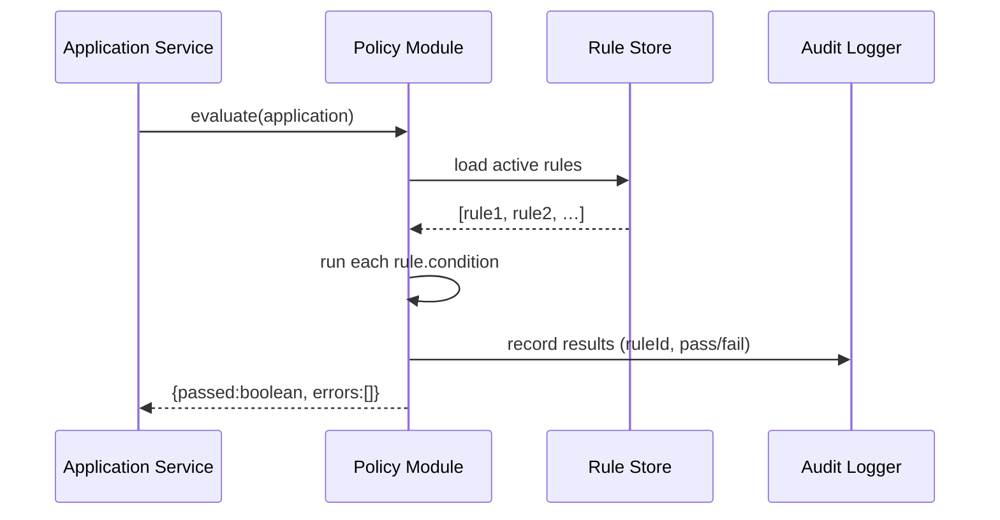

# Chapter 12: Policy Module

In [Chapter 11: Role-Based Access Control (RBAC)](11_role_based_access_control__rbac__.md) we learned how to control **who** can do what. Now we’ll see **what** rules they enforce and how. The **Policy Module** is our “rulebook clerk” that stores, evaluates, and publishes business rules—like federal fair housing regulations.

---

## 1. Motivation: Enforcing Fair Housing Rules

Imagine the Office of Public and Indian Housing wants to ensure no applicant is discriminated against when applying for a rental unit:

1. A tenant submits an application with their personal details.  
2. Before any backend workflow starts, we must check federal fair housing rules (e.g., “No denial based on race or national origin”).  
3. If a rule is violated, we reject the application with clear feedback.

The Policy Module centralizes these “if-then” rules so every part of HMS-OPS applies the same regulations, logs each decision, and keeps an audit trail.

---

## 2. Key Concepts

1. **Rule Store**  
   A central repository (often JSON or a DSL file) holding all active rules.  
2. **Evaluator**  
   The engine that takes input data, runs each rule’s condition, and returns pass/fail.  
3. **Publisher**  
   After review, approved rules are marked “active” and made available to all services.  
4. **Traceability**  
   Every evaluation logs which rule fired and why, aiding audits.  
5. **Extensible DSL**  
   Experts can write more complex rules (hierarchies, priorities) beyond simple if-then.

---

## 3. Using the Policy Module

Below is a minimal example: load two fair-housing rules, validate an application, and inspect the result.

```js
// app/src/validateApplication.js
import { loadRules, evaluate } from 'policy-module'

// 1. Define your rules (could come from AI or a human reviewer)
loadRules([
  {
    id: 'noRaceBias',
    condition: 'application.applicant.race !== application.unit.ownerRace',
    message: 'Cannot discriminate based on race'
  },
  {
    id: 'incomeMin',
    condition:  'application.applicant.income >= 30000',
    message: 'Minimum income is $30,000'
  }
])

// 2. Run evaluation on a sample application
const application = {
  applicant: { race: 'B', income: 28000 },
  unit:      { ownerRace: 'W' }
}

const result = evaluate(application)

console.log(result.passed) // false
console.log(result.errors) // ["Minimum income is $30,000"]
```

Explanation:
- `loadRules(...)` registers our rules in memory.
- `evaluate(data)` returns `{ passed: boolean, errors: [messages] }`.
- Here the income check fails, so `passed` is `false`.

---

## 4. Step-by-Step Sequence



1. The service calls `evaluate()`.  
2. Policy Module fetches active rules from the store.  
3. It tests each condition against input data.  
4. It logs each rule’s outcome.  
5. It returns a summary to the caller.

---

## 5. Under the Hood: Core Files

### 5.1 Rule Store (`policy-module/config/rules.json`)

```json
[
  {
    "id": "noRaceBias",
    "condition": "application.applicant.race !== application.unit.ownerRace",
    "message": "Cannot discriminate based on race"
  },
  {
    "id": "incomeMin",
    "condition": "application.applicant.income >= 30000",
    "message": "Minimum income is $30,000"
  }
]
```

Explanation:  
- A simple JSON array of rule objects.
- Each has an `id`, a JavaScript-style `condition` string, and an error `message`.

### 5.2 Evaluator (`policy-module/src/evaluator.js`)

```js
import rules from '../config/rules.json'
import { logEvaluation } from './logger'

export function evaluate(application) {
  const errors = []
  for (const rule of rules) {
    // eslint-disable-next-line no-new-func
    const fn = new Function('application', `return ${rule.condition}`)
    const passed = fn(application)
    logEvaluation(rule.id, passed)
    if (!passed) errors.push(rule.message)
  }
  return { passed: errors.length === 0, errors }
}
```

Explanation:
- We read rules from the JSON file.
- For each rule, we build a tiny function that returns true/false.
- We log the outcome, collect any error messages, and return a summary.

### 5.3 Logger (`policy-module/src/logger.js`)

```js
export function logEvaluation(ruleId, passed) {
  // In real life: write to a DB or audit service
  console.log(`[PolicyLog] Rule ${ruleId} passed? ${passed}`)
}
```

Explanation:
- Every rule check emits a log entry.
- Auditors can trace which rule fired and with what result.

---

## 6. Why This Matters

- **Consistency**: All services use the same rule definitions—no conflicting implementations.  
- **Auditability**: Detailed logs let compliance teams trace every decision.  
- **Extensibility**: Beginners see a simple JSON/JS setup; experts can swap in a full DSL or integrate with AI-driven rule authors.  
- **Governance**: Combined with [RBAC](11_role_based_access_control__rbac__.md), only authorized roles can add or publish rules.

---

## Conclusion

You’ve learned how the **Policy Module** centralizes “if-then” business rules—loading, evaluating, logging, and publishing them. This ensures fair, traceable decisions across HMS-OPS. Next up, we’ll explore how to manage data quality and privacy in [Chapter 13: Data Governance & Compliance](13_data_governance___compliance_.md).

---

Generated by [AI Codebase Knowledge Builder](https://github.com/The-Pocket/Tutorial-Codebase-Knowledge)