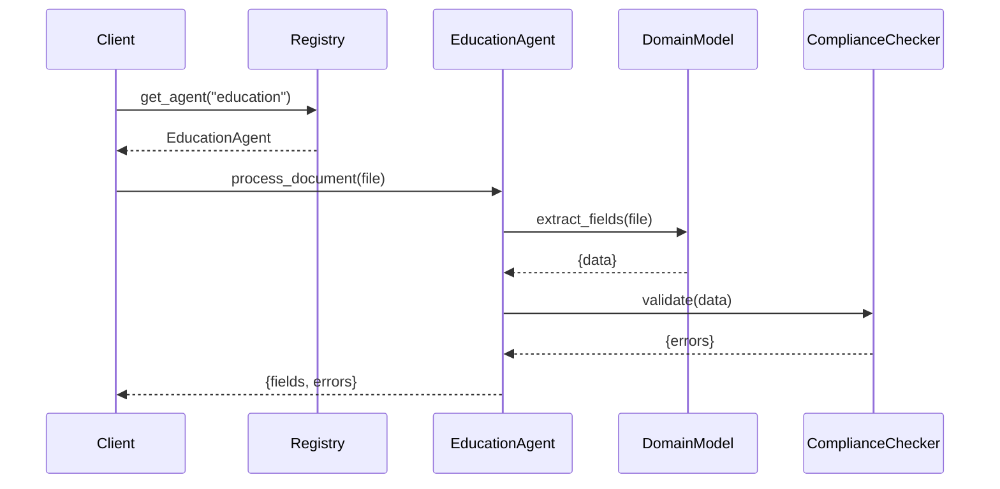

# Chapter 12: Specialized AI Agents

Building on our look at [External System Synchronization](11_external_system_synchronization_.md), HMS-OPS now brings you **Specialized AI Agents**—domain-tuned assistants that speak the language of healthcare, finance, education, and more. Instead of a one-size-fits-all model, each agent knows sector-specific rules, data formats, and compliance standards.

---

## 1. Motivation & Central Use Case

Imagine the U.S. Department of Education’s analysts who parse hundreds of grant applications each month. They need to:

  • Extract applicant details from PDFs  
  • Validate against education statutes  
  • Flag missing attachments (budget sheets, demographic forms)  

A **Specialized AI Agent** for education can:  
  – Use an “ED-Grant” vocabulary  
  – Understand which fields matter by federal statute  
  – Enforce formatting rules (e.g., budgets in CSV)  

Similarly, a healthcare agent validates HIPAA-formatted patient records, while a finance agent checks SEC rules. Each agent automates niche workflows with built-in compliance.

---

## 2. Key Concepts

1. **Domain Model**  
   A schema and vocabulary tuned to one sector (e.g., claim forms for insurance).

2. **Regulation Profile**  
   Encodes statutes and standards (e.g., HIPAA, Sarbanes-Oxley, FERPA).

3. **Specialized Pipeline**  
   Preprocessing → Model inference → Post-check routines for niche data.

4. **Agent Registry**  
   Directory that routes requests to the right domain agent.

5. **Fallback to Generic**  
   If no specialist exists, requests go to the generic HMS-OPS AI Representative (see [Chapter 13](13_ai_representative_agent_.md)).

---

## 3. How to Use Specialized Agents

Below is a minimal Python example showing how a client picks and uses a domain-specific agent:

```python
from hms_ops.agents import AgentRegistry

# 1. Get the registry and pick an education agent
registry = AgentRegistry()
edu_agent = registry.get_agent(domain="education")

# 2. Parse a grant application document
result = edu_agent.process_document("applicant_grant.pdf")

# 3. Inspect structured output and compliance flags
print("Fields:", result.fields)
print("Compliance Errors:", result.errors)
```

Explanation:  
- `AgentRegistry.get_agent` returns the `EducationAgent`.  
- `process_document` runs the agent’s pipeline, returning extracted fields and any rule violations.

---

## 4. Under the Hood

When you call `process_document`, here’s the flow:



1. **Registry** looks up the domain agent.  
2. **Agent** invokes its specialized model.  
3. **Checker** enforces sector rules.  
4. Combined result goes back to the client.

---

## 5. Internal Implementation

### 5.1 Agent Base & Registry (`hms_ops/agents/registry.py`)

```python
class AgentRegistry:
    def __init__(self):
        self._agents = {
            "healthcare": HealthcareAgent(),
            "finance": FinanceAgent(),
            "education": EducationAgent(),
        }

    def get_agent(self, domain):
        return self._agents.get(domain, GenericAgent())
```

Explanation:  
- We map domain names to agent instances.  
- If the domain isn’t registered, we fall back to a generic AI.

### 5.2 Example Specialized Agent (`hms_ops/agents/education.py`)

```python
class EducationAgent:
    def process_document(self, filepath):
        # 1. Extract fields with a custom NLP model
        fields = self._extract(filepath)
        # 2. Run compliance checks (FERPA, grant rules)
        errors = self._check_regulations(fields)
        return SimpleNamespace(fields=fields, errors=errors)

    def _extract(self, path):
        # stub: call a fine-tuned education model
        return {"applicant": "XYZ University", "amount": 100000}

    def _check_regulations(self, data):
        # stub: enforce max grant amount or missing docs
        errs = []
        if data["amount"] > 150_000:
            errs.append("Exceeds statutory limit")
        return errs
```

Explanation:  
- `_extract` uses a model trained on grant forms.  
- `_check_regulations` applies federal education funding rules.

---

## 6. Analogy & Takeaways

Think of each **Specialized AI Agent** like:

  • A healthcare coder fluent in ICD-10 and HIPAA  
  • A financial auditor who knows GAAP and SEC filings  
  • An education analyst who understands grant statutes  

They’re your “domain analysts in a box,” speeding up reviews and guaranteeing compliance.

---

## Conclusion

You’ve learned how HMS-OPS hosts **Specialized AI Agents** tuned to healthcare, finance, education, and more:

  - Domain-specific vocabularies and pipelines  
  - Built-in regulation enforcement  
  - An easy registry interface  

Next up: explore the catch-all **[AI Representative Agent](13_ai_representative_agent_.md)**, which handles queries with broad, generic reasoning when no specialist is available.

---

Generated by [AI Codebase Knowledge Builder](https://github.com/The-Pocket/Tutorial-Codebase-Knowledge)