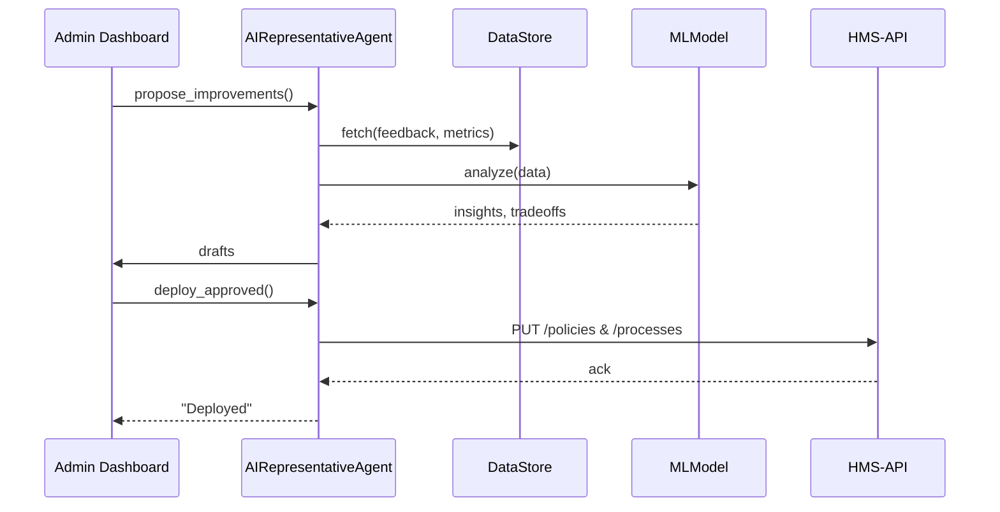

# Chapter 13: AI Representative Agent

Building on [Chapter 12: Specialized AI Agents](12_specialized_ai_agents_.md), where we saw domain-tuned assistants, now we introduce the **AI Representative Agent**—your digital policy analyst in the Office of Management and Budget (OMB). This agent:

- Scans user feedback & operational metrics  
- Spots inefficiencies or policy gaps  
- Drafts improvement proposals for stakeholder review  
- (When authorized) pushes approved changes via APIs  

It slashes manual workload and accelerates decision cycles.

---

## 1. Motivation & Central Use Case

Imagine the U.S. Department of Health and Human Services launches a new telehealth portal. Over time:

- Citizens submit hundreds of feedback tickets (“I can’t find mental-health resources,” “The form is confusing”).  
- Help-desk logs show delays in processing requests.  
- Operations dashboards highlight frequent API timeouts.

A human analyst could spend weeks reviewing logs and writing memos. The **AI Representative Agent** automates that:

1. Collects feedback tickets and performance data.  
2. Applies machine learning to prioritize common issues.  
3. Drafts updated policy or process rules.  
4. Formats them for stakeholder review.  
5. On approval, calls HMS-OPS APIs to deploy changes—instantly.

---

## 2. Key Concepts

1. **Autonomous Analysis**  
   Gathers feedback, logs, metrics without manual queries.  
2. **Trade-Off Evaluation**  
   Uses ML to weigh impact (e.g., faster responses vs. stricter validation).  
3. **Proposal Generator**  
   Drafts policy text or process flows in standard format.  
4. **Stakeholder Workflow**  
   Packages proposals with metadata for review dashboards.  
5. **API-Driven Deployment**  
   When authorized, executes changes via HMS-OPS’s [Backend API](08_backend_api_.md).

---

## 3. Using the AI Representative Agent

Here’s a minimal snippet to run a policy improvement cycle:

```python
from hms_ops.agents import AIRepresentativeAgent

# 1. Initialize agent with data sources
agent = AIRepresentativeAgent(
    feedback_source="helpdesk_tickets",
    metrics_source="ops_dashboard"
)

# 2. Analyze & draft proposals
drafts = agent.propose_improvements()
# drafts -> [
#   {"id":"p1","summary":"Streamline mental-health form","suggested_changes":{...}},
#   {"id":"p2","summary":"Increase API timeout to 30s", ...}
# ]

# 3. Submit drafts for stakeholder review
review_ids = agent.submit_for_review(drafts)
print("Under review:", review_ids)

# 4. Once approved, deploy changes
agent.deploy_approved()
```

Explanation:

- `propose_improvements()` returns a list of policy/process drafts.  
- `submit_for_review()` routes them to the stakeholder dashboard.  
- `deploy_approved()` calls HMS-OPS APIs to enact any green-lit updates.

---

## 4. What Happens Under the Hood



1. Agent pulls data from logs & ticket store.  
2. ML model spots patterns and suggests trade-offs.  
3. Drafts appear in the review dashboard.  
4. On approval, Agent calls the [Backend API](08_backend_api_.md) to update policies or processes.

---

## 5. Internal Implementation

### File: `hms_ops/agents/ai_representative.py`

```python
class AIRepresentativeAgent:
    def __init__(self, feedback_source, metrics_source):
        # wires up data connectors and ML pipelines
        self.feedback = FeedbackConnector(feedback_source)
        self.metrics = MetricsConnector(metrics_source)
        self.model = PolicyMLModel()
        self.api = BackendAPIClient()

    def propose_improvements(self):
        data = self.feedback.load() + self.metrics.load()
        insights = self.model.analyze(data)
        return self._format_drafts(insights)

    def submit_for_review(self, drafts):
        # send drafts to a stakeholder review queue
        return ReviewService().enqueue(drafts)

    def deploy_approved(self):
        approved = ReviewService().get_approved()
        for draft in approved:
            self.api.update_policy(draft["id"], draft["suggested_changes"])
```

- **FeedbackConnector** and **MetricsConnector** fetch raw inputs.  
- **PolicyMLModel** runs clustering, prioritization, and trade-off scoring.  
- **ReviewService** manages stakeholder workflows.  
- **BackendAPIClient** calls `/v1/policies` and `/v1/processes`.

---

## 6. Analogy & Takeaways

Think of the **AI Representative Agent** as a junior policy analyst who:

- Reads thousands of comment letters.  
- Summarizes top suggestions.  
- Drafts rule changes in OMB’s standard template.  
- Circulates drafts to agencies.  
- When approved, files them in the Federal Register (via APIs).

By automating this, HMS-OPS frees experts to focus on high-value debates, not data wrangling.

---

## Conclusion

In this chapter, you learned how the **AI Representative Agent**:

- Autonomously analyzes feedback and operations data  
- Generates policy and process improvement drafts  
- Integrates with stakeholder review workflows  
- Deploys approved changes via [Backend API](08_backend_api_.md)  

Up next: controlling overrides with human review in [Chapter 14: Human-in-the-Loop Override](14_human_in_the_loop_override_.md).

---

Generated by [AI Codebase Knowledge Builder](https://github.com/The-Pocket/Tutorial-Codebase-Knowledge)