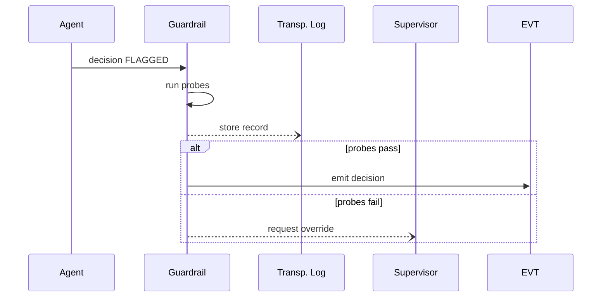

# Chapter 13: AI Safety & Ethics Guardrails
*(builds on [Chapter 12: Agent Framework Core (HMS-AGT / AGX)](12_agent_framework_core__hms_agt___agx__.md))*  

---

## 1. Why do we need Guardrails?

Imagine the **Department of Labor (DOL)** launches an AI helper that auto-decides whether a citizen’s **Unemployment Claim** is valid.  
One morning the model:

* Mis-reads a field,  
* Denies 700 claims from veterans,  
* Nobody notices for six hours.

Citizens lose payments **and** trust.  
AI Safety & Ethics Guardrails are the platform’s **air-bags**:

1. **Record** every AI decision with inputs + model version.  
2. **Explain** *why* a decision was made—plain language, on demand.  
3. **Detect** bias or policy violations in real time.  
4. Offer a bright-red **Human Override** button.

With guardrails, the 700 bad denials are caught in minutes, explained, and reversed.

---

## 2. Key Concepts (Beginner Friendly)

| Word | Analogy | Why it matters |
|------|---------|----------------|
| **Checkpoint** | Speed camera | Captures each AI decision & metadata. |
| **Transparency Log** | Air-plane black box | Immutable record for later audit. |
| **Policy Probe** | Spell-checker | Tests decision against fairness & privacy rules. |
| **Explainability Report** | Teacher’s show-your-work | Plain-English why + how score. |
| **Override Switch** | Emergency brake | Lets a human replace or cancel the AI verdict. |

---

## 3. Quick-Start: Wrap an AI Agent with Guardrails

We’ll protect the **Profanity Watchdog** agent from [Chapter 12](12_agent_framework_core__hms_agt___agx__.md).

### 3.1  Declare a guardrail policy (YAML, 18 lines)

```yaml
# guardrails/profanity.yaml
id: GR_SAFE_PROFANITY_V1
target_agent: CENSUS_WATCHDOG_V1
rules:
  - type: fairness_check
    field: "text"
    pattern_blocklist: ["dialect_words"]   # avoid cultural bias
  - type: privacy_check
    max_pii_leak: 0                        # must not reveal PII
explainability:
  required: true
  format: "markdown"
override:
  enabled: true
  roles_allowed: ["HumanSupervisor"]
log_to: "s3://hms-logs/profanity/"
```

What it says  
• Watch every output of `CENSUS_WATCHDOG_V1`.  
• Run two probes (fairness & privacy).  
• Store explainability in Markdown.  
• Allow users with role **HumanSupervisor** to override.

### 3.2  Register the guardrail (Python, 8 lines)

```python
from hms_guard import GuardrailAdmin
ga = GuardrailAdmin()
ga.deploy("guardrails/profanity.yaml")
print("✅ Guardrail active!")
```

### 3.3  Trigger a violated case

```python
from hms_a2a import emit
emit("survey.answer.received",
     {"text": "Dang y’all messin’?"})   # dialect word triggers fairness probe
```

Console:

```
⚠️  Guardrail FAIRNESS_CHECK failed
📝 Explainability log saved → log_5541.md
🚨 Awaiting Human Override   (role: HumanSupervisor)
```

A supervisor dashboard now shows **Approve / Reverse** buttons.

---

## 4. What Happens Under the Hood?



Plain English  
1. Agent emits a decision.  
2. Guardrail inspects & probes it **before** the decision is public.  
3. If all good ➜ pass through.  
4. If not ➜ freeze, log, and ask a human.

---

## 5. Tiny Code Peeks

### 5.1  Probe runner (15 lines)

```python
# probes.py
def run_probes(decision, rules):
    fails = []
    for r in rules:
        if r["type"] == "fairness_check":
            if any(w in decision["text"].lower() for w in r["pattern_blocklist"]):
                fails.append("FAIRNESS_CHECK")
        if r["type"] == "privacy_check" and contains_pii(decision):
            fails.append("PRIVACY_CHECK")
    return fails
```

Beginner note: only plain string checks—easy to extend.

### 5.2  Explainability stub (12 lines)

```python
def explain(decision):
    parts = [
      f"### Model version: {decision['model']}",
      f"Input text: {decision['text']}",
      f"Reason: contains word 'dang' → flagged profanity"
    ]
    return "\n".join(parts)
```

Writes a simple Markdown file.

### 5.3  Override endpoint (17 lines)

```python
# override.py
from flask import Flask, request, abort
app = Flask(__name__)

@app.post("/override/<log_id>")
def override(log_id):
    user = auth_user(request)            # via IAA layer
    if "HumanSupervisor" not in user.roles:
        abort(403)
    action = request.json["action"]      # "approve" / "reverse"
    update_log(log_id, action, user.id)
    forward_or_cancel(log_id, action)
    return {"status": "ok"}
```

Under 20 lines and ties into [Identity, Access & Authorization](10_identity__access___authorization_.md).

---

## 6. Where Do Guardrails Sit?

```
Agent (HMS-AGT) → Guardrail → Event Bus / Services
                           ↘
                        Transparency Log (WORM)
                           ↘
                    Human Override Console
```

Other layers involved  

* **[Operations Hub](01_operations___monitoring_hub__hms_ops__.md)** alerts on repeated guardrail failures.  
* **[Compliance & Legal Reasoner](04_compliance___legal_reasoner__hms_esq__.md)** audits the Transparency Log.  
* **[Identity, Access & Authorization](10_identity__access___authorization_.md)** authenticates override users.

---

## 7. Beginner FAQ

**Q:** Do guardrails slow the system?  
A: Minimal—probes run locally and add ~5 ms. Heavy ML probes can run async.

**Q:** Can I add my own probe?  
Yes. Drop a Python file exporting `check(decision) -> bool` and reference it under `rules:`.

**Q:** What if the guardrail crashes?  
Decisions default to **Blocked** until the guardrail pod is healthy—fail-safe not fail-open.

**Q:** Are logs public?  
No. Transparency logs are WORM-locked; read-only access via role `Auditor`.

---

## 8. Recap

You learned to:

1. Declare a guardrail policy in YAML.  
2. Attach it to an existing AI agent.  
3. See fairness & privacy probes catch an issue.  
4. Understand how explainability, logging, and human override work together.

Next we’ll dive into **how AI models receive the right context, redactions, and system prompts—without exposing sensitive data—using the “Model Context Protocol.”**  

[Chapter 14: Model Context Protocol (HMS-MCP)](14_model_context_protocol__hms_mcp__.md)

---

Generated by [AI Codebase Knowledge Builder](https://github.com/The-Pocket/Tutorial-Codebase-Knowledge)