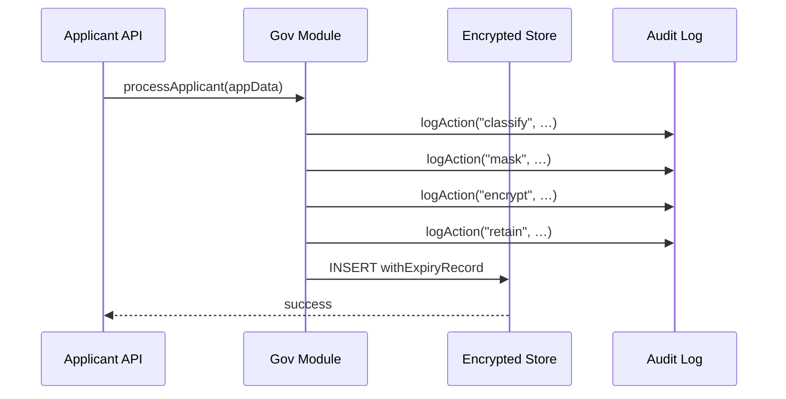

# Chapter 13: Data Governance & Compliance

In [Chapter 12: Policy Module](12_policy_module_.md) we saw how to author, evaluate, and log business rules. Now we turn to the “records office” that makes sure every piece of data—especially PII—follows privacy, retention, and audit requirements.

---

## 1. Why Data Governance & Compliance?

Imagine the **Office of Rural Development** is collecting loan applications. Each form includes:

- Social Security Numbers (SSNs)
- Birthdates
- Income details

The agency must ensure that:

1. SSNs are classified as “sensitive.”
2. Parts of SSNs are masked before display.
3. Sensitive fields are encrypted at rest.
4. Applicant data is deleted after 10 years.
5. Every action is logged for auditors.

Our **Data Governance & Compliance** abstraction automates these steps, so you don’t have to reinvent a records office for each service.

---

## 2. Key Concepts

1. **Classification**  
   Tag each field by sensitivity (e.g., `public`, `sensitive`, `highly_sensitive`).

2. **Masking**  
   Hide parts of a field (e.g., show `XXX-XX-6789` instead of full SSN).

3. **Encryption**  
   Encrypt sensitive data before storing (e.g., AES-256 with key rotation).

4. **Retention Rules**  
   Define how long data lives before deletion or archiving.

5. **Audit Logging**  
   Record every mask, encrypt, or delete action with timestamps and actor IDs.

---

## 3. A Simple Usage Example

Below is a minimal pipeline that classifies, masks, encrypts, enforces retention, and then stores an applicant record.

### config/dataGovernance.json
```json
{
  "classificationRules": [
    { "field": "ssn",   "level": "sensitive" },
    { "field": "email", "level": "highly_sensitive" }
  ],
  "maskingRules": [
    { "field": "ssn",   "maskWith": "XXX-XX-####" }
  ],
  "encryptionKeys": {
    "sensitive": "base64:key1base64:key1",
    "highly_sensitive": "base64:key2base64:key2"
  },
  "retentionPolicies": [
    { "level": "sensitive",       "days": 3650 },
    { "level": "highly_sensitive","days": 3650 }
  ]
}
```

### src/processApplicant.js
```js
import gov from './config/dataGovernance.json'
import { classify, mask, encrypt, retain, logAction } from 'hms-gov'

export function processApplicant(app) {
  // 1. Classification
  const cls = classify(app, gov.classificationRules)
  logAction('classify', cls)

  // 2. Masking
  const masked = mask(app, gov.maskingRules)
  logAction('mask', { ssn: masked.ssn })

  // 3. Encryption
  const encrypted = encrypt(masked, gov.encryptionKeys, cls)
  logAction('encrypt', Object.keys(encrypted))

  // 4. Retention
  const withExpiry = retain(encrypted, cls, gov.retentionPolicies)
  logAction('retain', { expiresAt: withExpiry._expiresAt })

  // 5. Store in database
  return withExpiry
}
```

Explanation:
- We load governance config.
- We run each stage, log the action, and finally return the transformed record for storage.

---

## 4. Sequence of Events



1. **API** calls `processApplicant`.  
2. **Gov Module** classifies, masks, encrypts, enforces retention, logging each step.  
3. The final record goes into the encrypted store.

---

## 5. Under the Hood

### 5.1 Classification (`hms-gov/src/classify.js`)
```js
export function classify(record, rules) {
  const result = {}
  rules.forEach(r => {
    result[r.field] = r.level
  })
  return result
}
```
Explanation: Builds a map of field→sensitivity.

### 5.2 Masking (`hms-gov/src/mask.js`)
```js
export function mask(record, rules) {
  const out = { ...record }
  rules.forEach(r => {
    // Replace digits with '*' except last 4
    out[r.field] = record[r.field].slice(-4).padStart(record[r.field].length, '*')
  })
  return out
}
```
Explanation: Masks SSN as `***-**-6789`.

### 5.3 Encryption (`hms-gov/src/encrypt.js`)
```js
import crypto from 'crypto'

export function encrypt(record, keys, cls) {
  const out = { ...record }
  for (const field in cls) {
    const level = cls[field]
    const key   = Buffer.from(keys[level], 'base64')
    const iv    = crypto.randomBytes(16)
    const cipher = crypto.createCipheriv('aes-256-cbc', key, iv)
    const enc = Buffer.concat([
      cipher.update(record[field], 'utf8'),
      cipher.final()
    ])
    out[field] = iv.toString('hex') + ':' + enc.toString('hex')
  }
  return out
}
```
Explanation: Uses AES-256 to encrypt each sensitive field.

### 5.4 Retention (`hms-gov/src/retain.js`)
```js
export function retain(record, cls, policies) {
  const out = { ...record }
  policies.forEach(p => {
    // If record has that level, set expiry
    if (Object.values(cls).includes(p.level)) {
      out._expiresAt = Date.now() + p.days * 24*60*60*1000
    }
  })
  return out
}
```
Explanation: Attaches a deletion timestamp based on policy.

---

## 6. Why This Matters

- **Consistency**: One module handles PII rules across all services.  
- **Compliance**: Automated masking, encryption, and retention enforce GDPR, HIPAA, or agency policies.  
- **Auditability**: Every step logs who did what—vital for security reviews.  
- **Flexibility**: Beginners edit a JSON file; experts hook in key vaults, custom masks, or dynamic retention.

---

## Conclusion

In this chapter you learned how **Data Governance & Compliance** classifies, masks, encrypts, and retires sensitive data—just like a records office enforcing document lifecycles. Next up is the overarching “security and policy control panel” in the [Governance Layer (HMS-SYS)](14_governance_layer__hms_sys__.md).

---

Generated by [AI Codebase Knowledge Builder](https://github.com/The-Pocket/Tutorial-Codebase-Knowledge)