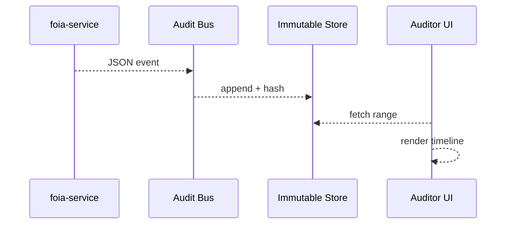

# Chapter 14: Compliance & Audit Trail Engine
*(coming from [Human-in-the-Loop (HITL) Oversight](13_human_in_the_loop__hitl__oversight_.md) — humans have reviewed the change; now we must **prove** it, forever.)*

---

## 1 · Why Do We Need a “Security Camera” for Software?

### 60-second story — “The FOIA Clock”

Under the Freedom of Information Act, the **Office of Natural Resources Revenue (ONRR)** must deliver royalty-payment data within **20 business days** of a citizen request.

1. **April 1** – Ruby submits a FOIA request.  
2. **April 3** – Clerk Johnson acknowledges it.  
3. **April 10** – Data export is generated.  
4. **April 11** – Johnson emails Ruby the ZIP file.  
5. **May 5** – An investigative journalist claims ONRR “altered numbers.”

ONRR opens the **Compliance & Audit Trail Engine** and replays every step:
• Who clicked what button  
• Which file hashes were produced  
• The SHA-chain proving no record was edited

Dispute closed in 30 minutes, not 30 days.

---

## 2 · Key Ideas in Plain English

| Term                     | Beginner-friendly meaning                              |
|--------------------------|--------------------------------------------------------|
| Audit Event              | A single “camera frame” (login, file export, policy approval). |
| Hash Chain               | Each event stores a fingerprint of the previous one → tamper evident. |
| Immutable Store          | A database where **nothing can be updated or deleted**—only appended. |
| Replay Tool              | Click-through timeline that reconstructs past state.   |
| Evidence Package         | ZIP bundle (CSV + signatures) you hand to auditors.    |

Analogy: a stack of numbered, wax-sealed envelopes; break one seal and everyone can see it.

---

## 3 · Quick Start — Logging Your First Event

Add one line to **any** micro-service:

```ts
// File: foia-service/foia.ts  (16 lines total)
import { log } from '@hms/audit';

export async function generateExport(req) {
  // 1. create ZIP (details skipped) ...
  await log({
    actor: req.user.id,
    action: 'FOIA_EXPORT_CREATED',
    resource: `request/${req.params.id}`,
    meta: { fileHash: zip.sha256 }
  });
  return zip;
}
```

Explanation  
• `log()` sends an **Audit Event** to the engine.  
• Only four required fields; anything else goes in `meta`.  
• No need to pass timestamps—the SDK adds them.

---

## 4 · What Happens Under the Hood?



1. Service emits an event.  
2. **Audit Bus** (tiny gRPC queue) batches and forwards to storage.  
3. Store writes record + `prevHash` = SHA256 of last record.  
4. Auditors pull events and view a tamper-evident timeline.

---

## 5 · A Peek Inside the Engine (Code ≤ 20 Lines)

### 5.1 Append-Only Writer

```ts
// engine/write.ts  (18 lines)
export async function append(ev) {
  const prev = await db.last();              // immutable table
  const prevHash = prev ? prev.hash : 'GENESIS';
  const record = {
    ...ev,
    ts: Date.now(),
    prevHash,
    hash: sha256(JSON.stringify({ ...ev, prevHash }))
  };
  await db.insert(record);                   // INSERT only
}
```

Explanation  
• Computes a new `hash` that *includes* `prevHash`.  
• Any later edit would break the chain → instantly detectable.

### 5.2 Simple Verifier

```ts
// tools/verify.js  (14 lines)
const rows = await db.all();
for (let i = 1; i < rows.length; i++) {
  const expected = sha256(JSON.stringify({ ...rows[i], prevHash: rows[i-1].hash }));
  if (rows[i].hash !== expected) throw Error('Tamper detected at ' + i);
}
console.log('Ledger OK ✓');
```

Run `node tools/verify.js` before handing data to GAO.

---

## 6 · Replaying History (CLI ≤ 10 Lines)

```bash
hms audit replay --actor "johnson" --from "2024-04-01"
```

Output:

```
2024-04-03 09:14  LOGIN           johnson
2024-04-10 13:22  FOIA_EXPORT_CREATED  request/712 hash=9f3...
2024-04-11 08:49  EMAIL_SENT      to=ruby@example.com
```

Copy/paste into your IG’s report.

---

## 7 · Integrating with Previous Layers

1. **HITL Gate** approval events (Chapter 13) call `log({action:'HITL_APPROVED', …})`.  
2. **Policy Pipeline** promotions (Chapter 10) log `POLICY_PROMOTED`.  
3. **Telemetry Rollbacks** (Chapter 11) log `AUTO_ROLLBACK`.

Everything funnels into **one** ledger—no hunting multiple logs.

---

## 8 · Common Pitfalls & Easy Fixes

| Pitfall                                       | Fast fix |
|-----------------------------------------------|----------|
| Services forget to log critical events        | Add ESLint rule: require `log()` inside key handlers. |
| Log spam (millions of trivial events)         | Use `log.debug()` (non-audited) for noisy data; reserve `log()` for compliance. |
| Clock skew across servers                     | Store **serverId** + monotonic counter; auditors rely on hash chain, not local clocks. |
| Giant evidence ZIP emails time-out            | Provide **S3 pre-signed link** instead of attachment. |

---

## 9 · Why Auditors & Courts Trust It

* **Tamper-evident** hash chain — changing one byte breaks all future hashes.  
* **Seven-year retention** on WORM storage (meets NARA & IRS 1075).  
* **One-click evidence package** satisfies FOIA, GAO, or litigation hold.

---

## 10 · Recap & Next Stop

You now have a **security-camera system** that:

• Records every meaningful action in an immutable ledger.  
• Lets staff or auditors replay history on demand.  
• Detects tampering automatically with simple hash math.  

If an event shows wrongdoing or a system outage, we must **escalate** it to the right people and, if needed, swap in backup services.  
That escalation logic is our final safeguard in  
[Incident Escalation & Replacement Logic](15_incident_escalation___replacement_logic_.md).

---

Generated by [AI Codebase Knowledge Builder](https://github.com/The-Pocket/Tutorial-Codebase-Knowledge)