# Chapter 14: Model Context Protocol (HMS-MCP)

*(picks up from [Chapter 13 – AI Safety & Ethics Guardrails](13_ai_safety___ethics_guardrails_.md))*  

---

## 1. Why do we need “diplomatic protocol” for AI agents?

Picture the **Department of Transportation (DOT)** reading **12,000 public comments** on a new highway-safety rule.  
An AI helper named **CommentBot** must:

1. Pull a **slice** of the comments from [Data Core](05_data_core__hms_dta__.md).  
2. Run a **sentiment analysis** tool.  
3. If more than 20 % of comments mention *“noise pollution”*, draft a memo **and** ping a human policy analyst for approval.

Without a common language:

* CommentBot would invent its own ad-hoc JSON to request the slice.  
* The sentiment tool would expect a different schema.  
* The human-approval workflow would require a third format.  

Chaos!  🌀

**Model Context Protocol (HMS-MCP)** is the **UN diplomacy rule-book** for every AI agent:

* One **grammar** for asking:  
  • “Give me data X” 
  • “Let me use tool Y” 
  • “Please obtain human approval Z” 
* One **envelope** so requests & replies can be logged and audited platform-wide.  
* Zero guess-work—every service, tool, and human inbox speaks **MCP**.

---

## 2. Key Concepts (Beginner Friendly)

| MCP Word | Think of it as… | Why it matters |
|----------|-----------------|----------------|
| **Frame** | A stamped visa page | Declares *why* the agent needs context. |
| **Capability** | Embassy window | A thing the agent can request (data slice, tool run, human approval). |
| **Manifest** | Packing list | What the agent already has in memory. |
| **Contract** | Signed form | Agreed-upon inputs/outputs for the capability. |
| **Envelope** | Sealed courier pouch | Wrapper that travels across HMS layers with signatures & trace-IDs. |

If you keep these five words in mind, MCP will feel simple.

---

## 3. Quick-Start: CommentBot asks for help (20 lines total!)

Below we let **CommentBot**:

1. Request a data slice (first 1 000 comments).  
2. Invoke the “sentiment” tool.  
3. Request human approval if the rule threshold is crossed.

### 3.1  Install the helper

```bash
pip install hms-mcp
```

### 3.2  Draft one **Frame**

```python
# commentbot.py  (≤20 lines)
from hms_mcp import Frame

frame = Frame(
    purpose = "DOT_public_comment_summary",
    manifest = {              # what the model already knows
        "rule_id": "DOT-2024-0007",
        "slice_limit": 1000
    },
    steps = [
        { "use": "dataset.comments", "where": "rule_id == $.rule_id",
          "limit": "$.slice_limit" },
        { "use": "tool.sentiment",  "input": "@prev" },
        { "use": "human.approval",  "condition": "@prev.noise_pct > 20",
          "role": "DOT.PolicyAnalyst" }
    ]
)
```

Explanation (plain English)  
1. **`purpose`** tells every downstream service *why* the agent is asking.  
2. **`manifest`** is like luggage already in hand.  
3. **`steps`** list the **capabilities**: a dataset, a tool, and a human.  
4. `$` references `manifest`; `@prev` references the previous step’s result.

### 3.3  Fire the frame & wait for a reply

```python
from hms_mcp import Router
reply = Router().dispatch(frame)
print("Outcome →", reply.status)
```

Possible console output:

```
🗂 dataset.comments → OK (1 000 rows)
🔎 tool.sentiment   → OK (noise_pct=24.6)
🧑‍⚖️ human.approval → PENDING (id=apr_5812)
Outcome → AWAITING_HUMAN
```

---

## 4. What *really* happened? (5 participants)

```mermaid
sequenceDiagram
    participant AGT as CommentBot
    participant MCP as MCP Router
    participant DTA as Data Core
    participant TOOL as Sentiment Tool
    participant H as Human Analyst
    AGT->>MCP: Frame (dataset → tool → human)
    MCP->>DTA: Contract: dataset.comments
    DTA-->>MCP: Envelope with rows
    MCP->>TOOL: Contract: tool.sentiment(input=rows)
    TOOL-->>MCP: Envelope {noise_pct:24.6}
    alt noise_pct>20
        MCP->>H: Contract: human.approval(...)
        H-->>MCP: APPROVED / REJECTED
    end
    MCP-->>AGT: Final Envelope
```



Step-by-step (words)

1. **Router** reads the frame one step at a time.  
2. For each step it creates a **Contract** and forwards it to the right capability.  
3. Each capability returns its own **Envelope**.  
4. If a *condition* is unmet, later steps are skipped automatically.

All envelopes share the same **trace-id** so auditors can replay the full chain.

---

## 5. Under-the-Hood Code Peeks

### 5.1  Envelope structure (JSON, 11 lines)

```json
{
  "trace_id": "trc_92ab",
  "step": "tool.sentiment",
  "payload": {"noise_pct": 24.6},
  "issued_by": "TOOL",
  "issued_at": "2024-06-04T15:21Z",
  "signature": "sha256:4d4c…"
}
```

Every envelope includes: **who**, **what**, **when**, **signature**.

### 5.2  Tiny router loop (Python, 14 lines)

```python
def dispatch(frame):
    trace = uuid4().hex[:6]
    payload = None
    for idx, step in enumerate(frame.steps):
        contract = build_contract(step, payload, frame.manifest)
        env_out  = call_capability(contract, trace)
        log(env_out)                      # transparency log
        if step.get("condition") and not eval_condition(step["condition"], env_out):
            break                        # stop chain
        payload = env_out.payload
    return env_out
```

*Beginners see*: iterate steps → build contract → call → log.

### 5.3  Capability registry (4 lines)

```python
REGISTRY = {
  "dataset.comments": DTA.read_slice,
  "tool.sentiment":   TOOL.run,
  "human.approval":   H.request
}
```

Adding a new capability is one line.

---

## 6. MCP & the Rest of HMS

```
Agent (HMS-AGT) ── builds Frame ──► MCP Router
                    │                 │
                    ▼                 ▼
           Capabilities (Data Core, Tools, Human approval)
                    │                 │
        [Guardrails](13_ai_safety___ethics_guardrails_.md) watch every envelope
```

Other links  

* **[Identity, Access & Authorization](10_identity__access___authorization_.md)** signs every envelope with the caller’s token.  
* **[Operations Hub](01_operations___monitoring_hub__hms_ops__.md)** exposes metrics: frames/min, failures, latency.  
* **[Workflow Orchestrator](07_workflow_orchestrator__hms_act___oms__.md)** can emit frames as part of long running workflows.

---

## 7. Beginner FAQ

**Q1: Do I need to learn a new DSL?**  
No. Frames are plain JSON/YAML with three required fields (`purpose`, `manifest`, `steps`).

**Q2: Can a step run *in parallel*?**  
Yes. Write `steps: [ [stepA, stepB], stepC ]` – the router fires inner lists concurrently.

**Q3: What if a capability is offline?**  
Router retries with back-off; after N failures it returns `status: ERROR` and the guardrail logs it.

**Q4: How big can the manifest be?**  
Recommended ≤ 8 KB. For bigger context (e.g., PDFs) store them in Data Core and pass a reference URL.

---

## 8. Recap & Looking Ahead

You learned:

1. **Why MCP exists**—a single diplomatic language for AI agents, tools, data, and humans.  
2. Five core pieces: Frame, Capability, Manifest, Contract, Envelope.  
3. How **CommentBot** requested data, ran a tool, and pinged a human in < 20 lines.  
4. The minimal router internals and how envelopes travel across HMS layers.  

In the next (and final) chapter we’ll see how citizens actually **see** the AI insights and approvals you just modelled—through reusable, policy-aware web components.  

Continue to [Chapter 15 – Interface Layer – Micro-Frontends (HMS-MFE)](15_interface_layer___micro_frontends__hms_mfe__.md)

---

Generated by [AI Codebase Knowledge Builder](https://github.com/The-Pocket/Tutorial-Codebase-Knowledge)