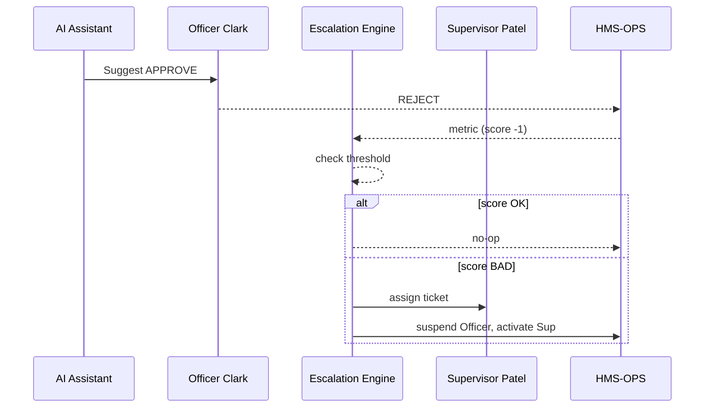

# Chapter 15: Incident Escalation & Replacement Logic  

*(You just learned how every click and rollback is stored forever in  
[Compliance & Audit Trail Engine](14_compliance___audit_trail_engine_.md).  
Now we’ll see **what happens when the numbers in that ledger reveal a pattern of under-performance or stubborn human overrides.  
Who steps in, how fast, and who replaces whom?**)*  

---

## 1 · Why Do We Need an Escalation & Replacement System?  

### Two-Minute Story — “The Stalled Emergency Grants”  

After a tornado, the **Federal Emergency Management Agency (FEMA)** releases *Emergency Roof-Repair Grants*.  

1. The **AI Grant Assistant** recommends *“Approve”* for 120 low-risk applications.  
2. **Officer Clark** manually *“Rejects”* 93 of them, claiming “needs more docs.”  
3. Complaints flood social-media, and Telemetry (Chapter 11) shows approval rate has fallen from **92 % → 22 %**.  

Because HMS runs **Incident Escalation & Replacement Logic**:  

1. The system notices Clark overrode effective AI advice **≥ 3 times** the acceptable threshold.  
2. An *Escalation Ticket* is opened and assigned to **Supervisor Patel**.  
3. If Patel does not respond in **4 h**, the ticket automatically re-routes to **Deputy Lee** and temporarily hands approvals back to the AI assistant.  
4. Every step is logged in the Audit Trail (Chapter 14).  

Citizens get their roofs. The problematic bottleneck is documented and fixed—no midnight conference calls.

---

## 2 · Key Concepts (Plain English)  

| Term                     | Beginner Meaning                                                    |
|--------------------------|----------------------------------------------------------------------|
| Performance Score        | Rolling grade (0–100) of how well a human or AI follows good advice |
| Threshold                | Score below which an escalation is triggered (e.g., < 70)           |
| Escalation Level         | The stage reached: *notify*, *re-assign*, *replace*                 |
| Replacement Candidate    | Backup human or AI allowed to take over                             |
| Cool-Down Period         | Time before the original actor can regain control                   |

Think of it as a **digital performance-improvement plan** baked into the software.

---

## 3 · How It Works in Three Steps  

### 3.1  Track Decisions & Scores  
```ts
// decisions/score.ts  (18 lines)
import { sendMetric } from '@hms/telemetry';

export function recordDecision(actorId: string, aiSuggested: string, humanChosen: string){
  const good = aiSuggested === humanChosen;
  // simple +1 / -1 scoring
  const delta = good ? 1 : -1;
  updateScore(actorId, delta);           // db call skipped
  sendMetric({
    stream: 'decision.score',
    actorId,
    delta
  });
}
```
**Explanation**  
• Every override emits a small metric.  
• `updateScore` keeps a rolling total (e.g., last 100 decisions).

---

### 3.2  Declare Escalation Rules  
```yaml
# rules/escalation.yaml
stream: decision.score
condition: "rollingScore < 70"
window: 1h
action:
  type: escalate
  to: supervisor   # or "backupAI"
  cooldown: 24h
```
**Explanation**  
• If someone’s **rolling score** dips below 70 within one hour → escalate.  
• After replacement, the original actor waits 24 h before resuming.

---

### 3.3  Auto-Escalate and Replace  
```ts
// escalation/engine.ts  (20 lines)
import { createTicket, assign } from '@hms/ops';
import { suspendActor, activateActor } from './roles';

export async function escalate(actorId, rule){
  const ticketId = await createTicket({
    subject: `Low performance score for ${actorId}`,
    ruleId: rule.id
  });
  const newOwner = await assign(ticketId, rule.action.to);

  await suspendActor(actorId, rule.action.cooldown);
  await activateActor(newOwner);

  log({
    action: 'ESCALATED',
    from: actorId,
    to: newOwner,
    ticketId
  }); // goes to Audit Trail
}
```
**Explanation**  
1. Creates a ticket for visibility.  
2. Moves work to supervisor **or** backup AI.  
3. Suspends the original actor for the cool-down window.  
4. Writes a single audit entry.

---

## 4 · End-to-End Flow (Sequence Diagram)  


*Only five participants—easy to grasp.*

---

## 5 · Under the Hood (Step-By-Step)  

1. **Decision Recorder** (Chapter 11) publishes `decision.score` events.  
2. **Feedback Engine** reads events, maintains `rollingScore`.  
3. When a rule fires, it invokes `escalate()` in the Escalation Engine.  
4. The engine:  
   a. Creates a ticket in HMS-OPS.  
   b. Swaps the *active actor* field in the assignment table.  
   c. Notifies all parties via email/Slack.  
5. All state changes (suspend, activate, ticket) call `log()` from Chapter 14.

---

## 6 · Hands-On: Simulate a Bad Actor in 30 s  

```bash
# 1. Start mock services
docker compose up telemetry escalation ops

# 2. Bombard with bad overrides (score will plummet)
node scripts/fakeOverrides.js  --actor clark --bad 50

# 3. Tail escalation logs
docker logs -f escalation_engine
# Expect: "ESCALATED from clark to supervisor"
```

Open `http://localhost:4400/ops/tickets` — you’ll see the new escalation ticket.

---

## 7 · Common Pitfalls & Quick Fixes  

| Pitfall                                    | Quick Fix |
|--------------------------------------------|-----------|
| Good actors penalized by noisy AI          | Use **precision-recall** to refine what counts as “good advice.” |
| Supervisor also under-performs             | Chain multiple escalation levels: supervisor → director → backup AI. |
| Escalations create endless ping-pong       | Add **cool-down** so control doesn’t flip back too soon. |
| Hard-coded thresholds                      | Store in YAML (see above) so policy board can tweak without code. |

---

## 8 · Recap  

You now have a safety net that:  

1. **Scores** how well humans (or AIs) follow effective recommendations.  
2. **Detects** sustained under-performance.  
3. **Escalates** work to a supervisor or backup AI—automatically.  
4. **Logs** every step for auditors in the immutable ledger.  

With this final piece, HMS can **self-monitor, self-correct, and stay accountable**—all while keeping humans firmly in control whenever stakes are high.

*Congratulations, you’ve reached the end of the HMS tutorial series.  
Your digital agency is now ready to serve citizens faster, fairer, and more transparently than ever before!*

---

Generated by [AI Codebase Knowledge Builder](https://github.com/The-Pocket/Tutorial-Codebase-Knowledge)