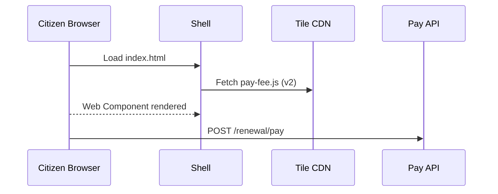

# Chapter 15: Interface Layer – Micro-Frontends (HMS-MFE)

*(picks up from [Chapter 14: Model Context Protocol (HMS-MCP)](14_model_context_protocol__hms_mcp__.md))*  

---

## 1  Why do we need Micro-Frontends?

Imagine a citizen named **Tina** renewing her driver-license on the **Department of Transportation (DOT)** portal.  
Her screen shows five small cards:

| Card | What it does |
|------|--------------|
| “Upload Photo” | Lets Tina drag & drop a JPEG. |
| “Pay Renewal Fee” | Opens her agency wallet. |
| “Schedule Road Test” | Picks a date. |
| “Check Application Status” | Shows live progress. |
| “Accessibility Help” | Toggles large-text mode. |

Tomorrow a new state law cuts the renewal fee by \$5.  
Only the **“Pay Renewal Fee”** card must change—nothing else should be redeployed.

That is exactly what **HMS-MFE** enables: **Lego-style web tiles** that can be swapped, audited, or A/B-tested **independently**.

---

## 2  Key Concepts (Beginner-Friendly)

| Term | Think of it as… | Why it matters |
|------|-----------------|----------------|
| **Shell / Host** | Shopping-mall hallway | Loads & arranges the tiles. |
| **Tile (Micro-Frontend)** | Individual shop | Handles one task (“Pay”, “Schedule”). |
| **Import Map** | Mall directory | Tells the shell where each tile lives. |
| **Release Toggle** | “Open/Closed” sign | Instantly switch versions on or off. |
| **Accessibility Contract** | Wheelchair ramp | Guarantees every tile passes WCAG tests. |

Keep these 5 words—90 % of HMS-MFE is making them cooperate.

---

## 3  Quick-Start: Publish a **“Pay Renewal Fee”** Tile

We will:

1. Scaffold a 15-line Web Component (`pay-fee.js`).  
2. Register it in the shell’s **import map**.  
3. Toggle between **v1** (old price) and **v2** (new price) without redeploying the portal.

### 3.1  Create the Web Component (≤ 15 lines)

```javascript
// pay-fee/v2/pay-fee.js
class PayFee extends HTMLElement {
  connectedCallback() {
    const fee = 35;        // newlaw: $35
    this.innerHTML = `
      <h3>Pay Renewal Fee</h3>
      <p>Amount: $${fee}</p>
      <button id="pay">Pay now</button>`;
    this.querySelector('#pay')
        .addEventListener('click', () =>
            fetch('/api/renewal/pay', {method:'POST',body:fee}));
  }
}
customElements.define('pay-fee', PayFee);
export default PayFee;
```

Explanation  
1. Runs when inserted into the DOM (`connectedCallback`).  
2. Shows the \$35 amount.  
3. Calls the secure backend API (guarded by [Identity, Access & Authorization](10_identity__access___authorization_.md)).  

### 3.2  Publish & version the tile

```bash
# push static files to the CDN bucket
aws s3 cp pay-fee/v2/ s3://cdn.gov/mfe/pay-fee/v2/ --recursive
```

Tiles are pure JS/HTML/CSS files—no server restart.

### 3.3  Update the Shell’s import map (8 lines)

```json
// shell/import-map.json
{
  "imports": {
    "pay-fee": "https://cdn.gov/mfe/pay-fee/v2/pay-fee.js",
    "schedule-test": "https://cdn.gov/mfe/schedule-test/v1/schedule-test.js"
  }
}
```

The shell fetches this JSON at runtime.  
Changing the URL from `/v1/` → `/v2/` is a **1-line toggle**.

### 3.4  Minimal Shell loader (≤ 20 lines)

```html
<!-- index.html -->
<!DOCTYPE html><html>
<head>
  <script type="importmap" src="/import-map.json"></script>
  <script type="module">
    import 'pay-fee';             // auto-registers <pay-fee>
    import 'schedule-test';
  </script>
</head>
<body>
  <pay-fee></pay-fee>
  <schedule-test></schedule-test>
</body>
</html>
```

Open the page—v2 of the tile appears with the \$35 fee.  
Roll back? Just flip the import-map URL to `/v1/`.

---

## 4  What Happens Behind the Curtain?



Plain English  

1. Browser loads the **shell**.  
2. Shell reads `import-map.json`, fetches each tile from the CDN.  
3. Tiles render themselves & call backend APIs—already protected by earlier HMS layers.  

---

## 5  Under-the-Hood Code Peeks

### 5.1  Import-map toggle script (12 lines)

```python
# scripts/swap_tile.py
import json, sys, pathlib
tile, version = sys.argv[1:]           # e.g., pay-fee v2
im = json.loads(pathlib.Path('import-map.json').read_text())
url = im["imports"][tile]
im["imports"][tile] = url.replace("/v1/", f"/{version}/")
pathlib.Path('import-map.json').write_text(json.dumps(im, indent=2))
print(f'🔄 {tile} now points to {version}')
```

Run `python swap_tile.py pay-fee v1` to roll back.

### 5.2  Accessibility test snippet (8 lines)

```bash
# CI step (GitHub Action)
npx pa11y-ci https://cdn.gov/mfe/pay-fee/v2/demo.html \
   --standard WCAG2AA || exit 1
```

Build fails if the tile violates WCAG 2.1 AA—**Accessibility Contract** in action.

---

## 6  How HMS-MFE Talks to the Rest of the Stack

```
Citizen Browser
      │           (JWT cookie)
      ▼
Shell ── loads Tiles ──► CDN
      │                 │
      ▼                 ▼
Tiles — fetch APIs ──► [Governance Layer](02_governance_layer__hms_gov__.md)
                      ▼
                  Micro-services
                      ▲
                [Operations Hub](01_operations___monitoring_hub__hms_ops__.md) tracks errors
```

Other links:

* **Import-map** itself is stored in the **Data Core catalog** for auditability.  
* **Release Toggles** can be gated by policy rules from [HMS-CDF](03_policy_engine___hms_cdf__codified_democracy_foundation__.md) (e.g., “only release after committee vote”).  
* Tiles emit UX metrics straight to HMS-OPS dashboards.

---

## 7  Beginner FAQ

**Q1:** Do I need a front-end framework?  
No. Plain Web Components work. React/Vue tiles are fine too—they compile down to one JS file the shell imports.

**Q2:** Can two tiles share state (e.g., logged-in user)?  
Yes. The shell injects a small `window.hmsContext` object with the user’s JWT and feature flags.

**Q3:** What if a tile crashes?  
The shell wraps each tile in a **shadow DOM + error boundary**; a crash displays a friendly “This card is temporarily unavailable” banner but the rest of the page stays alive.

**Q4:** How do we A/B test?  
Publish **v2** side-by-side, then set `import-map.json` based on a feature-flag cookie—handled by the shell’s 5-line flag loader.

---

## 8  Recap & What’s Next  

You learned to:

1. Think of the portal as a **mall hallway** (shell) filled with **shops** (tiles).  
2. Publish a 15-line “Pay Fee” tile and flip versions with a one-line import-map change.  
3. See how accessibility checks, policy gates, and runtime monitoring slot in automatically with other HMS layers.  
4. Peek at the tiny scripts and diagrams under the hood.

Designers and developers can now build, trade, and reuse these tiles across agencies.  
Where do they **discover** ready-made tiles like “Address Lookup” or “Disaster Relief Status”?  
Find out in the next (and final) chapter: [Marketplace & Discovery (HMS-MKT)](16_marketplace___discovery__hms_mkt__.md) 🎉

---

Generated by [AI Codebase Knowledge Builder](https://github.com/The-Pocket/Tutorial-Codebase-Knowledge)