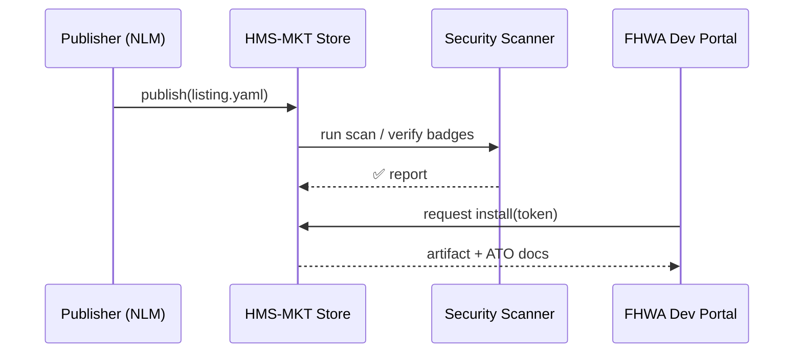

# Chapter 16: Marketplace & Discovery (HMS-MKT)

*(picks up from [Chapter 15: Interface Layer – Micro-Frontends (HMS-MFE)](15_interface_layer___micro_frontends__hms_mfe__.md))*  

---

## 1  Why a “government app-store” at all?

The **Federal Highway Administration (FHWA)** wants to add an “Address Autocomplete” card to its on-line **Bridge Repair Grant** portal.

Traditionally that means:

1. Issue an RFP.
2. Wait 90 days for bids.
3. Review security docs.
4. Sign an “Authority-to-Operate” (ATO) package.
5. Finally copy code into production.

By the time the card appears, bridge season is over.  

**HMS-MKT makes this a 5-minute shopping trip**:

```
Search “address autocomplete”  →  Pick vetted tile  →  Click “Install”
```

All badges (price, certifications, ATO paperwork) are already attached, so procurement teams can approve with a single digital signature.

---

## 2  Key concepts (Beginner-friendly)

| Word | Think of it as… | Why it matters |
|------|-----------------|----------------|
| **Listing** | A product page in the store | Describes a data set, widget, or AI skill. |
| **Badge** | Sticker on the box | “ATO-Granted”, “FedRAMP High”, “Free Tier”. |
| **Collection** | Store shelf | Group of listings (e.g., “UI Tiles”, “AI Skills”). |
| **Install Token** | Purchase receipt | One-time JWT that lets your project fetch the artifact. |
| **Review** | Star rating | Lets other agencies share feedback & bug notes. |

Remember these five—everything in HMS-MKT is just arranging, filtering, and delivering them.

---

## 3  Quick-start: Install the “Address Autocomplete” tile

### 3.1 Search the marketplace (CLI, 3 lines)

```bash
hms-mkt search "address autocomplete" --type=tile
```

Example output:

```
ID   NAME                       BADGES
T04  US-Street-Autocomplete v2  ATO✅  FedRAMP✅  FREE
```

### 3.2 Inspect the listing

```bash
hms-mkt info T04
```

Shows:

```
• Maintainer: USPS Digital Services
• Price: Free
• Certifications: FedRAMP High, Section 508
• Install script: install_t04.sh
• Last security scan: 2024-05-21 (clean)
```

### 3.3 Generate an install token (requires `ProcurementOfficer` role)

```bash
hms-mkt install T04 --project=bridge-grant
```

Console:

```
🔑 Install token: tok_f27b... (valid 60 min)
🚚 Artifact copied to s3://agency-cdn/tiles/address-auto/v2/
📄 ATO docs attached to project registry
```

Done!  
Open your portal; the **shell import-map** now points to the new tile.

---

## 4  Adding your own listing (publisher view)

Suppose the **National Library of Medicine (NLM)** wants to share a de-identified *Opioid Prescription* data set.

### 4.1 Write a 12-line listing file

```yaml
# listings/opioid_presc.yaml
id: DS_OPIOID_2024Q1
name: "Opioid Prescriptions 2024-Q1"
type: dataset
source_url: "s3://nlm-data/opioid_2024q1.parquet"
badges: [ "HIPAA-Safe", "Free" ]
price: 0
ato_reference: "ATO-2023-9876"
license: "CC-BY-4.0"
```

### 4.2 Publish (CLI, 2 lines)

```bash
hms-mkt publish listings/opioid_presc.yaml
✅ Listing visible at https://mkt.gov/listings/DS_OPIOID_2024Q1
```

Other agencies can now search, preview sample rows, and install with a token.

---

## 5  What happens under the hood?



Plain-English steps  
1. **Publish** – Store validates YAML schema then kicks off automatic scans.  
2. **Scan** – External scanner signs a “clean” report; store attaches it as a **Badge**.  
3. **Install** – When another agency requests, store generates a short-lived **Install Token**, logs the transaction for auditors, and copies the artifact into the agency’s own storage.

---

## 6  Tiny code peeks

### 6.1 Store catalog entry (JSON, 11 lines)

```json
{
  "id": "T04",
  "name": "US-Street-Autocomplete v2",
  "type": "tile",
  "version": "2.0.0",
  "badges": ["FedRAMP", "ATO"],
  "price": 0,
  "artifact": "s3://store/tiles/T04/v2.zip",
  "publisher": "USPS",
  "created": "2024-04-12"
}
```

A simple row in a Dynamo-like table.

### 6.2 Token generator (8 lines)

```python
def token(listing_id, project):
    payload = {
        "sub": project,
        "listing": listing_id,
        "exp": time.time()+3600
    }
    return jwt.encode(payload, PRIVATE, algorithm="RS256")
```

Tokens reuse the same JWT machinery from [Identity, Access & Authorization](10_identity__access___authorization_.md).

### 6.3 Auto-copy artifact (10 lines)

```python
def deliver(listing, bucket):
    src = listing["artifact"]
    dst = f"s3://{bucket}/{listing['id']}/{listing['version']}/"
    s3.copy(src, dst, recursive=True)
    return dst
```

Keeps installs reproducible—always the same hash.

---

## 7  Where HMS-MKT fits in the big picture

```
Developer / Analyst
      │ search / install
      ▼
[Marketplace – HMS-MKT]  ── delivers →  Project Storage / Import-Map
      │                                       │
      ▼                                       ▼
Badges, ATO docs                   Apps, Workflows, Agents
      │                                       │
[Governance Layer](02_governance_layer__hms_gov__.md) enforces policy before runtime use
```

Other connections  

* **[HMS-OPS](01_operations___monitoring_hub__hms_ops__.md)** shows per-listing error trends.  
* **[HMS-CDF](03_policy_engine___hms_cdf__codified_democracy_foundation__.md)** can require committee approval before paid installs.  
* **[AI Representative Agents](11_ai_representative_agent_.md)** can *suggest* marketplace items but cannot install without a human token.

---

## 8  Beginner FAQ

**Q:** Is everything free?  
No. Listings can be **Free**, **Fixed Price**, or **Pay-as-you-go**. Pricing and procurement rules appear as badges.

**Q:** What if a listing has a security flaw later?  
The publisher flags a **“Security Advisory”** badge; HMS-OPS notifies every project that installed it.

**Q:** Can state or local agencies use HMS-MKT?  
Yes—access is federated through their Login.gov identity, but some federal-only listings can be hidden via policy.

**Q:** How do reviews work?  
After 7 days of usage, the portal prompts maintainers to leave a 1–5 ★ rating plus comments; these are visible on the listing page.

---

## 9  Recap

In this final chapter you:

1. Learned why a marketplace slashes procurement from months to minutes.  
2. Installed a vetted “Address Autocomplete” tile in three CLI commands.  
3. Published a de-identified data set with a 12-line YAML.  
4. Saw how badges, tokens, and automatic scans keep everything secure and auditable.  
5. Peeked at the tiny code powering catalog rows, token signing, and artifact delivery.

**Congratulations—you’ve completed the HMS tutorial series!**  
You now have a full tour, from mission-critical monitoring to policy engines, AI guardrails, micro-frontends, and finally a one-stop discovery marketplace.

> **Next steps:** clone the sample repo, publish your own widget, and help improve digital public services for everyone. 🎉

---

Generated by [AI Codebase Knowledge Builder](https://github.com/The-Pocket/Tutorial-Codebase-Knowledge)