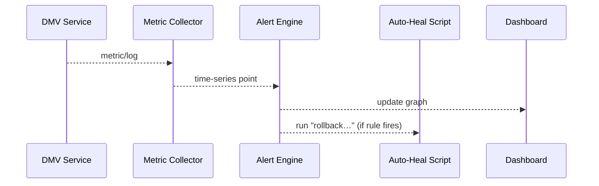

# Chapter 20: Monitoring & Operations Center (HMS-OPS)  

*(continuing from [Central Data Repository (HMS-DTA)](19_central_data_repository__hms_dta__.md))*  

---

## 1 · Why Do We Need a “Mission Control” for Government Software?  

### A 60-Second Story  

1. April 14th, 7 p.m. — citizens scramble to renew driver’s licenses before Tax-Day deadlines.  
2. Traffic on the DMV portal spikes from **800 req/s → 9 000 req/s** in 4 minutes.  
3. A brand-new photo-upload micro-service starts throwing **502 errors**.  
4. HMS-OPS immediately:  
   • spots the error spike,  
   • rolls traffic back to yesterday’s stable canary,  
   • posts “Service Degradation Resolved” to the public status page, **all in < 90 seconds**.  

That is the difference between a stressful night and front-page headlines.  
HMS-OPS is the platform’s **Mission Control**—dashboards, logs, alerts, and auto-healing tied together and mapped to **NIST 800-53** operational controls.

---

## 2 · Key Concepts (Plain Words)

| Concept | Beginner Analogy | Why You Care |
|---------|------------------|--------------|
| Metric | Heart-rate monitor | Tracks “req/s”, CPU, or backlog size |
| Log Stream | Black-box voice recorder | Every service’s `LogKit` line flows here |
| Alert Rule | Smoke detector | Fires when a metric crosses a limit |
| Auto-Heal Script | Spare tire robot | Runs `kubectl rollout undo` or `restart svc` |
| TechStat KPI Board | Report card to OMB | Shows uptime, cost per request, etc. |

---

## 3 · Five-Minute Quick-Start

Below we:  
1) emit a custom metric,  
2) watch it on a live dashboard,  
3) set an auto-heal on error spike — all in **< 20 lines** each.

### 3.1 Emit a Metric from Any Service

```python
# dmv_photo.py  (excerpt)
from hms_ops import Metric

def upload_photo(blob):
    ok = _save(blob)          # pretend work
    Metric.emit("photo.upload.ok", 1 if ok else 0)
    return ok
```

*Explanation* – `Metric.emit` is one line; HMS-OPS agents pick it up over gRPC and append it to the central time-series store.

---

### 3.2 Create a Dashboard Tile (CLI)

```bash
hmsops dash add \
  --query "sum(rate(photo.upload.ok[5m]))" \
  --title "Photo Uploads / sec" \
  --panel line
```

*Result* – Visit `https://ops.hms.gov/dash/dmv` and watch the line climb in real-time.

---

### 3.3 Add an Auto-Heal Rule

```python
# heal_rule.py   (≤ 20 lines)
from hms_ops import Alert, Heal

Alert.create(
    name    = "photo_error_spike",
    expr    = "rate(photo.upload.ok[1m]) < 0.7",
    for_sec = 60,
    on_fire = Heal(script="rollback dmv-photo --to=prev")
)
```

*Explanation* – If < 70 % of uploads succeed for 60 s, HMS-OPS executes the rollback script automatically.

---

## 4 · What Happens Behind the Curtain?



Only **five** moving parts; each message is TLS-encrypted and produces an audit entry in [HMS-DTA](19_central_data_repository__hms_dta__.md).

---

## 5 · Inside HMS-OPS (Tiny Code Peeks)

### 5.1 Metric Collector Loop (14 lines)

```python
# hms_ops/collector.py
import kafka, time
bus = kafka.Consumer("hms.metrics")

def loop():
    while True:
        msg = bus.poll(timeout=1)
        if not msg: continue
        ts, name, val = msg.value
        write_tsdb(name, ts, val)          # TSDB = time-series DB
```

### 5.2 Alert Evaluator (18 lines)

```python
# hms_ops/alert.py
import promql, subprocess

def tick(alert):
    val = promql.eval(alert.expr)          # e.g., current error rate
    now = time.time()
    if val and val > alert.threshold:
        if now - alert.last_fire > alert.for_sec:
            subprocess.Popen(alert.on_fire.script.split())
            alert.last_fire = now
```

*Takeaway* – It’s regular Python calling `subprocess`; nothing magical.

---

## 6 · Where OPS Hooks into Other HMS Layers

| Layer | Interaction | Example |
|-------|-------------|---------|
| [HMS-UTL](18_utility___shared_library_layer__hms_utl__.md) | All services log with `LogKit` → logs stream to OPS | Search `lvl:"ERROR"` |
| [HMS-ACH](12_financial_transaction_core__hms_ach__.md) | Reconciliation mismatch triggers alert | “Bank vs Ledger Δ > \$0.01” |
| [HITL](07_human_in_the_loop_oversight__hitl__.md) | Auto-heal failures open a **Take-Over** ticket | Ops engineer approves manual fix |
| [HMS-ESR](17_simulation___behavior_lab__hms_esr__.md) | Simulation gates feed expected latency; OPS watches real latency vs. baseline | Detects prod drift |
| **OMB TechStat** | KPI board exports PDF | Quarterly review compliance |

---

## 7 · Hands-On Exercise (3 min)

1. Install CLI: `pip install hms-ops-cli`  
2. Tail live errors:

   ```bash
   hmsops logs --svc dmv-photo --level ERROR --follow
   ```

3. In a separate shell, run a failure loop:

   ```bash
   for i in {1..30}; do curl -X POST /api/photo/fail; done
   ```

4. Watch the alert fire in the first shell, then run:

   ```bash
   hmsops alert list --active
   ```

   You should see `photo_error_spike` marked **“fired, heal-running”**.

---

## 8 · Frequently Asked Beginner Questions

**Q: Is HMS-OPS another Prometheus + Grafana bundle?**  
A: Under the hood it reuses those battle-tested engines, but wraps them with:  
• scoped tokens,  
• NIST 800-53 audit hooks,  
• auto-heal scripting, and  
• OMB TechStat KPI templates.

**Q: How do I add a new service?**  
A: Deploy it with `HMS_SERVICE=<name>` env var; `LogKit` and `Metric.emit` auto-discover.

**Q: Can I silence alerts during maintenance?**  
A: Yes:

```bash
hmsops alert silence photo_error_spike --for 2h --reason "planned upgrade"
```

Silence is logged for auditors.

**Q: What happens if the heal script also fails?**  
A: OPS escalates to [HITL](07_human_in_the_loop_oversight__hitl__.md) with a “Take-Over Required” ticket.

---

## 9 · What You Learned

1. HMS-OPS is **Mission Control**—metrics, logs, alerts, auto-heal, KPI boards.  
2. Emitting a metric, creating a dashboard, and adding auto-heal took **under 20 lines each**.  
3. Internally it’s simple loops over time-series data plus subprocess calls.  
4. OPS ties every other HMS component together while satisfying **NIST 800-53** and **OMB TechStat** reporting.

Next we’ll dive into the guardrails that keep AI actions aligned with public-interest values: [AI Governance Value Guardrails](21_ai_governance_value_guardrails_.md).

---

Generated by [AI Codebase Knowledge Builder](https://github.com/The-Pocket/Tutorial-Codebase-Knowledge)