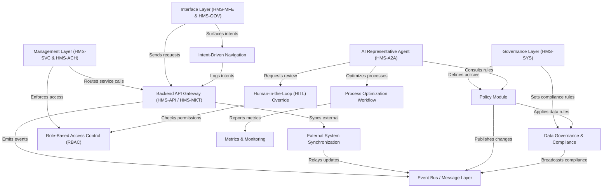

# Tutorial: HMS-OPS

This project is a **comprehensive AI operations management platform** for government ecosystems. It integrates *automated workflows*, *policy enforcement*, and *real-time synchronization* across services. *Administrators* define policies via a governance layer, *citizens* interact through responsive interfaces, and *AI agents* optimize processes while humans review actions for compliance. The system ensures **security**, **data governance**, and **transparent monitoring** for efficient public service delivery.

**Source Repository:** [None](None)

## Chapters

1. [Interface Layer (HMS-MFE & HMS-GOV)
](01_interface_layer__hms_mfe___hms_gov__.md)
2. [Intent-Driven Navigation
](02_intent_driven_navigation_.md)
3. [Management Layer (HMS-SVC & HMS-ACH)
](03_management_layer__hms_svc___hms_ach__.md)
4. [Backend API Gateway (HMS-API / HMS-MKT)
](04_backend_api_gateway__hms_api___hms_mkt__.md)
5. [Event Bus / Message Layer
](05_event_bus___message_layer_.md)
6. [External System Synchronization
](06_external_system_synchronization_.md)
7. [AI Representative Agent (HMS-A2A)
](07_ai_representative_agent__hms_a2a__.md)
8. [Process Optimization Workflow
](08_process_optimization_workflow_.md)
9. [Metrics & Monitoring
](09_metrics___monitoring_.md)
10. [Human-in-the-Loop (HITL) Override
](10_human_in_the_loop__hitl__override_.md)
11. [Role-Based Access Control (RBAC)
](11_role_based_access_control__rbac__.md)
12. [Policy Module
](12_policy_module_.md)
13. [Data Governance & Compliance
](13_data_governance___compliance_.md)
14. [Governance Layer (HMS-SYS)
](14_governance_layer__hms_sys__.md)

---

Generated by [AI Codebase Knowledge Builder](https://github.com/The-Pocket/Tutorial-Codebase-Knowledge)