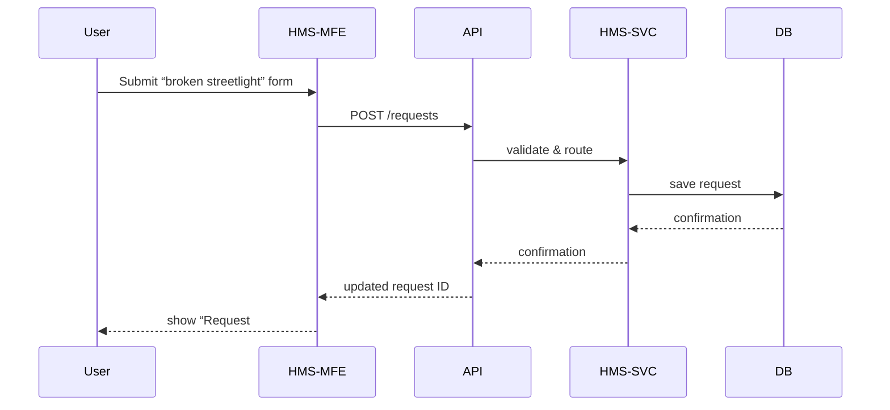
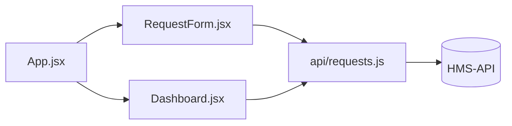

# Chapter 1: Citizen Frontend (HMS-MFE)

Welcome to the **Citizen Frontend (HMS-MFE)**—the “town hall” portal for residents, businesses, or NGOs. In this chapter, we’ll see how HMS-MFE makes it easy to submit requests (like permit applications or roadside pothole reports) and track their progress through an intuitive web interface.

---

## 1. Why HMS-MFE? A Real-World Use Case

Imagine Jane, a city resident, wants to report a broken streetlight. Today she might fill out a PDF, email it, then wait weeks for status updates. HMS-MFE solves this by offering:

- A simple form to describe the issue  
- A dashboard to see when the city responds  
- Notifications at each step  

This is just like applying for a federal grant on Grants.gov—but streamlined and branded for your local government.

---

## 2. Key Concepts

1. **Micro-frontend Container**  
   - Hosts multiple “widgets” (forms, dashboards).  
   - Allows independent deployment and styling.

2. **Request Form Module**  
   - A reusable component to submit new requests.

3. **Dashboard Module**  
   - Shows status updates in a table or card view.

4. **State & API Layer**  
   - Manages data fetching from the Market & Policy API ([HMS-API/HMS-MKT](03_market___policy_api__hms_api_hms_mkt__.md)).

---

## 3. Building the Citizen Portal

### 3.1 Basic App Setup

File: `src/index.jsx`
```jsx
import React from 'react'
import ReactDOM from 'react-dom'
import App from './App'

ReactDOM.render(<App />, document.getElementById('root'))
```
*This mounts our portal into the page.*

---

### 3.2 The Main Container

File: `src/App.jsx`
```jsx
import React from 'react'
import RequestForm from './components/RequestForm'
import Dashboard from './components/Dashboard'

export default function App() {
  return (
    <div>
      <h1>City Service Portal</h1>
      <RequestForm />   {/* Submit new issues */}
      <Dashboard />     {/* Track existing requests */}
    </div>
  )
}
```
*The container stitches together our two main modules.*

---

## 4. User Journey: What Happens Under the Hood

### 4.1 Step-by-Step Sequence



---

## 5. Inside the RequestForm Module

### 5.1 High-Level Walkthrough

1. Render form fields (title, description, photo upload).  
2. On submit, call `requests.create()` from HMS-API.  
3. Show success message and clear form.

### 5.2 Code Snippet

File: `src/components/RequestForm.jsx`
```jsx
import React, {useState} from 'react'
import {createRequest} from '../api/requests' // Calls HMS-API

export default function RequestForm() {
  const [desc, setDesc] = useState('')
  const submit = async () => {
    const res = await createRequest({description: desc})
    alert(`Created Request #${res.id}`)
    setDesc('')
  }

  return (
    <div>
      <h2>Report an Issue</h2>
      <textarea
        placeholder="Describe the issue"
        value={desc} onChange={e => setDesc(e.target.value)}
      />
      <button onClick={submit}>Submit</button>
    </div>
  )
}
```
*Very minimal form with a single text area.*

---

## 6. Styling & Theming

Analogous to hanging posters in your town hall, theming ensures every widget “feels” part of the same building:

```css
body { font-family: Arial, sans-serif; background: #f4f4f4; }
h1 { color: #004080; }
button { background: #008cba; color: white; border: none; padding: 8px; }
```

---

## 7. Putting It All Together



- **App.jsx**: Hosts modules  
- **RequestForm & Dashboard**: UI components  
- **api/requests.js**: Wraps fetch calls to [HMS-API/HMS-MKT](03_market___policy_api__hms_api_hms_mkt__.md)

---

## 8. Conclusion

In this chapter, you learned:
- What the Citizen Frontend (HMS-MFE) is for  
- The main modules: **RequestForm** and **Dashboard**  
- How data flows from user to database  

Up next, we’ll see how government staff review these requests in the [Admin/Gov Portal (HMS-GOV)](02_admin_gov_portal__hms_gov__.md).

---

Generated by [AI Codebase Knowledge Builder](https://github.com/The-Pocket/Tutorial-Codebase-Knowledge)