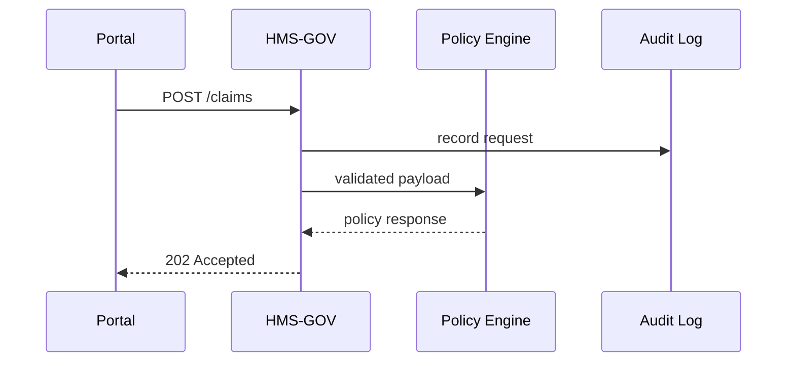

# Chapter 1: Governance Layer (HMS-GOV)


> “Where policy meets software.”

Welcome to HMS-SCM! Before we dive into AI agents, legal reasoning, or dazzling dashboards, we need a single front door that **every** request must walk through.  
That front door is the **Governance Layer (HMS-GOV)**.

---

## 1. Why Do We Need HMS-GOV?

Imagine City Hall:

* A citizen arrives with a benefits form.  
* The front-desk clerk checks ID, date-stamps the paperwork, and routes it to the right department.  
* Every interaction is logged for transparency.

HMS-GOV plays the same role for digital services:

* It receives API calls from portals, mobile apps, or partner agencies.  
* It checks each call for compliance with privacy, ethics, and statutory rules.  
* It routes valid requests to internal micro-services and records who did what.

Without a strong front door, we would have 20+ services (policy engine, AI agents, data hubs, etc.) all re-implementing the same security and compliance logic—an invitation to bugs and audited nightmares.

---

## 2. Starter Use-Case: Submitting a Veteran Benefits Claim

We’ll follow a single journey to make concepts concrete:

1. A veteran fills out **Form 22-1990** (Education Benefits) in our web portal.  
2. The portal sends a `POST /claims` request.  
3. HMS-GOV inspects the request, ensures PII redaction rules are met, attaches a digital signature, and forwards the payload to the **Policy Codification Engine** (covered in [Chapter 2](02_policy_codification_engine__hms_cdf__.md)).  
4. If anything violates FFIEC privacy rules, HMS-GOV rejects the call with an explanatory error.

Keep this journey in mind—we’ll implement a tiny slice of it next.

---

## 3. Key Concepts (Beginner Friendly)

| Concept | City-Hall Analogy | One-Line Job |
|---------|------------------|--------------|
| API Gateway | The reception counter | Accepts & routes requests |
| Compliance Screen | ID check & metal detector | Blocks non-compliant calls |
| Signature Recorder | Date-stamp machine | Adds verifiable signatures |
| Audit Log | Clerk’s ledger | Stores who did what, when |
| Policy Adapter | Inter-office mail | Converts external forms to internal formats |

---

## 4. Using HMS-GOV in Code

Below is a super-mini “hello world” Governance Layer using Node.js and Express. Real code lives across services, but this 18-line snippet shows the heart of it.

```js
// gov.js  (run with: node gov.js)
const express = require('express');
const app = express();
app.use(express.json());

// 1. Compliance screen (very naive)
function complianceCheck(req, res, next) {
  if (!req.headers['x-api-key']) {
    return res.status(401).json({error: 'Missing API Key'});
  }
  // TODO: Privacy, ethics, rate-limit, etc.
  next();
}

// 2. Signature recorder
function addSignature(req, res, next) {
  req.body._signedBy = 'HMS-GOV';
  req.body._timestamp = Date.now();
  next();
}

// 3. Route to internal service stub
app.post('/claims', complianceCheck, addSignature, (req, res) => {
  // In real life we’d call HMS-CDF via HTTPS.
  console.log('Forwarding payload:', req.body);
  res.status(202).json({status: 'accepted'});
});

app.listen(3000, () => console.log('GOV listening on 3000'));
```

What happens?

1. A request to `POST /claims` arrives.  
2. `complianceCheck` ensures a key is present.  
3. `addSignature` tags the payload.  
4. The request is (fake) forwarded and the caller gets `202 Accepted`.

Try it:

```bash
curl -X POST http://localhost:3000/claims \
  -H "Content-Type: application/json" \
  -H "x-api-key: test123" \
  -d '{"veteranId":"VET42"}'
```

You should see `{"status":"accepted"}` in the terminal.

---

## 5. What Happens Under the Hood?

Below is a lightweight sequence diagram for our veteran claim:



Step-by-step narrative:

1. The portal’s HTTP call lands on HMS-GOV.  
2. GOV checks API keys, privacy flags, etc.  
3. All details go to the **Activity Logging & Audit Trail** service (see [Chapter 21](21_activity_logging___audit_trail_.md)).  
4. The cleansed payload is sent to the **Policy Codification Engine** for rule evaluation.  
5. The final response is returned to the caller.

---

## 6. Peeking at the Real Implementation

In the repo you’ll find:

```
/hms-gov
 ├─ gov-gateway.js      # Main Express / Fastify entry
 ├─ middlewares/
 │    ├─ privacy.js     # Redacts SSNs
 │    ├─ ethics.js      # Checks bias flags
 │    └─ rateLimit.js
 └─ adapters/
      └─ toHmsCdf.js    # Maps external → internal schema
```

A micro-snippet from `middlewares/privacy.js` (7 lines):

```js
module.exports = function privacy(req, res, next) {
  if (req.body.ssn) {
    req.body.ssn = req.body.ssn.replace(/\d{5}(?=\d{4})/, 'XXXXX');
  }
  next();
};
```

Explanation: If a Social Security Number is spotted, the first five digits are masked. Simple, but illustrates how HMS-GOV enforces privacy before data moves deeper into the stack.

---

## 7. Common Questions

**Q: Is HMS-GOV a firewall?**  
A: Partially. It filters traffic, but also transforms payloads, attaches signatures, and coordinates policy checks.

**Q: Can I bypass HMS-GOV to talk directly to back-end services?**  
A: No. Internal services are on a private network; HMS-GOV is the only public entry point.

**Q: Where do detailed policy rules live?**  
A: In the [Policy Codification Engine (HMS-CDF)](02_policy_codification_engine__hms_cdf__.md). GOV asks CDF whenever it needs to know whether a call should be allowed.

---

## 8. Key Takeaways

• HMS-GOV is the “front desk” for all external traffic.  
• It enforces compliance, attaches digital signatures, and logs every action.  
• Think of it as a smart API gateway tailored for government-grade oversight.

---

### Up Next

In the next chapter, we’ll open the door to the rulebook itself—how policies are written in code and evaluated in real time by the [Policy Codification Engine (HMS-CDF)](02_policy_codification_engine__hms_cdf__.md). See you there!

---

Generated by [AI Codebase Knowledge Builder](https://github.com/The-Pocket/Tutorial-Codebase-Knowledge)