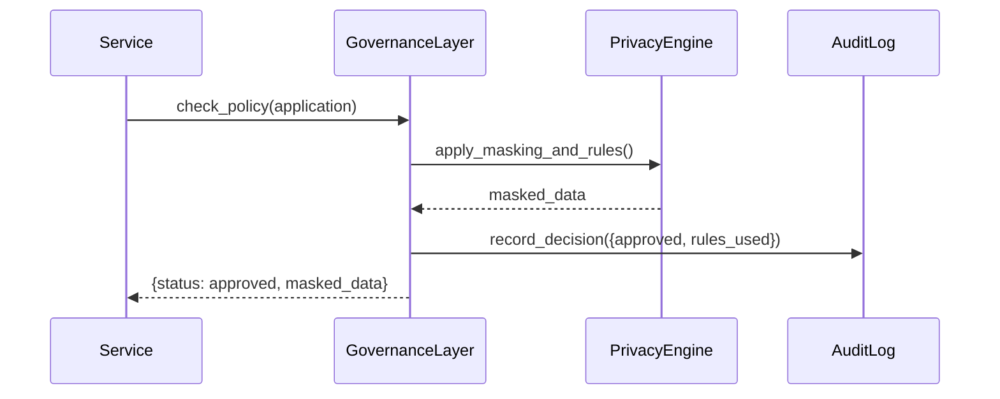

# Chapter 1: Governance Layer

Welcome to the first chapter of the HMS-SCM tutorial! In this chapter, we'll explore the **Governance Layer**—the rulebook and oversight board of our entire platform. Think of it like the Privacy and Civil Liberties Oversight Board for a federal agency, making sure every action meets legal and ethical standards (e.g., OMB Circular A-130, Federal Data Strategy).

---

## Why Do We Need a Governance Layer?

Imagine a citizen submits an online benefit application (Form 123) to the Department of Community Planning and Development. Before any downstream service processes that sensitive data, we need to:

1. Check privacy policies (Did the user consent?).
2. Enforce ethical AI rules (No bias or unfair decisions).
3. Log actions for audits (OMB audit trails).
4. Block requests that violate regulations.

Without a central “rulebook,” each microservice might implement its own checks—leading to inconsistencies, compliance gaps, and nightmare audits.

---

## High-Level Use Case

**Scenario:**  
A state agency’s portal sends a JSON payload with a citizen’s SSN and income info. The Governance Layer must:

- Mask SSN if flagged private.
- Validate consent based on Federal Data Strategy.
- Log the decision (approval or block).
- Return an “OK to proceed” or “Blocked” response.

---

## Key Concepts

1. **Policy Definitions**  
   - Rules written in a simple DSL or JSON (e.g., “Mask SSN if data classification = PRIVATE”).

2. **Oversight Board**  
   - A logical component that approves or rejects requests based on policies.

3. **Audit Logging**  
   - Every decision is recorded with timestamp, user ID, rule invoked.

4. **Compliance Engine**  
   - Implements regulations like OMB Circulars, FedRAMP, etc.

---

## Using the Governance Layer

Below is how a downstream service (e.g., a Microservice for benefit calculation) calls the Governance Layer before processing:

```python
# service.py
from governance import GovernanceLayer

gov = GovernanceLayer()

application = {
    "citizen_id": "12345",
    "ssn": "111-22-3333",
    "income": 45000,
    "consent": True
}

decision = gov.check_policy(application)
print(decision)  # -> {"status": "approved", "masked_data": {...}}
```

Explanation:  
- We import `GovernanceLayer`, pass the application data.  
- `check_policy` returns `approved` or `blocked`, plus any masked fields.

---

## What Happens Under the Hood?

### Step-by-Step Walkthrough

1. **Request Arrival**: Service calls `check_policy()`.  
2. **Policy Matching**: Governance Layer finds relevant rules (e.g., privacy/masking).  
3. **Decision & Masking**: It applies transformations (mask SSN) or blocks.  
4. **Audit Log**: Records the decision in an audit store.  
5. **Response**: Returns the final decision to the caller.

### Sequence Diagram



---

## Inside the Code

### File: governance.py

```python
# governance.py

class GovernanceLayer:
    def __init__(self):
        # Load policy definitions from JSON or DB
        self.policies = load_policies()  

    def check_policy(self, data):
        # 1. Find matching policies
        rules = find_rules(data, self.policies)
        # 2. Apply privacy/ethics rules
        masked = apply_rules(data, rules)
        # 3. Log the decision
        audit_record(data, rules)
        # 4. Return decision
        return {"status": "approved", "masked_data": masked}
```

Explanation:  
- `load_policies()` reads JSON rules.  
- `find_rules()` picks rules based on fields (e.g., `ssn`).  
- `apply_rules()` masks or transforms data.  
- `audit_record()` writes to an audit log for compliance.

### File: policies.json

```json
[
  {
    "field": "ssn",
    "action": "mask",
    "condition": "classification == 'PRIVATE'"
  },
  {
    "field": "income",
    "action": "allow",
    "condition": "consent == true"
  }
]
```

Explanation:  
- Simple JSON defines which fields to mask or allow, based on conditions.

---

## Conclusion

You’ve now learned how the Governance Layer serves as the platform’s “ethical overseer,” enforcing data privacy, logging audits, and ensuring compliance with federal guidelines (OMB, Federal Data Strategy). In the next chapter, we’ll see how to **orchestrate** these checks alongside resource management in the [Management Layer](02_management_layer_.md).  

Happy coding!

---

Generated by [AI Codebase Knowledge Builder](https://github.com/The-Pocket/Tutorial-Codebase-Knowledge)