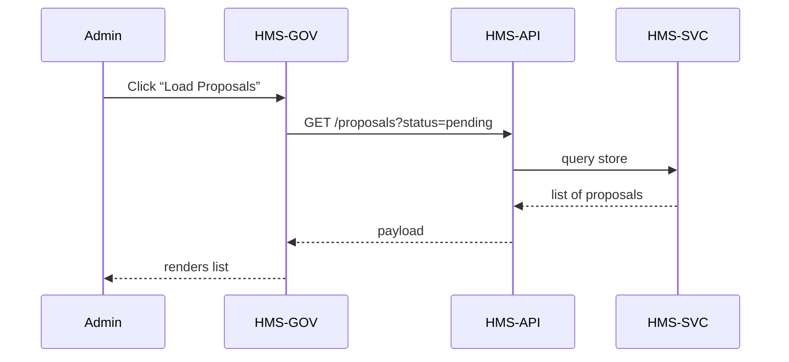

# Chapter 2: Admin/Gov Portal (HMS-GOV)

Welcome back! In [Chapter 1: Citizen Frontend (HMS-MFE)](01_citizen_frontend__hms_mfe__.md), we saw how residents submit requests. Now let’s look at how decision-makers review and manage proposals in the **Admin/Gov Portal (HMS-GOV)**.

---

## 1. Why HMS-GOV? A Real-World Use Case

Imagine the AI Agent Framework (covered later) drafts a new “Park Beautification Ordinance” to convert vacant lots into playgrounds. Before that draft becomes law, the mayor’s team needs to:

- See all AI-generated proposals  
- Read or edit legislative text  
- Approve, override, or send back for revision  
- Check performance metrics (e.g., projected cost, community impact)

**HMS-GOV** brings all of this into one interface, ensuring humans stay in control.

---

## 2. Key Concepts

1. **Portal Layout**  
   A dashboard with navigation tabs: Proposals, Drafts, Metrics.

2. **AI Proposals List**  
   Shows new suggestions (title, summary, status).

3. **Draft Review Panel**  
   Expand a proposal to edit text, attach comments, or view revision history.

4. **Override/Endorse Controls**  
   Buttons to Approve, Edit & Resubmit, or Reject.

5. **Performance Metrics Viewer**  
   Charts and tables showing impacts like budget and timeline.

---

## 3. Building the Admin Portal

### 3.1 App Entry Point

File: `src/index.jsx`
```jsx
import React from 'react'
import ReactDOM from 'react-dom'
import AdminApp from './AdminApp'

ReactDOM.render(
  <AdminApp />, 
  document.getElementById('admin-root')
)
```
*Mounts our admin portal into the page.*

---

### 3.2 Main Container

File: `src/AdminApp.jsx`
```jsx
import React from 'react'
import ProposalList from './components/ProposalList'
import MetricsViewer from './components/MetricsViewer'

export default function AdminApp() {
  return (
    <div>
      <h1>Mayor’s Decision Hub</h1>
      <ProposalList />     {/* List of AI proposals */}
      <MetricsViewer />    {/* High-level performance charts */}
    </div>
  )
}
```
*Stitches together the two main views.*

---

### 3.3 ProposalList Component

File: `src/components/ProposalList.jsx`
```jsx
import React, {useEffect, useState} from 'react'
import {fetchProposals} from '../api/proposals'
import ReviewPanel from './ReviewPanel'

export default function ProposalList() {
  const [items, setItems] = useState([])
  useEffect(() => fetchProposals().then(setItems), [])
  return (
    <div>
      <h2>AI Proposals</h2>
      {items.map(p => (
        <ReviewPanel key={p.id} proposal={p}/>
      ))}
    </div>
  )
}
```
*Fetches proposals from the API and renders one `ReviewPanel` per item.*

---

### 3.4 ReviewPanel Component

File: `src/components/ReviewPanel.jsx`
```jsx
import React, {useState} from 'react'
export default function ReviewPanel({proposal}) {
  const [text, setText] = useState(proposal.draft)
  const approve = () => {/* call API to endorse */}
  return (
    <div className="panel">
      <h3>{proposal.title}</h3>
      <textarea value={text} onChange={e=>setText(e.target.value)}/>
      <button onClick={approve}>Approve</button>
      <button /* onClick to override */>Override</button>
    </div>
  )
}
```
*Lets staff read/edit text and choose an action.*

---

## 4. What Happens Under the Hood

### 4.1 Sequence Diagram



---

### 4.2 Internal Implementation Walkthrough

1. **`fetchProposals()`** calls `/proposals?status=pending` on [HMS-API/HMS-MKT](03_market___policy_api__hms_api_hms_mkt__.md).  
2. **HMS-API** forwards to **HMS-SVC**, which queries the database.  
3. The UI receives JSON like:
   ```json
   [
     { "id": 42, "title": "Park Beautification", "draft": "Article 1: ..." }
   ]
   ```
4. **ReviewPanel** shows the draft and wires up Approve/Override buttons.

---

### 4.3 Core Service Code

File: `src/api/proposals.js`
```js
// Lightweight wrapper around fetch
export async function fetchProposals() {
  const res = await fetch('/api/proposals?status=pending')
  return res.json()  // returns array of proposals
}
```
*Under 10 lines! Simplifies API calls for the UI.*

---

## 5. Conclusion

In this chapter you learned how **HMS-GOV** assembles AI proposals, lets government staff review drafts, and maintains HITL control. Next up, we’ll dig into the [Market & Policy API (HMS-API/HMS-MKT)](03_market___policy_api__hms_api_hms_mkt__.md) to see how proposals are stored and served.

---

Generated by [AI Codebase Knowledge Builder](https://github.com/The-Pocket/Tutorial-Codebase-Knowledge)