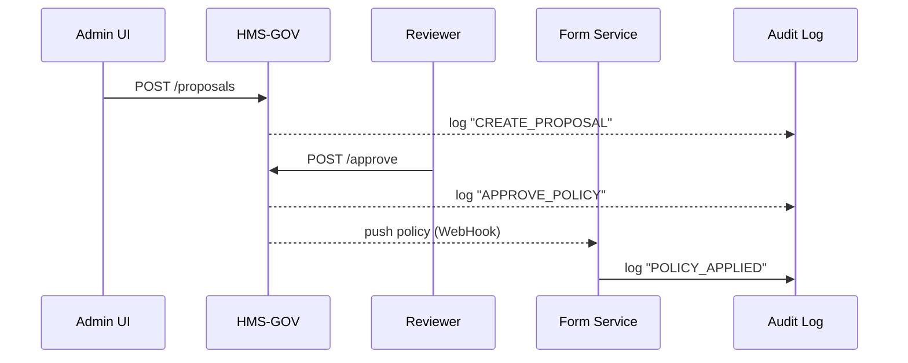

# Chapter 2: Governance Layer (HMS-GOV)

*Coming from [Chapter 1: Multi-Layered Microservices Architecture](01_multi_layered_microservices_architecture_.md).*

---

## 1. Why Do We Need “City Hall”? – A 2-Minute Story  

Imagine the **Occupational Safety and Health Administration (OSHA)** wants to launch an online “Workplace Hazard Report.”  
Before any citizen sees the new form, federal rules demand that:

1. **Privacy** – Employees’ SSNs must be masked.  
2. **Ethics** – No AI suggestion may bias against small businesses.  
3. **Transparency** – All changes must be logged for audit.

Without a *central* place to configure and enforce these rules, every microservice (Form, AI-Suggest, Notification…) would need hard-coded checks—guaranteed chaos!

**HMS-GOV** is our “city hall.” It:

* Stores policies (the laws).  
* Reviews & approves changes (the permit office).  
* Audits every action (the public record).

---

## 2. Mental Model

| Real-World Analogy | HMS-GOV Piece | One-Liner |
|--------------------|---------------|-----------|
| City Ordinance Book | **Policy Registry** | JSON/YAML documents that describe rules. |
| Permit Counter | **Approval Workflow** | Human or AI reviewers sign off proposals. |
| CCTV in City Hall | **Audit Log** | Immutable timeline of who did what, when. |
| Inter-office Mail | **Policy Dispatcher** | Publishes approved rules to other layers. |

(We’ll meet the *Process & Policy Module* deeply in [Chapter 3](03_process___policy_module_.md).)

---

## 3. The 3 Core Concepts

### 3.1 Policy  
A declarative rule, e.g.:

```yaml
id: mask-ssn
scope: form-field
match: "ssn"
action: "mask-last-4"
version: 1.0
```

### 3.2 Proposal  
A draft change (new policy, edit, or removal) awaiting approval.

### 3.3 Audit Event  
An immutable record:

```json
{
  "eventId": "EV-301",
  "actor": "admin@osha.gov",
  "action": "APPROVE_POLICY",
  "target": "mask-ssn",
  "timestamp": "2024-04-28T14:02:11Z"
}
```

---

## 4. A Beginner-Friendly Walk-Through

Goal: Add the **“mask-ssn”** policy before the hazard form goes live.

1. OSHA admin submits a proposal.
2. Governance reviewers approve it (2-eye principle).
3. HMS-GOV publishes the policy.  
4. Form microservice fetches it and starts masking SSNs automatically.

### 4.1 Interacting with HMS-GOV

#### 1) Submit Proposal

```python
# client_submit_policy.py
import requests, json

policy = {
  "id": "mask-ssn",
  "scope": "form-field",
  "match": "ssn",
  "action": "mask-last-4"
}

resp = requests.post(
  "https://gov.hms.gov/proposals",
  json={"policy": policy, "comment": "Legal requirement"}
)

print(resp.status_code)   # 201
print(resp.json())        # {"proposalId": "PR-77"}
```

*Explainer*: The admin posts a JSON body; the server replies with a unique proposal ID.

#### 2) Approve Proposal

```python
# client_approve.py
requests.post(
  "https://gov.hms.gov/proposals/PR-77/approve",
  headers={"X-User": "reviewer@osha.gov"}
)
```

*Explainer*: A second user approves; HMS-GOV now promotes the policy.

#### 3) Form Service Fetches Latest Policies

```python
# form_service_boot.py  (runs inside the Form microservice)
import requests, os, json
rules = requests.get("https://gov.hms.gov/policies?scope=form-field").json()
open("/tmp/policies.json", "w").write(json.dumps(rules))
```

*Explainer*: Every service can poll or subscribe; we keep it simple with an HTTP GET.

---

## 5. What Happens Under the Hood?



Five participants, one clear flow.

---

## 6. Inside HMS-GOV (Tiny Implementation)

Folder structure (simplified):

```
hms-gov/
 ├─ app.py
 ├─ policies.db        # SQLite
 └─ audit.log
```

### 6.1 app.py (20 lines)

```python
from fastapi import FastAPI, HTTPException
from pydantic import BaseModel
import sqlite3, json, uuid, datetime

app = FastAPI()
db = sqlite3.connect("policies.db", check_same_thread=False)

class Proposal(BaseModel):
    policy: dict
    comment: str

def audit(actor, act, tgt):
    with open("audit.log", "a") as f:
        f.write(json.dumps({
            "eventId": uuid.uuid4().hex,
            "actor": actor,
            "action": act,
            "target": tgt,
            "timestamp": datetime.datetime.utcnow().isoformat()+"Z"
        })+"\n")

@app.post("/proposals", status_code=201)
def submit(p: Proposal):
    pid = "PR-"+uuid.uuid4().hex[:6]
    db.execute("INSERT INTO proposal VALUES (?,?,?)",
               (pid, json.dumps(p.policy), p.comment))
    audit("submitter", "CREATE_PROPOSAL", pid)
    return {"proposalId": pid}

@app.post("/proposals/{pid}/approve")
def approve(pid: str):
    row = db.execute("SELECT policy FROM proposal WHERE id=?", (pid,)).fetchone()
    if not row: raise HTTPException(404)
    db.execute("INSERT INTO policy VALUES (?)", row)
    audit("reviewer", "APPROVE_POLICY", pid)
    return {"status": "approved"}
```

*Highlights*  
• Uses SQLite for quick demo storage.  
• `audit()` writes JSON lines to a file—good enough for a tutorial.  
• We purposely skip auth & fancy error handling; those live in [Security & Compliance Framework](09_security___compliance_framework_.md).

---

## 7. Consuming Policies in Other Services

**Pattern**: Pull on startup + refresh on a schedule.

```python
# mask_ssn.py  (utility used by Form Service)
import re, json

RULES = json.load(open("/tmp/policies.json"))

def mask(value, rule):
    return re.sub(r"\d{3}-\d{2}", "***-**", value)

def apply_field_rules(field_id, value):
    for r in RULES:
        if r["match"] == field_id and r["action"] == "mask-last-4":
            return mask(value, r)
    return value
```

Call `apply_field_rules("ssn", "123-45-6789")` ➜ `***-**-6789`.

---

## 8. Where Does It Fit in the Big Picture?

```mermaid
flowchart TD
    GOV[HMS-GOV<br>(Policies & Audit)]
    POLLER[Policy Fetch<br>(in each svc)]
    SVC1[Form Svc]
    SVC2[AI-Suggest]
    GOV --WebHook / Poll--> POLLER
    POLLER --> SVC1
    POLLER --> SVC2
```

Every microservice remains *independent*, yet **all** obey the same rules.

---

## 9. Key Takeaways

1. HMS-GOV is the single source of truth for rules, approvals, and audits.  
2. Policies are small JSON/YAML docs—easy to version and discuss.  
3. Services consume policies **dynamically**, so a change needs zero redeploys.  
4. A minimal FastAPI + SQLite demo already shows the core mechanics.

---

## 10. Up Next

Now that we understand *where* policies live, we’ll explore *how to model and manage* them in depth in [Process & Policy Module](03_process___policy_module_.md).

---

Generated by [AI Codebase Knowledge Builder](https://github.com/The-Pocket/Tutorial-Codebase-Knowledge)