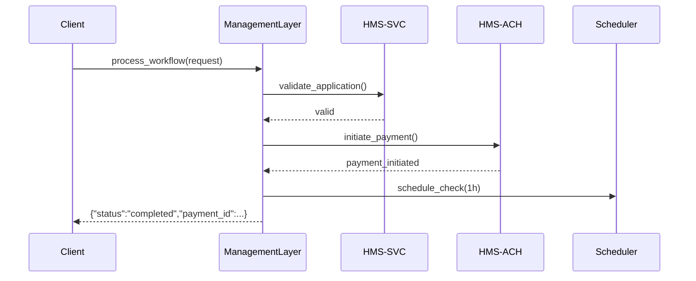

# Chapter 2: Management Layer

Welcome back! In [Chapter 1: Governance Layer](01_governance_layer_.md) we saw how our system enforces policies, masks data, and logs audits. Now we’ll build the “operations center” of HMS-SCM: the **Management Layer**. Think of it like a federal agency’s program management office (e.g., NNSA’s PMO) that directs resources, tracks progress, and enforces SLAs across all teams.

---

## Why Do We Need a Management Layer?

Imagine a state agency approves small-business grants. A citizen fills out an online form, submits bank info, and expects funds within two business days. To coordinate:

1. A service validates the application (HMS-SVC).  
2. Another service initiates the ACH transfer (HMS-ACH).  
3. A scheduler checks progress and retries on failures.  
4. A health monitor watches service uptime and alerts on SLA misses.

Without a central “operations center,” each microservice would work in silos—no single view of who’s done what. The Management Layer harmonizes these parts, tracks the end-to-end workflow, and raises flags if something goes off-script.

---

## High-Level Use Case

**Scenario:**  
A grant application arrives with ID `GR-2023-55`. We need to:

1. Validate applicant data via HMS-SVC.  
2. If valid, trigger payment through HMS-ACH.  
3. Schedule a follow-up status check in 1 hour.  
4. Report success or failure to the client.

By the end of this chapter, you’ll know how to call one simple API—**`process_workflow`**—and let the Management Layer do the heavy lifting.

---

## Key Concepts

1. Service Coordinator  
   - Routes requests to the right microservice (HMS-SVC, HMS-ACH).

2. Workflow Manager  
   - Defines the sequence of steps (validate → pay → follow-up).

3. Health Monitor  
   - Continuously checks service health and SLA compliance.

4. Scheduler  
   - Schedules retries or periodic checks (e.g., check payment status after 1 hr).

---

## Using the Management Layer

Here’s how a client talks to our Management Layer:

```python
# client_app.py
from management import ManagementLayer

ml = ManagementLayer()

request = {
    "application_id": "GR-2023-55",
    "applicant": {"name": "Jane Doe", "bank_account": "12345"},
    "amount": 2500
}

result = ml.process_workflow(request)
print(result)
# -> {"status": "completed", "payment_id": "PAY-789", "details": "..."}
```

Explanation:  
- We import `ManagementLayer`.  
- Call `process_workflow` with application data.  
- The layer runs all steps under the hood and returns a final status.

---

## What Happens Under the Hood?

1. **Request Arrival**  
   - `ManagementLayer` receives the request.

2. **Validation**  
   - Calls HMS-SVC to check applicant eligibility.

3. **Payment Initiation**  
   - If valid, calls HMS-ACH to create the transfer.

4. **Scheduling**  
   - Uses the Scheduler to re-check payment status in 1 hr.

5. **Health Check**  
   - Monitors each service call and logs SLA metrics.

6. **Final Response**  
   - Aggregates results and returns to the caller.

### Sequence Diagram



---

## Inside the Code

### File: management.py

```python
# management.py

class ManagementLayer:
    def __init__(self):
        self.svc = HMSSvcClient()       # Client for HMS-SVC
        self.ach = HMSAchClient()       # Client for HMS-ACH
        self.scheduler = Scheduler()    # Scheduler for follow-ups

    def process_workflow(self, req):
        # 1. Validate applicant
        valid = self.svc.validate(req["applicant"])
        if not valid:
            return {"status": "error", "message": "validation_failed"}

        # 2. Initiate payment
        pay = self.ach.transfer(req["amount"], req["applicant"])
        if not pay["success"]:
            return {"status": "error", "message": "payment_failed"}

        # 3. Schedule a follow-up check
        self.scheduler.schedule(
            job=lambda: self.ach.check_status(pay["payment_id"]),
            delay=3600
        )

        # 4. Return result
        return {"status": "completed", "payment_id": pay["payment_id"]}
```

Explanation:  
- `__init__` sets up service clients and scheduler.  
- `process_workflow` runs each step in order, handling errors simply.

### Supporting Clients (Simplified)

```python
# svc_client.py
class HMSSvcClient:
    def validate(self, applicant):
        # Imagine this calls an HTTP API and returns True/False
        return True

# ach_client.py
class HMSAchClient:
    def transfer(self, amount, applicant):
        # Initiates ACH payment, returns a dict
        return {"success": True, "payment_id": "PAY-789"}

    def check_status(self, payment_id):
        # Checks payment status later
        pass
```

Explanation:  
- These stubs hide HTTP details.  
- In real code, you'd handle retries, timeouts, and error logging.

---

## Conclusion

You’ve seen how the **Management Layer** acts as the mission control for HMS-SCM—coordinating services, managing workflows, and enforcing SLAs. Next up, we’ll connect these operations to users and UIs in the [Interface Layer](03_interface_layer_.md).

---

Generated by [AI Codebase Knowledge Builder](https://github.com/The-Pocket/Tutorial-Codebase-Knowledge)