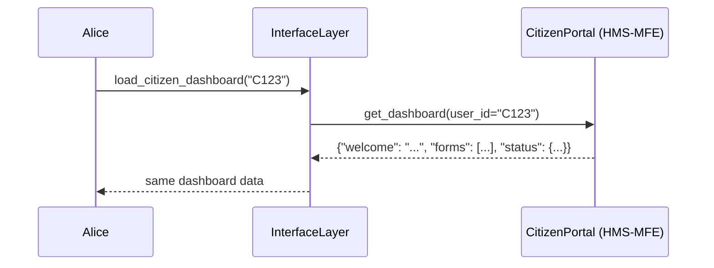

# Chapter 3: Interface Layer

Welcome back! In [Chapter 2: Management Layer](02_management_layer_.md) we built the “operations center” that orchestrates microservices and workflows. Now, we’ll open the front doors and conference rooms—our **Interface Layer**—so citizens and officials can actually interact with HMS-SCM.

---

## Why the Interface Layer Matters

Imagine walking into a federal agency’s customer service area:

- Citizens queue at service counters to submit forms and check application status.
- Executives meet in conference rooms to review high-level reports and dashboards.

The **Interface Layer** in HMS-SCM plays exactly these two roles:

1. **HMS-MFE (Citizen Portal)**  
   – Everyday users log in, fill out benefit or grant forms, and track their requests.

2. **HMS-GOV (Admin Portal)**  
   – Agency officials and policy-makers view analytics dashboards, approve requests, and generate reports.

Without a clean, role-specific UI, all the back-end magic from [Chapter 1](01_governance_layer_.md) and [Chapter 2](02_management_layer_.md) is useless—people need an easy way to see and do things.

---

## Central Use Case

Alice is a citizen who wants to check the status of her housing application.  
Bob is an administrator who needs to review pending applications and download a weekly report.

We’ll see how both log in through the **Interface Layer**, get the right UI components, and interact with HMS-SCM.

---

## Key Concepts

1. **InterfaceLayer**  
   – The “reception desk” that routes requests to either the Citizen Portal or Admin Portal.

2. **CitizenPortal (HMS-MFE)**  
   – Retrieves forms, status updates, and simple dashboards for citizens.

3. **AdminPortal (HMS-GOV)**  
   – Provides complex dashboards, approval forms, and reporting tools for officials.

---

## Using the Interface Layer

Here’s how a simple client app would load dashboards for both roles:

```python
# client_app.py
from interface import InterfaceLayer

iface = InterfaceLayer()

# 1. Citizen view
alice_dashboard = iface.load_citizen_dashboard(user_id="C123")
print(alice_dashboard)
# -> {"welcome": "Hello Alice!", "forms": ["Housing Application"], "status": {"HA-001": "Under Review"}}

# 2. Admin view
bob_dashboard = iface.load_admin_dashboard(user_id="A456")
print(bob_dashboard)
# -> {"reports": ["Weekly Stats","Audit Log"], "pending_applications": 42}
```

Explanation:  
- We create `InterfaceLayer()`.  
- `load_citizen_dashboard` fetches forms and statuses via HMS-MFE.  
- `load_admin_dashboard` fetches reports and pending tasks via HMS-GOV.

---

## What Happens Under the Hood?

Before diving into code, here’s the step-by-step flow when Alice loads her dashboard:



For Bob (admin), `InterfaceLayer` routes to `AdminPortal (HMS-GOV)` instead of `CitizenPortal`.

---

## Inside the Code

### File: interface.py

```python
# interface.py

from mfe_service import CitizenPortal
from gov_service import AdminPortal

class InterfaceLayer:
    def __init__(self):
        self.citizen_portal = CitizenPortal()
        self.admin_portal   = AdminPortal()

    def load_citizen_dashboard(self, user_id):
        return self.citizen_portal.get_dashboard(user_id)

    def load_admin_dashboard(self, user_id):
        return self.admin_portal.get_dashboard(user_id)
```

Explanation:  
- We import two portal classes.  
- `InterfaceLayer` simply delegates to the right portal based on the method called.

---

### File: mfe_service.py

```python
# mfe_service.py

class CitizenPortal:
    def get_dashboard(self, user_id):
        # In real code, fetch data from back-end APIs
        return {
            "welcome": f"Hello {user_id}!",
            "forms": ["Housing Application", "Benefit Renewal"],
            "status": {"HA-001": "Under Review", "BR-002": "Approved"}
        }
```

Explanation:  
- `get_dashboard` returns a simple JSON with forms and statuses for the citizen.

---

### File: gov_service.py

```python
# gov_service.py

class AdminPortal:
    def get_dashboard(self, user_id):
        # In real code, fetch reports and counts from analytics services
        return {
            "reports": ["Weekly Stats", "Audit Log"],
            "pending_applications": 42
        }
```

Explanation:  
- `get_dashboard` returns admin-specific dashboards and key metrics.

---

## Conclusion

You’ve now seen how the **Interface Layer** opens two portals—HMS-MFE for citizens and HMS-GOV for administrators—just like service counters and conference rooms in a federal agency. This layer ensures each user sees the right UI components and data.

Next up: we’ll add automated oversight for AI components in the [AI Governance Model](04_ai_governance_model_.md). Happy building!

---

Generated by [AI Codebase Knowledge Builder](https://github.com/The-Pocket/Tutorial-Codebase-Knowledge)