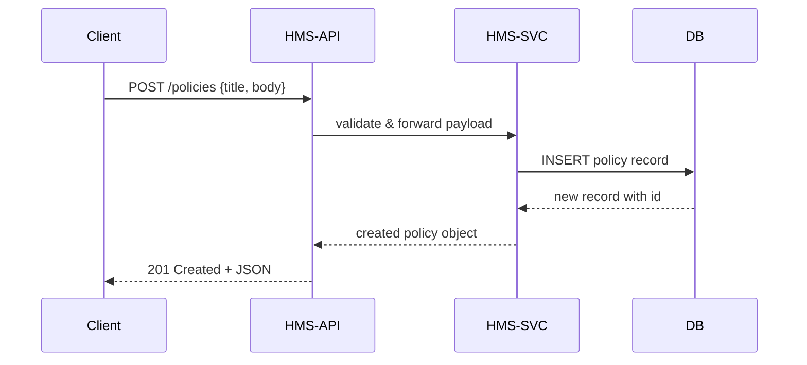

# Chapter 3: Market & Policy API (HMS-API/HMS-MKT)

Welcome back! In [Chapter 2: Admin/Gov Portal (HMS-GOV)](02_admin_gov_portal__hms_gov__.md), we saw how government staff review and approve proposals. Now let’s dive into the **Market & Policy API (HMS-API/HMS-MKT)**—the “public records office in code form.” This chapter shows you how to create, update, and query policies, processes, and transaction records via simple REST endpoints.

---

## 1. Why HMS-API/HMS-MKT? A Real-World Use Case

Imagine the Environmental Protection Agency (EPA) needs to publish a new “Vehicle Emissions Standard.” They want:

- A system to **create** the policy text and assign it an ID  
- A way for partner systems (e.g., scheduling platforms, data warehouses) to **fetch** the latest rules  
- An endpoint to **update** the status (e.g., “Draft” → “Published”)  

HMS-API/HMS-MKT provides a consistent set of RESTful endpoints so agencies and partners can automate these tasks—no manual database scripts or stale CSV files.

---

## 2. Key Concepts

1. **Resources**  
   - `policies`: texts and metadata about laws or regulations  
   - `processes`: workflows tied to policies (e.g., public comment period)  
   - `transactions`: records of actions (e.g., “Policy #42 was approved by user X”)  

2. **HTTP Verbs**  
   - `POST /policies` → Create a new policy  
   - `GET  /policies` → List or search policies  
   - `GET  /policies/{id}` → Retrieve one policy  
   - `PUT  /policies/{id}` → Update an existing policy  

3. **JSON Payloads**  
   - Input and output are standard JSON.  
   - Each resource has simple fields like `id`, `title`, `body`, `status`.

---

## 3. Using HMS-API/HMS-MKT

Below are minimal JavaScript examples showing how a partner app (or another service) can talk to HMS-API.

### 3.1 Create a New Policy

File: `src/api/policies.js`
```js
// Sends a POST to /api/policies with title/body
export async function createPolicy(data) {
  const res = await fetch('/api/policies', {
    method: 'POST',
    headers: {'Content-Type': 'application/json'},
    body: JSON.stringify(data)
  });
  return res.json(); // e.g. { id: 101, title: "...", status: "Draft" }
}
```
*When you call `createPolicy({ title, body })`, you get back the new policy with its `id`.*

### 3.2 Update Policy Status

```js
// Changes status for policy #101
export async function updatePolicyStatus(id, status) {
  const res = await fetch(`/api/policies/${id}`, {
    method: 'PUT',
    headers: {'Content-Type': 'application/json'},
    body: JSON.stringify({ status })
  });
  return res.json(); // updated policy object
}
```
*Use this to move from “Draft” to “Published” or “Archived.”*

### 3.3 Query Published Policies

```js
// Fetches policies that are already published
export async function listPublishedPolicies() {
  const res = await fetch('/api/policies?status=Published');
  return res.json(); // array of policy objects
}
```
*Returns a list of all policies where `status=Published`.*

---

## 4. What Happens Under the Hood?

Here’s a simplified view of how a `POST /policies` call flows through the system:



1. The API layer checks basic auth/permissions.  
2. It calls Management Services (HMS-SVC) for business rules.  
3. SVC writes to the database and returns the new record.  
4. The API sends a 201 response with JSON back to the client.

---

## 5. Inside the API: Minimal Express Routes

Below is a very simple Express server that implements the `policies` resource. We break it into two files for clarity.

### 5.1 Route Definitions

File: `server/routes/policies.js`
```js
const express = require('express');
const router = express.Router();
const svc = require('../services/policyService');

// Create a policy
router.post('/', async (req, res) => {
  const created = await svc.create(req.body);
  res.status(201).json(created);
});

// List or filter policies
router.get('/', async (req, res) => {
  const list = await svc.list(req.query);
  res.json(list);
});

module.exports = router;
```
*Two routes: `POST /` and `GET /` under `/api/policies`.*

### 5.2 Business Logic Service

File: `server/services/policyService.js`
```js
// In reality this calls a database layer; we mock with an in-memory array
let store = [];
let nextId = 1;

exports.create = async (data) => {
  const record = { id: nextId++, status: 'Draft', ...data };
  store.push(record);
  return record;
};

exports.list = async ({ status }) => {
  return status ? store.filter(p => p.status === status) : store;
};
```
*Very minimal: we keep policies in `store`, auto-assign an `id`, and filter by `status`.*

---

## 6. Conclusion

In this chapter you learned how the **Market & Policy API (HMS-API/HMS-MKT)** exposes simple REST endpoints to create, update, and query policies. You saw:

- Core resources (`policies`, `processes`, `transactions`)  
- How to call the API from a client app  
- A high-level flow of requests through the API and services  
- Minimal Express.js route and service code  

Next up, we’ll explore how **Management Services (HMS-SVC)** applies business rules and orchestrates more complex workflows. See you in [Chapter 4: Management Services (HMS-SVC)](04_management_services__hms_svc__.md)!

---

Generated by [AI Codebase Knowledge Builder](https://github.com/The-Pocket/Tutorial-Codebase-Knowledge)