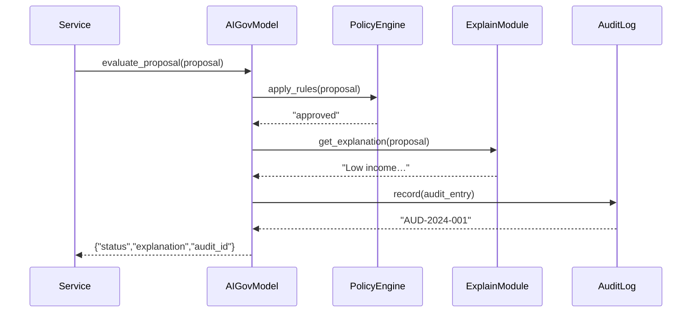

# Chapter 4: AI Governance Model

Welcome back! In the previous chapter, [Interface Layer](03_interface_layer_.md), we opened up portals so users and officials can talk to HMS-SCM. Now we’ll build the **AI Governance Model**—the “Privacy and Civil Liberties Oversight Board” for every AI decision in our platform.

## Why an AI Governance Model?

Imagine the U.S. Department of Health and Human Services (HHS) uses an AI to recommend patients for a public-health program. We need to be sure each recommendation is:

- Transparent: Citizens can see why they were recommended.
- Safe & Ethical: No hidden bias or unfair exclusions.
- Private: Sensitive data never leaks.
- True: The AI’s reasoning matches facts.
- Auditable: Every step is logged and can be contested.

Without a structured framework, AI suggestions can become black boxes—hurting trust and opening audit nightmares.

## Central Use Case

A state agency portal sends applicant data to an AI service that scores disaster-relief eligibility. Before acting on the score, we run it through our AI Governance Model to:

1. Check policy rules (e.g., fairness thresholds).  
2. Generate a human-friendly explanation.  
3. Record an audit trail (input, model version, rules applied).  
4. Return a governance decision (approve, flag for review).

## Key Concepts

1. **Decision Checkpoints**  
   Hook points at data input, model inference, and post-processing, where we inspect AI outputs.

2. **Policy Engine**  
   Encodes rules for ethics, privacy, safety, and truthfulness (like “no more than 5% score difference by ZIP code”).

3. **Explainability Module**  
   Extracts plain-language reasons: “Score high because income < $30K and dependents > 2.”

4. **Audit Trail**  
   Logs every proposal with timestamp, model version, rules used, and explanation ID.

5. **Contestation Portal**  
   Lets experts or citizens dispute flagged decisions and triggers human review.

---

## Using the AI Governance Model

Here’s how your service calls the governance model:

```python
# ai_client.py
from ai_governance_model import AIGovernanceModel

gov = AIGovernanceModel()

proposal = {
  "applicant_id": "C789",
  "input_data": {"income": 25000, "dependents": 3},
  "model_version": "v1.2"
}

result = gov.evaluate_proposal(proposal)
print(result)
# -> {
#      "status": "approved",
#      "explanation": "Low income and 3 dependents increased eligibility.",
#      "audit_id": "AUD-2024-001"
#    }
```

Explanation:  
- We pass applicant info plus which AI model ran.  
- The governance model returns a status, a human-friendly explanation, and an audit ID for traceability.

---

## What Happens Under the Hood?



Steps:
1. **Rules Check**: `PolicyEngine` enforces fairness, privacy, safety.  
2. **Explain**: `ExplainabilityModule` returns a clear reason.  
3. **Audit**: `AuditLog` writes inputs, decisions, and explanations.  
4. **Response**: Governance decision goes back to the caller.

---

## Inside the Code

### File: ai_governance_model.py

```python
# ai_governance_model.py
from policy_engine import PolicyEngine
from explainability import ExplainabilityModule
from audit_log import AuditLog

class AIGovernanceModel:
    def __init__(self):
        self.policy = PolicyEngine()
        self.explain = ExplainabilityModule()
        self.log = AuditLog()

    def evaluate_proposal(self, proposal):
        decision = self.policy.apply_rules(proposal)
        explanation = self.explain.get_explanation(proposal)
        audit_id = self.log.record(proposal, decision, explanation)
        return {
            "status": decision,
            "explanation": explanation,
            "audit_id": audit_id
        }
```

Explanation:  
- We wire together the policy, explain, and audit components.  
- `evaluate_proposal` runs all steps and returns a combined result.

### File: policy_engine.py

```python
# policy_engine.py
class PolicyEngine:
    def apply_rules(self, proposal):
        # Simplified: check fairness and thresholds
        score = proposal.get("input_data", {}).get("income", 0)
        if score < 30000:
            return "approved"
        return "flag_for_review"
```

Explanation:  
- Very basic rule: income under \$30K is auto-approved, else flagged.

### File: explainability.py

```python
# explainability.py
class ExplainabilityModule:
    def get_explanation(self, proposal):
        data = proposal["input_data"]
        return f"Income {data['income']} and {data['dependents']} dependents."
```

Explanation:  
- Returns a short, plain-language sentence about key factors.

### File: audit_log.py

```python
# audit_log.py
import uuid
class AuditLog:
    def record(self, proposal, decision, explanation):
        audit_id = "AUD-" + uuid.uuid4().hex[:8]
        # Here you'd write proposal + decision + explanation to storage
        return audit_id
```

Explanation:  
- Generates a simple UUID-based audit ID and (in real code) logs full details.

---

## Conclusion

You’ve learned how the **AI Governance Model** brings oversight, transparency, and auditability to every AI decision—just like the PCLOB does for government surveillance. Next, we’ll see how to stitch these governance checks into our services and scale them with a [Microservices Architecture](05_microservices_architecture_.md).  

Happy coding!

---

Generated by [AI Codebase Knowledge Builder](https://github.com/The-Pocket/Tutorial-Codebase-Knowledge)