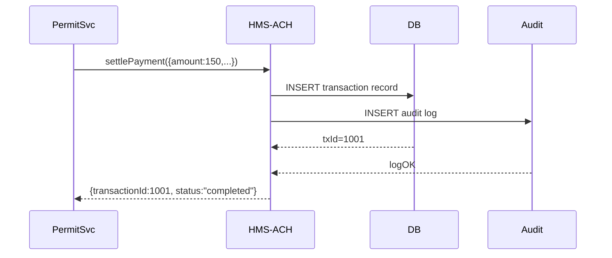

# Chapter 5: Financial Clearinghouse (HMS-ACH)

In [Chapter 4: Management Services (HMS-SVC)](04_management_services__hms_svc__.md), we wired up business workflows like permit processing. Now it’s time to handle the money side—collecting fees, disbursing grants, and keeping everything auditable in the **Financial Clearinghouse (HMS-ACH)**.

---

## 1. Why HMS-ACH? A Real-World Use Case

Imagine the Alcohol, Tobacco, Firearms and Explosives Bureau (ATF) issues a permit for a private fireworks display. They must:

- Collect the \$150 permit fee from the applicant  
- Record that payment in a secure “city treasury” ledger  
- Disburse \$50 of that fee to the local fire department for safety inspections  
- Keep an audit trail for regulators  

**HMS-ACH** acts like the city treasury: it’s the single source of truth for every cent that flows in or out, with built-in compliance and traceability.

---

## 2. Key Concepts

1. **Transaction Record**  
   A single line item (payment in or payment out) with amount, accounts, timestamp.

2. **Settlement**  
   Grouping one or more transactions into a batch (e.g., daily permit fees).

3. **Audit Log**  
   An immutable log entry for every action, so auditors can reconstruct the full history.

4. **Compliance & Traceability**  
   Enforces that every transaction references a valid permit, grant, or internal order ID.

---

## 3. Using HMS-ACH to Settle a Payment

Here’s how our permit workflow in `permitService` can call HMS-ACH to collect a fee:

```js
// server/services/permitService.js
const ach = require('./achService')

async function processPermit(application) {
  // ... calculate fee ...
  const payment = await ach.settlePayment({
    amount: 150,
    currency: 'USD',
    fromAccount: application.applicantBank,
    toAccount: 'ATF-Treasury',
    reference: `Permit#${application.id}`
  })

  // attach payment info before saving final record
  return { ...application, feePaid: payment.transactionId }
}
```

When you call `ach.settlePayment()`, it:
- Creates a transaction  
- Writes an audit entry  
- Returns a `{ transactionId, status }` object  

---

## 4. What Happens Under the Hood?



1. **PermitSvc** requests a settlement.  
2. **HMS-ACH** records a transaction.  
3. It also writes an **Audit Log** entry.  
4. Once both succeed, HMS-ACH returns success to the caller.

---

## 5. Inside HMS-ACH: Service Code

### 5.1 Transaction & Audit Helpers

```js
// server/services/achService.js
const db    = require('../lib/db')      // your DB client
const audit = require('./auditService') // append-only log

async function settlePayment({amount, currency, fromAccount, toAccount, reference}) {
  // 1. Record the money move
  const tx = await db.insert('transactions', {
    amount, currency, fromAccount, toAccount, reference, timestamp: Date.now()
  })
  // 2. Write an audit entry
  await audit.log({txId: tx.id, action: 'SETTLE', details: {amount, reference}})
  return { transactionId: tx.id, status: 'completed' }
}

module.exports = { settlePayment }
```

- `db.insert(...)` writes the transaction.  
- `audit.log(...)` writes an immutable log entry.

### 5.2 Exposing a REST Endpoint

```js
// server/routes/payments.js
const express = require('express')
const { settlePayment } = require('../services/achService')
const router = express.Router()

router.post('/', async (req, res) => {
  const result = await settlePayment(req.body)
  res.status(201).json(result)
})

module.exports = router
```

Clients (like `permitService` or a grant-disbursement tool) `POST /api/payments` with:
```json
{
  "amount": 5000,
  "currency": "USD",
  "fromAccount": "FederalGrants",
  "toAccount": "ResearchLabXYZ",
  "reference": "Grant#2024-ENV-001"
}
```
and receive a `{ transactionId, status }` response.

---

## 6. Conclusion

In this chapter you learned how the **Financial Clearinghouse (HMS-ACH)**:

- Acts as a “city treasury” for all fees and payouts  
- Records every transaction and audit log entry  
- Exposes a simple `settlePayment` API for upstream services  

Next up, we’ll see how to keep HMS-SCM in sync with external ledgers and partner systems in [Chapter 6: External System Sync](06_external_system_sync_.md).

---

Generated by [AI Codebase Knowledge Builder](https://github.com/The-Pocket/Tutorial-Codebase-Knowledge)