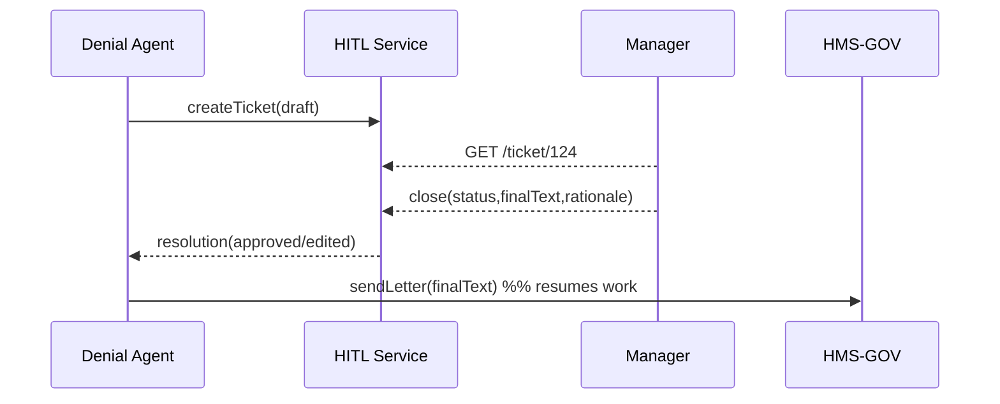

# Chapter 5: Human-in-the-Loop (HITL) Override
[← Back to Chapter&nbsp;4: AI Representative Agent Framework](04_ai_representative_agent_framework__hms_agt__.md)

> “Pull the emergency brake before the train leaves the station.”

---

## 1. Why Do We Need HITL?

Picture this:  
An AI agent inside the Department of Housing drafts a **“benefits-denial”** letter to a veteran.  
The text looks legal, but a new HUD memo—published only this morning—might change eligibility.  
We are **not** willing to rely on probability; a real manager must glance at the letter first.

The **Human-in-the-Loop (HITL) Override** is that safety brake.  
It lets any agent pause automation, hand the decision to a human reviewer, and then:

1. Record the human’s verdict & written rationale.  
2. Ship that rationale to the training set so the agent improves next time.  
3. Provide a full audit trail for inspectors or FOIA requests.

Fail-safe for policy makers, learning loop for technologists.

---

## 2. Key Concepts (Beginner Friendly)

| Term | Everyday Analogy | One-Line Job |
|------|------------------|--------------|
| HITL Ticket | “Please sign here” sticky note | Bundle of AI suggestion + context |
| Reviewer | Human manager with override rights | Approves, edits, or rejects ticket |
| Rationale Log | Comment box on a form | Required explanation for the decision |
| Auto-Resumption | Cruise control re-engage | Agent continues once ticket closed |
| Feedback Hook | Teacher’s red ink | Feeds reviewer edits back into model |

---

## 3. Starter Use-Case – Reviewing a Denial Letter

Goal: Stop an AI denial letter until a housing-program manager signs off.

### 3.1 Agent-Side Code (18 lines)

```js
// denyLetterAgent.js  (simplified)
import axios from 'axios';

async function draftDenial(data) {
  const letter = `Dear ${data.name}, we must deny...`; // 4 lines skipped

  // 1. Ask ESQ for legal OK
  const legal = await axios.post('http://esq/advice', { text: letter });
  if (!legal.data.approved) return hitlOverride(letter, legal.notes);

  // 2. No flags ➜ send automatically
  await sendLetter(letter);
}

async function hitlOverride(text, notes) {
  // Open a HITL ticket
  const res = await axios.post('http://hitl/tickets', {
     draft: text,
     notes,
     agentId: 'AGT_DENIAL_01'
  });
  return `⏸ Awaiting human review (#${res.data.ticketId})`;
}
```

Explanation  
1 – 4 Agent drafts the letter and calls HMS-ESQ (legal spell-check).  
5   If ESQ is unhappy, `hitlOverride` creates a **HITL ticket** instead of sending.  
10-15 Ticket object stores the draft, risk notes, and agent ID for traceability.

---

### 3.2 Reviewer Experience (Console Mock, 13 lines)

```js
// reviewerCli.js
import axios from 'axios';

async function review(ticketId){
  const {data: t} = await axios.get(`http://hitl/tickets/${ticketId}`);
  console.log('--- AI Draft ---\n', t.draft);
  console.log('Risk Notes:', t.notes);

  const edited = t.draft.replace('deny', 'approve'); // manager edit
  await axios.post(`http://hitl/tickets/${ticketId}/close`, {
     status: 'edited',
     finalText: edited,
     rationale: 'Applicant qualifies under new HUD memo 24-06.'
  });
  console.log('✅ Ticket closed & letter sent.');
}

review(process.argv[2]);
```

A manager runs:

```bash
node reviewerCli.js 124
```

• Sees the AI draft  
• Edits one line  
• Provides a required *rationale* sentence  
• Hits “close,” automatically sending the corrected letter.

---

## 4. What Happens Under the Hood?



1. Agent raises a ticket → HITL stores it.  
2. Manager pulls it from their dashboard/CLI.  
3. On closure, HITL logs the decision & rationale.  
4. Agent resumes and calls **Governance Layer (HMS-GOV)** to actually send the letter.  
5. Ticket, edits, and rationale flow to **Activity Logging & Audit Trail** for auditors.

---

## 5. Inside the HITL Service

Folder snapshot:

```
/hms-hitl
 ├─ server.js        # REST entry (Express 60 lines)
 ├─ db/
 │    └─ tickets.json  # tiny demo store
 ├─ retrain/
 │    └─ queue.js    # pushes edits to model fine-tune
 └─ README.md
```

### 5.1 Ticket Model (8 lines)

```js
// models/ticket.js
export function newTicket({draft, notes, agentId}){
  return {
    id: Date.now().toString(),
    draft,
    notes,
    agentId,
    status: 'open',
    history: []  // reviewer events
  };
}
```

### 5.2 Close Endpoint (12 lines)

```js
// server.js fragment
app.post('/tickets/:id/close', (req, res)=>{
  const t = DB.find(req.params.id);
  Object.assign(t, req.body, { status: 'closed', closedAt: Date.now() });
  // 1. Persist rationale for audits
  Audit.log('hitl.close', t);
  // 2. Ship edits to re-training queue
  Retrain.push({agentId: t.agentId, original: t.draft, final: t.finalText});
  res.json({ok:true});
});
```

What we gain:  
• An immutable **audit log** line.  
• A **feedback hook** (`Retrain.push`) so the next model version learns from human edits.

---

## 6. Common Questions

**Q: Does every agent decision need HITL?**  
No. Agents call HITL only when risk exceeds a rule-based threshold, most often flagged by [HMS-ESQ](03_legal_reasoning_service__hms_esq__.md) or policy packs in [HMS-CDF](02_policy_codification_engine__hms_cdf__.md).

**Q: Can a manager bypass rationale?**  
No. The `rationale` field is `NOT NULL`; the close endpoint rejects empty text.

**Q: How long do we keep tickets?**  
Configurable (default 7 years) per federal records guidelines; files auto-archive to the **Data Hub & Analytics Engine**.

---

## 7. Key Takeaways

• **HITL Override** acts as a circuit-breaker: AI pauses, people decide.  
• Every ticket captures the draft, risk notes, human edits, and written reasoning.  
• Closed tickets feed the **learning loop**, improving future AI behavior.  
• Seamlessly integrates with governance, legal checks, and audit services.

---

### Up Next

Agents now know when to stop and ask for help.  
But *how* do they share the full model context—prompts, embeddings, temperature, guardrails—with auditors or other agents?  
Enter the [Model Context Protocol (HMS-MCP)](06_model_context_protocol__hms_mcp__.md).

---

Generated by [AI Codebase Knowledge Builder](https://github.com/The-Pocket/Tutorial-Codebase-Knowledge)