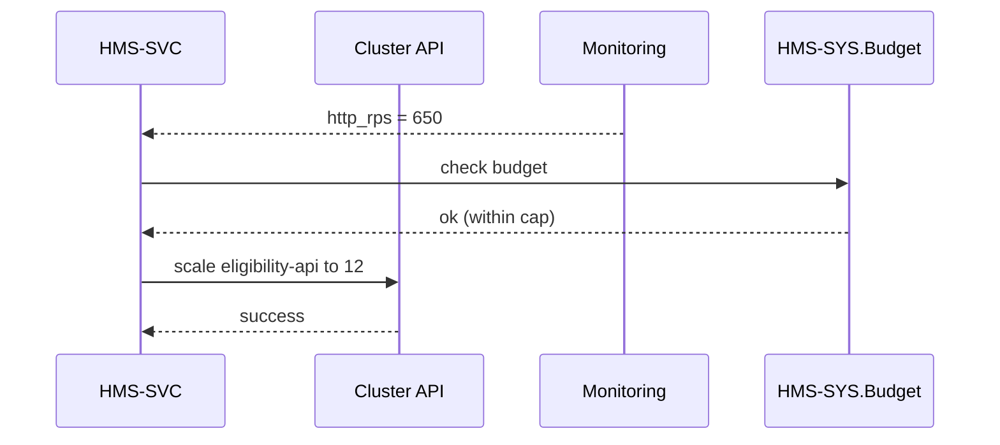
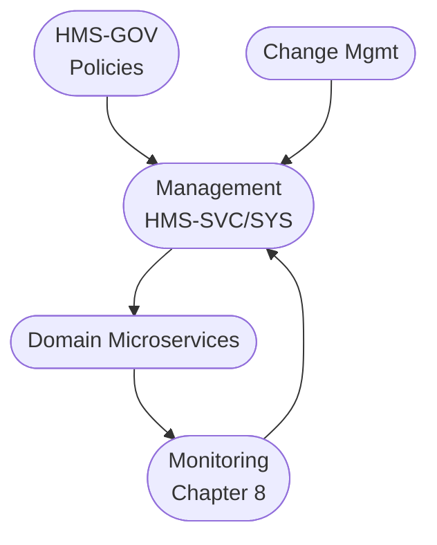

# Chapter 5: Management Layer (HMS-SVC & HMS-SYS)

*Coming from [Change Management & Versioning](04_change_management___versioning_.md).*

---

## 1. Why Do We Need a “Public-Works” Layer? – A 90-Second Story  

At 9 a.m. the **Government Publishing Office (GPO)** publishes a new 400-page regulation about student-loan forgiveness.  
By 9:01 every borrower in the country refreshes the **Student Aid Portal** to see if they qualify.

Without any code change, the platform must:

1. Double its API replicas to handle traffic.  
2. Ensure every request is authenticated.  
3. Record every lookup for audit.  
4. Stay within the monthly cloud budget Congress approved.

All these *operational* tasks live in the **Management Layer**—specifically the two services:

* **HMS-SVC** – “Service Control”: knobs for scaling, rate-limits, feature toggles.  
* **HMS-SYS** – “System Control”: budgets, shared infrastructure (auth, logging, AI schedulers).

Think of **HMS-GOV** (Chapter 2) as *policy writers* and **CMV** (Chapter 4) as *publishers*.  
**HMS-SVC/SYS** are the *electricians and plumbers* who keep the city running.

---

## 2. Key Concepts (Beginner-Friendly Table)

| Analogy | Real Component | One-Sentence Role |
|---------|----------------|-------------------|
| Circuit Breaker Box | **HMS-SVC** | Toggle on/off or resize any microservice without redeploying code. |
| Utility Billing Office | **HMS-SYS.Budget** | Tracks CPU, RAM, and cloud spend vs. the appropriated budget. |
| Passport Checkpoint | **HMS-SYS.Auth** | Central OAuth2 / SSO for every request. |
| City Ledger | **HMS-SYS.ACH** | Securely moves money between agency accounts (e.g., grant payouts). |
| Citywide PA System | **HMS-SYS.Logs** | Collects logs & metrics; forwards to Monitoring Layer (Chapter 8). |
| Traffic Light AI | **HMS-SYS.Orchestrator** | Uses simple rules or ML to auto-scale services and schedule jobs. |

---

## 3. Guided Walk-Through: Handling the GPO Traffic Surge

Goal: Automatically add more “Eligibility” API pods for 20 minutes, then scale back—without touching application code.

### 3.1 Declaring an Auto-Scale Rule

```python
# create_autoscale_rule.py
import requests

rule = {
  "service": "eligibility-api",
  "minReplicas": 4,
  "maxReplicas": 20,
  "trigger": {"metric": "http_rps", "threshold": 500}
}
r = requests.post("https://svc.hms.gov/autoscale-rules", json=rule)
print(r.json())          # { "ruleId": "AR-101" }
```

Explanation (1 min):
• We tell **HMS-SVC**: “If requests-per-second > 500, go up to 20 pods.”  
• The service returns a rule ID for later editing.

### 3.2 Watching the Rule in Action

```python
# watch_rule.py
import time, requests, pprint
while True:
    stat = requests.get("https://svc.hms.gov/rules/AR-101/status").json()
    pprint.pprint(stat)   # e.g., {"replicas": 12, "metric": 640}
    time.sleep(5)
```

Outputs a tiny JSON every 5 seconds so you can see replicas climb and fall.

### 3.3 Budget Guardrail (Optional)

```python
# set_budget_cap.py
import requests
cap = {"monthlyUSD": 10000}
requests.post("https://sys.hms.gov/budgets/eligibility-api", json=cap)
```

If costs approach \$10 k, **HMS-SYS** will nudge **HMS-SVC** to stop at, say, 15 replicas—even if demand is higher.  
(All numbers demo-level.)

---

## 4. What Happens Under the Hood?



Only four actors—easy to trace.

---

## 5. Inside HMS-SVC: 18 Lines of Demo Code

_File: `hms_svc/autoscale.py`_

```python
from fastapi import FastAPI
import os, requests

app = FastAPI()
RULES = {}          # id -> rule dict
STATE = {}          # svc -> current replica count

def k8s_scale(svc, n):
    requests.post(f"http://k8s/api/scale/{svc}", json={"replicas": n})

@app.post("/autoscale-rules")
def add_rule(r: dict):
    rid = f"AR-{len(RULES)+1}"
    RULES[rid] = r
    STATE[r["service"]] = r["minReplicas"]
    return {"ruleId": rid}

@app.get("/rules/{rid}/status")
def status(rid: str):
    r = RULES[rid]; svc = r["service"]
    return {"replicas": STATE[svc], "metric": _latest_metric(svc)}

def _loop():
    import time
    while True:
        for rid, rule in RULES.items():
            m = _latest_metric(rule["service"])
            if m > rule["trigger"]["threshold"]:
                new = min(STATE[rule["service"]]+1, rule["maxReplicas"])
                STATE[rule["service"]] = new; k8s_scale(rule["service"], new)
        time.sleep(10)
```

Highlights:  
• Stores rules in memory for demo-simplicity.  
• Every 10 s compares the metric and scales by +1 pod (naïve but clear).  
• `_latest_metric()` is a stub calling Prometheus/Grafana.

Run `_loop()` in a background thread at startup—done!

---

## 6. Inside HMS-SYS: Mini Budget Checker

_File: `hms_sys/budget.py` (≤ 15 lines)_

```python
BUDGETS = {}   # svc -> dollars
SPEND   = {}   # svc -> dollars so far

def set_cap(svc, usd):
    BUDGETS[svc] = usd

def record_usage(svc, usd):
    SPEND[svc] = SPEND.get(svc, 0) + usd

def within_cap(svc):
    return SPEND.get(svc, 0) < BUDGETS.get(svc, 999999)
```

`within_cap()` is what **HMS-SVC** calls before approving a scale-up.

---

## 7. Other Everyday Tasks in the Management Layer

1. **Authentication (HMS-SYS.Auth)**  
   Central OAuth2 server; every microservice verifies incoming JWTs.  
   Benefit: “log in once, reuse everywhere.”

2. **Logging & Telemetry**  
   HMS-SYS.Logs ships every log line to a shared Elastic/OPENSEARCH cluster.  
   (The details appear in [Monitoring, Telemetry, and KPIs](08_monitoring__telemetry__and_kpis_.md).)

3. **Finance / ACH (HMS-SYS.ACH)**  
   Simplified endpoint:

   ```python
   # ach_transfer.py
   requests.post(
       "https://sys.hms.gov/ach/transfer",
       json={"from": "Treasury", "to": "GPO", "amount": 250000})
   ```

   Internally wraps a Fedwire/ACH file but hides that complexity.

4. **AI Job Orchestration**  
   Suppose an ML model drafts grant-award letters nightly.  
   HMS-SYS.Orchestrator schedules the job at 2 a.m., checks cost caps, and routes outputs to Storage.

---

## 8. How Management Connects to the Rest of HMS-SCM



Policies flow *down*; metrics & spend flow *up*.

---

## 9. Quick Tips & Best Practices

1. **Separate Concern**: Never bake scaling or auth into business code—let HMS-SVC/SYS do it.  
2. **Name Your Rules** so non-tech PMs can search (“eligibility-surge-Q3”).  
3. **Budget Alerts**: Always pair auto-scale rules with a dollar cap.  
4. **Dry-Run First**: HMS-SVC supports `?dryRun=true` to preview replica counts.  
5. **Tag Everything** with `agency`, `program`, and `fiscalYear` labels for audits.

---

## 10. Recap & What’s Next

In this chapter you learned:

• The Management Layer is the city’s utility room—handling scaling, auth, logging, budgets, and AI job scheduling.  
• **HMS-SVC** directly tweaks running services; **HMS-SYS** owns cross-cutting system resources.  
• A tiny 18-line demo proved auto-scaling is *not* magic; it’s just an API + loop.  
• Management sits between policy (chapters 2-4) and real-time monitoring (chapter 8).

Next we’ll see how these services *talk to each other asynchronously* using events:  
[Event-Driven Workflow Orchestration](06_event_driven_workflow_orchestration_.md)

---

Generated by [AI Codebase Knowledge Builder](https://github.com/The-Pocket/Tutorial-Codebase-Knowledge)