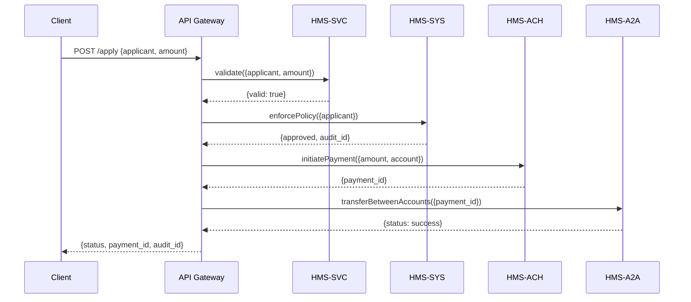

# Chapter 5: Microservices Architecture

In [Chapter 4: AI Governance Model](04_ai_governance_model_.md), we added oversight, explanations, and audit trails to every AI decision. Now let’s look under the hood at how our platform is actually built—piece by piece—using a **Microservices Architecture**.

---

## Why Microservices?

Imagine a federal agency made up of separate bureaus:

- One bureau only handles citizen registrations.
- Another handles service validation.
- A third processes payments.
- A fourth moves money between accounts.

Each bureau does one job really well, can change its procedures independently, and talks to other bureaus through a well-defined protocol (APIs). That’s the idea behind microservices: small, focused services that collaborate, scale, and get deployed on their own schedule.

---

## Central Use Case

Alice applies for a small-business grant through a state portal. Here’s the end-to-end flow:

1. **Submission**  
   The portal (API Gateway) receives Alice’s application.

2. **Validation** (HMS-SVC)  
   A microservice checks her eligibility rules.

3. **Governance Check** (HMS-SYS)  
   Another service enforces policy (privacy, audit).

4. **Payment** (HMS-ACH)  
   If approved, we trigger an ACH payment.

5. **Inter-Account Transfer** (HMS-A2A)  
   Finally, money moves between government accounts.

Each microservice is independent—so teams can update HMS-SVC without touching HMS-ACH.

---

## Key Concepts

- **Independent Services**  
  Each component (HMS-SYS, HMS-SVC, HMS-ACH, HMS-A2A) owns its own codebase, database, and deployment pipeline.

- **API Contracts**  
  Services communicate over HTTP/JSON (or gRPC). Clear request/response formats keep everyone in sync.

- **Service Discovery**  
  An API Gateway or a registry tells callers where each service lives, hiding load-balancing and fail-over details.

- **Failure Isolation**  
  If HMS-ACH is down, other services still run. Timeouts and retries contain failures to single services.

- **Scalability**  
  We can spin up extra HMS-SVC instances during heavy validation loads without touching payments.

---

## How to Use It

A client only talks to the **API Gateway**. The gateway forwards requests to the right services and aggregates results.

Example: Submit a grant application

```python
# client.py
import requests

app = {
  "applicant_id": "C789",
  "amount": 5000,
  "bank_account": "987654321"
}

resp = requests.post("https://api.hms.gov/apply", json=app)
print(resp.json())
# -> {"status":"completed","payment_id":"PAY-001","audit_id":"AUD-2024-1234"}
```

Explanation:  
- We send JSON to `/apply`.  
- The gateway runs through validation, governance, payment, and returns a single JSON.

---

## What Happens Under the Hood?



1. **API Gateway** receives the request.  
2. Calls **HMS-SVC** to validate business rules.  
3. Calls **HMS-SYS** for governance and audit logging.  
4. Calls **HMS-ACH** to initiate an ACH payment.  
5. Calls **HMS-A2A** for final account adjustments.  
6. Aggregates all responses and returns to the client.

---

## Inside the Code

### File: api_gateway.py

```python
# api_gateway.py
from svc_client import HMSSvcClient
from sys_client import HMSSysClient
from ach_client import HMSAchClient
from a2a_client import HMSA2AClient

class APIGateway:
    def __init__(self):
        self.svc = HMSSvcClient()
        self.sys = HMSSysClient()
        self.ach = HMSAchClient()
        self.a2a = HMSA2AClient()

    def apply(self, data):
        valid = self.svc.validate(data)
        if not valid:
            return {"status": "rejected", "reason": "validation_failed"}

        policy = self.sys.enforce(data)
        if policy["approved"] is False:
            return {"status": "rejected", "audit_id": policy["audit_id"]}

        payment = self.ach.pay(data["amount"], data["bank_account"])
        self.a2a.transfer(payment["payment_id"])
        return {
          "status": "completed",
          "payment_id": payment["payment_id"],
          "audit_id": policy["audit_id"]
        }
```

Explanation:  
- We instantiate clients for each service.  
- We run each step in order, checking for errors.  
- Finally, we return a combined JSON.

---

### Service Client Example

```python
# svc_client.py
class HMSSvcClient:
    def validate(self, data):
        # In real life, this calls HMS-SVC over HTTP
        return True
```

You’d create similar stubs for `sys_client.py`, `ach_client.py`, and `a2a_client.py`. Each hides the network details so the gateway stays simple.

---

## Conclusion

You’ve seen how our platform breaks down into small, independently deployable services—each with a single focus. This **Microservices Architecture** keeps our system flexible, scalable, and easy to maintain.

Up next: building the concrete endpoints in our [Backend API](06_backend_api_.md).

---

Generated by [AI Codebase Knowledge Builder](https://github.com/The-Pocket/Tutorial-Codebase-Knowledge)